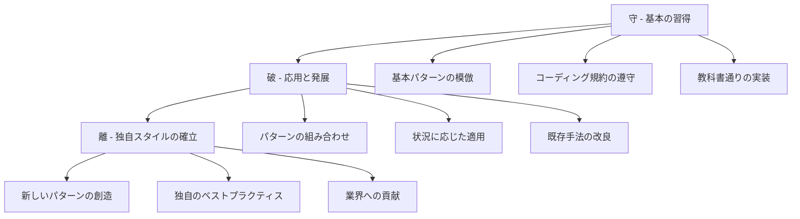

# 守破離とプログラミング学習の段階

## 守破離の各段階における特徴



## 段階別学習アプローチ

| 段階 | 期間目安 | 学習方法 | 注意点 | 到達目標 |
|------|----------|----------|--------|----------|
| **守** | 1-2年 | • 模倣学習<br>• パターン暗記<br>• ツール習得 | • 疑問を持たずに従う<br>• 基本を飛ばさない | 基本パターンの習得 |
| **破** | 2-5年 | • パターン組み合わせ<br>• 応用問題解決<br>• 改良への挑戦 | • 基本を軽視しない<br>• 闇雲に変更しない | 状況判断力の獲得 |
| **離** | 5年以上 | • 新技術の創造<br>• 知識の体系化<br>• 他者への指導 | • 独善的にならない<br>• 基本原則を忘れない | 独自スタイルの確立 |

## プログラミングにおける守破離の実例

### 守 - 基本の習得段階

```csharp
// 段階: 守 - 教科書通りの実装
public class CustomerService
{
    public bool IsValid(Customer customer)
    {
        if (customer == null)
            return false;
        if (string.IsNullOrEmpty(customer.Name))
            return false;
        if (string.IsNullOrEmpty(customer.Email))
            return false;
        return true;
    }
}
```

### 破 - 応用と発展段階

```csharp
// 段階: 破 - パターンの組み合わせと改良
public class CustomerValidator
{
    private readonly List<IValidationRule<Customer>> _rules;
    
    public CustomerValidator()
    {
        _rules = new List<IValidationRule<Customer>>
        {
            new NotNullRule<Customer>(),
            new RequiredFieldRule<Customer>(c => c.Name),
            new EmailFormatRule<Customer>(c => c.Email)
        };
    }
    
    public ValidationResult Validate(Customer customer)
    {
        var errors = _rules
            .Where(rule => !rule.IsValid(customer))
            .Select(rule => rule.ErrorMessage)
            .ToList();
            
        return new ValidationResult(errors);
    }
}
```

### 離 - 独自スタイルの確立段階

```csharp
// 段階: 離 - 独自のフレームワーク創造
public static class FluentValidation
{
    public static ValidatorBuilder<T> For<T>() => new ValidatorBuilder<T>();
}

// 使用例:独自のDSL(Domain Specific Language)
var validator = FluentValidation.For<Customer>()
    .Ensure(c => c.Name).IsNotEmpty().WithMessage("名前は必須です")
    .Ensure(c => c.Email).IsEmail().WithMessage("有効なメールアドレスを入力してください")
    .Ensure(c => c.Age).IsBetween(0, 120).WithMessage("年齢は0-120の範囲で入力してください")
    .Build();
```

## 各段階で陥りやすい罠と対策

### 守段階の罠
- **完璧主義の罠**: すべてを理解してから先に進もうとする
- **対策**: まずは動くものを作る経験を積む

### 破段階の罠  
- **複雑化の罠**: 新しい技術や手法を無闇に適用する
- **対策**: 問題の本質を見極めてから手法を選択

### 離段階の罠
- **独善化の罠**: 自分の手法に固執し、他者の意見を聞かない
- **対策**: 継続的な学習と謙虚な姿勢を保つ