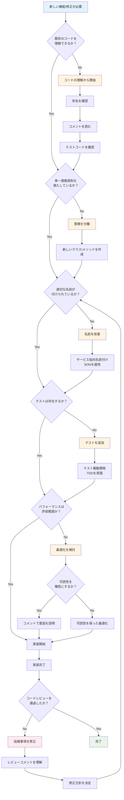

# コーディング判断フローチャート



## 判断基準とチェックポイント

### 1. コード理解フェーズ
- **命名確認**: 変数、メソッド、クラス名が意図を表現しているか
- **コメント確認**: Whyが書かれているか（Howではなく）
- **テスト確認**: 期待動作を理解できるか

### 2. 設計原則チェック
| 原則 | チェック項目 | 対策 |
|------|-------------|------|
| **単一責務** | 1つのことだけをしているか | クラス/メソッドの分離 |
| **命名適切性** | 意図が伝わる名前か | SON原則の適用 |
| **テスト可能性** | テストしやすいか | 依存性の注入、モック化 |

### 3. 品質判断基準
```
1. 意図の表現度 (美しいコードの第一原則)
2. 単一責務度 (美しいコードの第二原則) 
3. 命名適切度 (美しいコードの第三原則)
4. 重複排除度 (Once And Only Once)
5. 抽象度統一 (メソッド記述の適切性)
6. ルール統一度 (コーディング規約準拠)
7. テスト容易性 (Testable設計)
```

### 4. パフォーマンス vs 可読性のトレードオフ判断
```
可読性優先 ← → パフォーマンス優先

一般的なケース: 可読性優先
クリティカルパス: パフォーマンス優先（コメントで補完）
```

### 5. レビュー対応指針
- **建設的**: 指摘の意図を理解する
- **学習機会**: 新しい知識を積極的に吸収
- **品質向上**: チーム全体の品質向上に貢献

---

*このフローチャートは第8章「実践的なコーディング手法」で学ぶ判断プロセスを可視化したものです。*