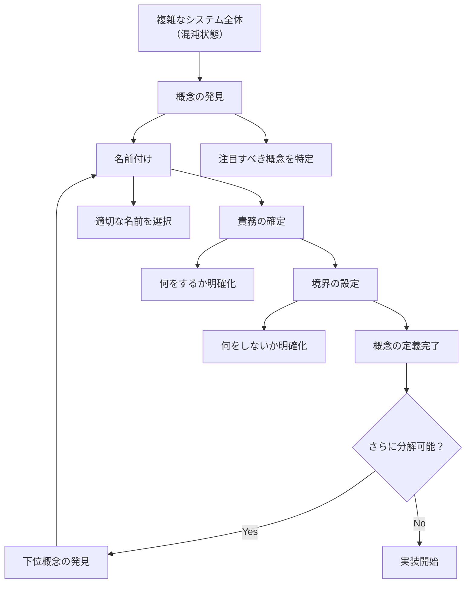

# Name and Conquer による概念階層の構築

## Name and Conquer の実践プロセス



## 概念階層の構築例

```
システム全体（混沌）
        ↓ Name and Conquer
┌─────────────────────────────────────┐
│        OrderManagement              │ ← 大きな概念を命名
│   （注文管理という概念領域）          │
└─────────────────────────────────────┘
        ↓ 責務による分解
┌──────────────┐  ┌──────────────┐
│ OrderProcessor │  │ CustomerService │ ← 中レベル概念
│  （注文処理）   │  │  （顧客管理）   │
└──────────────┘  └──────────────┘
        ↓                    ↓
┌──────────────┐  ┌──────────────┐
│OrderValidator │  │AddressValidator│ ← 小レベル概念
│ （注文検証）   │  │ （住所検証）   │
└──────────────┘  └──────────────┘
```

## 混沌から秩序への変化

| 段階 | 状態 | 特徴 | 問題点 |
|------|------|------|--------|
| **混沌状態** | 概念が未分化 | • 全てが `Manager`, `Handler`<br>• 責務が不明確<br>• 境界があいまい | • 理解困難<br>• 変更リスク高<br>• テスト困難 |
| **概念発見** | 注目点の特定 | • 重要な概念を認識<br>• 関心事の分離開始<br>• パターンの発見 | • まだ具体化されていない<br>• 名前が決まっていない |
| **名前確定** | 概念の具現化 | • 適切な名前を選択<br>• 概念が具体的に<br>• チーム内で共通理解 | • 責務範囲が不明確<br>• 境界設定が未完了 |
| **責務限定** | 役割の明確化 | • 何をするかが明確<br>• 何をしないかも明確<br>• 単一責務原則に準拠 | • 実装詳細は未確定<br>• インターフェース未定義 |
| **秩序確立** | 実装可能状態 | • 完全に定義された概念<br>• 明確な境界<br>• テスト可能な構造 | • なし（理想状態） |

## 実践的な Name and Conquer のテクニック

### 1. 概念発見のための質問

```
「このコードは何をしているのか？」
        ↓
「なぜこの処理が必要なのか？」
        ↓
「この責務は独立して価値を提供するか？」
        ↓
「他の概念との関係は何か？」
```

### 2. 名前選択の基準

| 基準 | 良い例 | 悪い例 | 理由 |
|------|--------|--------|------|
| **具体性** | `CustomerValidator` | `Validator` | 何を検証するかが明確 |
| **責務の明確さ** | `PriceCalculator` | `Calculator` | 何を計算するかが明確 |
| **ドメイン用語** | `OrderProcessor` | `DataProcessor` | ビジネスドメインを反映 |
| **動詞の適切さ** | `Parser`, `Converter` | `Manager`, `Handler` | 具体的な動作を表現 |

### 3. 境界設定のチェックリスト

- [ ] この概念の責務は明確に定義されているか？
- [ ] 他の概念との境界は明確か？
- [ ] 単一責務原則に準拠しているか？
- [ ] 概念の名前だけで役割が理解できるか？
- [ ] テスト可能な単位になっているか？