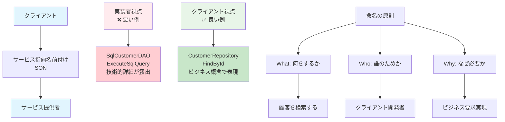

# Service Oriented Naming (SON) 概念図



## SON (Service Oriented Naming) の核心原則

### 1. クライアント視点での命名
- **実装詳細ではなく、サービスの本質を表現**
- **技術的詳細よりも、ビジネス価値を重視**

### 2. サービス提供の観点
| 観点 | 悪い例 | 良い例 |
|------|--------|--------|
| **技術観点** | `SqlDataAccess` | `CustomerRepository` |
| **処理観点** | `ExecuteQuery` | `FindCustomer` |
| **実装観点** | `HttpPostRequest` | `SubmitOrder` |

### 3. 命名判断フロー
```
1. このコードの「クライアント」は誰か？
2. クライアントは何を「求めている」か？
3. どのような「サービス」を提供するか？
4. そのサービスを一言で表現すると？
5. その表現がクラス/メソッド名として適切か？
```

### 4. SON適用の効果
- **理解容易性**: クライアントが意図を直感的に理解
- **保守性**: 実装変更がクライアントに影響しない
- **再利用性**: 明確な責務により再利用しやすい
- **テスト性**: 明確なサービス境界によりテストしやすい

---

*この図は第2章「命名の重要性とベストプラクティス」の理解を促進するために作成されました。*