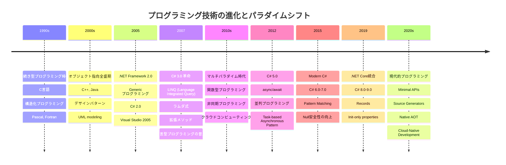

# 技術進化タイムライン



## パラダイムの進化概要

### 1. 手続き型 → オブジェクト指向 (1990s - 2000s)
```
複雑性の管理手法の変化:
手続き分解 → オブジェクトとしての抽象化
```

### 2. オブジェクト指向 → マルチパラダイム (2005 - 2010s)  
```
表現力の拡張:
単一パラダイム → 複数パラダイムの選択的適用
```

### 3. C# 3.0における革新 (2007)
| 機能 | 従来の書き方 | C# 3.0以降 |
|------|--------------|------------|
| **コレクション操作** | foreach + if | LINQ Where |
| **匿名メソッド** | delegate(int x) { } | x => {} |
| **型推論** | List<Customer> customers | var customers |

### 4. 宣言型プログラミングの台頭
```csharp
// 命令型(How): どうやってやるか
var result = new List<string>();
foreach (var customer in customers)
{
    if (customer.IsActive && customer.Region == "Asia")
        result.Add(customer.Name);
}

// 宣言型(What): 何をしたいか  
var result = customers
    .Where(c => c.IsActive && c.Region == "Asia")
    .Select(c => c.Name)
    .ToList();
```

### 5. 非同期プログラミングの進化
```csharp
// .NET 1.0-2.0 時代
IAsyncResult BeginOperation(AsyncCallback callback, object state);
void EndOperation(IAsyncResult result);

// .NET 4.0 Task時代  
Task<string> OperationAsync();

// .NET 4.5 async/await時代
async Task<string> OperationAsync() => await SomeOperationAsync();
```

### 6. 現代的技術トレンド (2020s)
- **Cloud-Native**: マイクロサービス、コンテナ化
- **DevOps統合**: CI/CD、Infrastructure as Code
- **AIアシスト**: GitHub Copilot、Code Generation
- **型安全性**: Nullable Reference Types
- **パフォーマンス**: Native AOT、Span<T>

## 将来展望 (2030s予測)

### 技術トレンド
```
1. AIによるコード生成の普及
2. 量子コンピューティング対応
3. よりDeclarative(宣言的)な開発手法
4. ローコード/ノーコード統合
5. 自動テスト・自動リファクタリング
```

### プログラミングパラダイムの進化
```
コード中心 → 意図中心
実装詳細 → ビジネス価値
How(どうやって) → What(何を) + Why(なぜ)
```

---

*この技術進化タイムラインは第10章「現代的なプログラミング技術と将来展望」の理解を深めるために作成されました。*