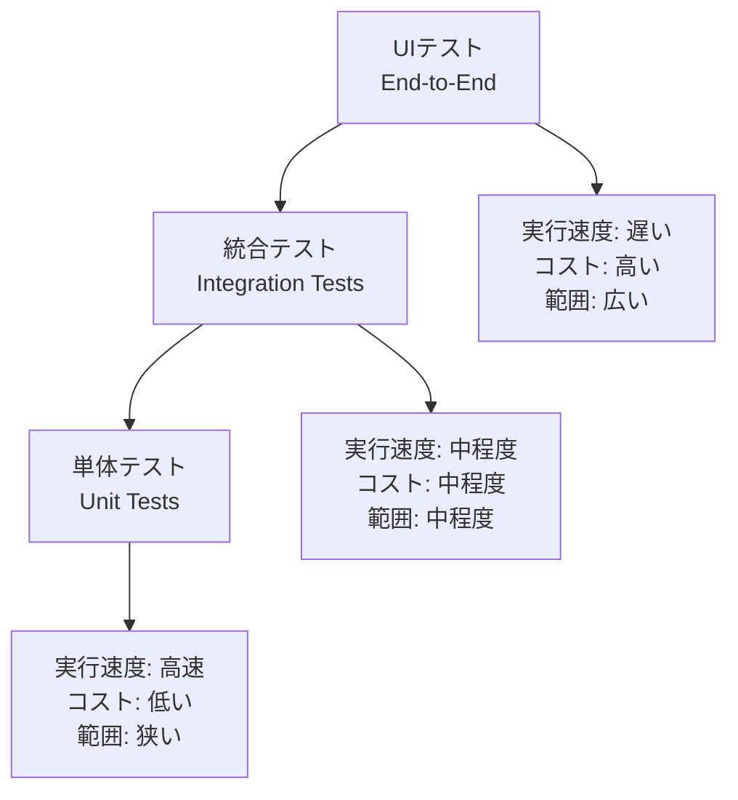

# テスト戦略とテスタブル設計パターン

## テストピラミッドと各層の特徴



## テスト種類別比較表

| テスト種類 | 目的 | 実行速度 | 保守コスト | テスト範囲 | 推奨比率 |
|-----------|------|----------|------------|-----------|----------|
| **単体テスト** | 個別機能の検証 | ⚡⚡⚡ 高速 | 💰 低 | 🎯 狭い | 70% |
| **統合テスト** | コンポーネント間連携 | ⚡⚡ 中程度 | 💰💰 中 | 🎯🎯 中程度 | 20% |
| **E2Eテスト** | 全体的なユーザー体験 | ⚡ 低速 | 💰💰💰 高 | 🎯🎯🎯 広い | 10% |

## テスタブル設計の原則

### 依存性注入による分離

#### ❌ テストしにくい設計
```csharp
public class OrderService
{
    public void ProcessOrder(Order order)
    {
        // 直接依存 - テストが困難
        var emailService = new EmailService();
        var paymentGateway = new PaymentGateway();
        var database = new SqlDatabase();
        
        // ビジネスロジックと外部依存が密結合
        var result = paymentGateway.ProcessPayment(order.Payment);
        database.SaveOrder(order);
        emailService.SendConfirmation(order.CustomerEmail);
    }
}
```

#### ✅ テストしやすい設計
```csharp
public class OrderService
{
    private readonly IEmailService _emailService;
    private readonly IPaymentGateway _paymentGateway;
    private readonly IOrderRepository _orderRepository;
    
    public OrderService(
        IEmailService emailService,
        IPaymentGateway paymentGateway,
        IOrderRepository orderRepository)
    {
        _emailService = emailService;
        _paymentGateway = paymentGateway;
        _orderRepository = orderRepository;
    }
    
    public async Task<OrderResult> ProcessOrder(Order order)
    {
        var paymentResult = await _paymentGateway.ProcessPaymentAsync(order.Payment);
        if (!paymentResult.IsSuccessful)
            return OrderResult.Failed("Payment failed");
            
        await _orderRepository.SaveAsync(order);
        await _emailService.SendConfirmationAsync(order.CustomerEmail);
        
        return OrderResult.Success(order);
    }
}
```

## テストダブルの種類と使い分け

| 種類 | 目的 | 特徴 | 使用場面 | 例 |
|------|------|------|----------|-----|
| **Dummy** | プレースホルダー | 実装なし | パラメータ充填 | `new Customer()` |
| **Stub** | 決められた値を返す | 固定レスポンス | 簡単な依存置換 | `emailService.Send() => true` |
| **Mock** | 呼び出しを検証 | 相互作用の確認 | 振る舞いテスト | `Verify(x => x.Send(email))` |
| **Spy** | 呼び出しを記録 | 実行記録を保存 | 副作用の確認 | 送信メール一覧の保存 |
| **Fake** | 軽量な実装 | 簡略化された動作 | 統合テスト | インメモリデータベース |

## TDD プラクティス別の効果

### Red-Green-Refactor サイクル

```
🔴 Red: 失敗するテストを書く
├─ 要件を明確化
├─ インターフェース設計
└─ 期待動作の定義

🟢 Green: テストを通す最小実装
├─ 実装の開始
├─ 動作する証拠
└─ 要件の充足確認

🔵 Refactor: コードの改善
├─ 重複の除去
├─ 設計の改良
└─ 可読性の向上
```

### テスト駆動開発の効果測定

| 観点 | TDD適用前 | TDD適用後 | 改善効果 |
|------|-----------|-----------|----------|
| **バグ密度** | 10件/KLOC | 3件/KLOC | 70%減少 |
| **設計品質** | 複雑な結合 | 疎結合設計 | 大幅改善 |
| **変更容易性** | リスク高 | 安全に変更可能 | 大幅改善 |
| **ドキュメント** | 仕様書依存 | 実行可能仕様 | 自動更新 |
| **リファクタリング** | 困難 | 安全に実行可能 | 継続的改善 |

## アンチパターンと対策

### テストのアンチパターン

| アンチパターン | 問題点 | 対策 |
|---------------|--------|------|
| **巨大なテスト** | 失敗原因不明 | 1テスト1検証項目 |
| **脆いテスト** | 少しの変更で破綻 | 実装詳細に依存しない |
| **遅いテスト** | 実行が億劫 | 外部依存をモック化 |
| **重複テスト** | 保守コスト高 | テストのDRY原則 |
| **Magic Number** | 意図不明な値 | 意味のある定数使用 |

### テスタブル設計のアンチパターン

| アンチパターン | 例 | 改善策 |
|---------------|-----|--------|
| **Singleton** | `Database.Instance.Save()` | 依存性注入 |
| **静的依存** | `DateTime.Now` | `IDateTimeProvider` |
| **new演算子** | `new FileWriter()` | Factory パターン |
| **巨大クラス** | 1000行のService | 単一責務原則 |
| **隠蔽状態** | private フィールド直接テスト | パブリックAPI経由 |

## テスト命名規約

### 推奨命名パターン

```csharp
// パターン1: Given_When_Then
[Test]
public void Given_InvalidEmail_When_RegisterUser_Then_ThrowsValidationException()

// パターン2: Should_ExpectedBehavior_When_StateUnderTest  
[Test]
public void Should_ThrowValidationException_When_EmailIsInvalid()

// パターン3: 日本語(説明的)
[Test]  
public void 無効なメールアドレスでユーザー登録する場合_バリデーション例外が発生すること()
```

### テストケース設計マトリックス

| 入力条件 | 正常値 | 境界値 | 異常値 | 期待結果 |
|----------|--------|--------|--------|----------|
| **メールアドレス** | `user@example.com` | `a@b.co` | `invalid-email` | 成功/境界確認/例外 |
| **年齢** | `25` | `0, 120` | `-1, 121` | 成功/境界確認/例外 |
| **パスワード** | `ValidPass123!` | `8文字ちょうど` | `短すぎ` | 成功/境界確認/例外 |

## 継続的改善のための指標

### コードカバレッジの目標

```
推奨カバレッジ目標:
├─ 行カバレッジ: 80%以上
├─ 分岐カバレッジ: 70%以上  
├─ 条件カバレッジ: 60%以上
└─ パスカバレッジ: 主要パスの100%
```

### テスト品質の評価項目

- [ ] テストが期待動作を明確に表現している
- [ ] テストが独立して実行可能である
- [ ] テストが高速に実行される(1秒以内)
- [ ] テストが決定的である(毎回同じ結果)
- [ ] テストが保守しやすい構造である
- [ ] テストが適切な粒度で設計されている