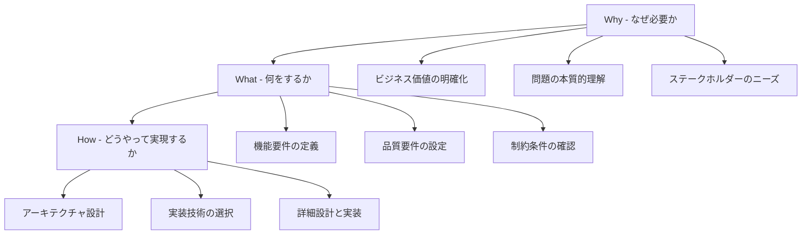

# Why-What-How 思考法による段階的問題解決

## Why-What-How の階層構造



## 階層別の思考プロセス

### Why層: 目的と価値の明確化

| 観点 | 質問例 | 成果物 | 関係者 |
|------|--------|--------|--------|
| **ビジネス価値** | なぜこのシステムが必要なのか？ | ビジネスケース | 経営陣、事業部門 |
| **ユーザー価値** | ユーザーにとってどんな価値があるのか？ | ユーザーストーリー | プロダクトオーナー、UX |
| **技術的価値** | 技術的にどんな課題を解決するのか？ | 技術戦略 | アーキテクト、開発者 |

```csharp
// Why層の例: ビジネス価値の明確化
/*
* Why: 顧客満足度を向上させ、競合優位性を確保するため
* Business Value: 注文処理時間を50%短縮
* User Value: 注文から発送まで1日以内で完了
* Technical Value: 注文処理の自動化により人的ミスを削減
*/
```

### What層: 要件と仕様の定義

| 観点 | 質問例 | 成果物 | 関係者 |
|------|--------|--------|--------|
| **機能要件** | 何をする機能が必要か？ | 機能仕様書 | ビジネスアナリスト |
| **品質要件** | どんな品質基準を満たすべきか？ | 品質要求仕様 | 品質保証チーム |
| **制約条件** | 何が制約となるか？ | 制約一覧 | アーキテクト |

```csharp
// What層の例: 機能要件の定義
public interface IOrderProcessingService
{
    // What: 注文を処理する機能
    Task<OrderResult> ProcessOrderAsync(Order order);
    
    // What: 注文状況を確認する機能  
    Task<OrderStatus> GetOrderStatusAsync(int orderId);
    
    // What: 注文をキャンセルする機能
    Task<CancellationResult> CancelOrderAsync(int orderId);
}
```

### How層: 実装と技術選択

| 観点 | 質問例 | 成果物 | 関係者 |
|------|--------|--------|--------|
| **アーキテクチャ** | どんな構造で実現するか？ | アーキテクチャ設計書 | アーキテクト |
| **技術選択** | どんな技術を使うか？ | 技術選定書 | 技術リード |
| **実装詳細** | どう実装するか？ | 詳細設計書、コード | 開発者 |

```csharp
// How層の例: 実装の詳細
public class OrderProcessingService : IOrderProcessingService
{
    private readonly IOrderRepository _orderRepository;
    private readonly IPaymentService _paymentService;
    private readonly IInventoryService _inventoryService;
    private readonly INotificationService _notificationService;
    
    // How: 依存性注入によるサービス構築
    public OrderProcessingService(
        IOrderRepository orderRepository,
        IPaymentService paymentService,
        IInventoryService inventoryService,
        INotificationService notificationService)
    {
        _orderRepository = orderRepository;
        _paymentService = paymentService;
        _inventoryService = inventoryService;
        _notificationService = notificationService;
    }
    
    // How: 段階的な注文処理の実装
    public async Task<OrderResult> ProcessOrderAsync(Order order)
    {
        try
        {
            // How: 在庫確認の実装
            var inventoryResult = await _inventoryService.CheckAvailabilityAsync(order.Items);
            if (!inventoryResult.IsAvailable)
                return OrderResult.Failed("在庫不足");
            
            // How: 決済処理の実装
            var paymentResult = await _paymentService.ProcessPaymentAsync(order.Payment);
            if (!paymentResult.IsSuccessful)
                return OrderResult.Failed("決済失敗");
            
            // How: 注文保存の実装
            await _orderRepository.SaveAsync(order);
            
            // How: 通知送信の実装
            await _notificationService.SendOrderConfirmationAsync(order);
            
            return OrderResult.Success(order);
        }
        catch (Exception ex)
        {
            // How: エラーハンドリングの実装
            await _notificationService.SendErrorNotificationAsync(ex);
            return OrderResult.Failed($"システムエラー: {ex.Message}");
        }
    }
}
```

## Why-What-How の実践的な適用例

### 例: ECサイトの注文機能開発

```
Why (なぜ)
├─ ビジネス価値: 売上向上、顧客満足度向上
├─ ユーザー価値: 簡単・迅速な購入体験
└─ 技術価値: 注文処理の自動化、運用効率化

What (何を)
├─ 機能要件
│  ├─ 商品をカートに追加
│  ├─ 注文確定・決済
│  └─ 注文状況確認
├─ 品質要件
│  ├─ 応答時間 < 3秒
│  ├─ 可用性 99.9%
│  └─ 同時接続 1000ユーザー
└─ 制約条件
   ├─ 既存システムとの連携
   ├─ 予算・スケジュール
   └─ セキュリティ要件

How (どうやって)
├─ アーキテクチャ
│  ├─ マイクロサービス
│  ├─ イベント駆動
│  └─ CQRS パターン
├─ 技術スタック
│  ├─ ASP.NET Core
│  ├─ Azure Service Bus
│  └─ SQL Server
└─ 実装詳細
   ├─ DDD設計
   ├─ 単体テスト
   └─ CI/CD自動化
```

## 思考プロセスの検証方法

### 各層でのチェックポイント

| 層 | チェック項目 | 検証方法 |
|---|-------------|----------|
| **Why** | 価値が明確か | ステークホルダーレビュー |
| **Why** | 問題の本質を捉えているか | 根本原因分析 |
| **What** | 要件が網羅されているか | 要件レビュー |
| **What** | 測定可能か | 受け入れテスト定義 |
| **How** | 実現可能か | プロトタイプ検証 |
| **How** | 品質基準を満たすか | 技術検証・負荷テスト |

### トレーサビリティの確保

```
Why1 → What1,2,3 → How1,2,3,4
     ↓
   価値の実現が追跡可能
   
例:
Why: 顧客満足度向上
 └─ What: 注文処理時間短縮
     └─ How: 自動化による処理時間削減
         └─ 実装: 非同期処理パターン
```