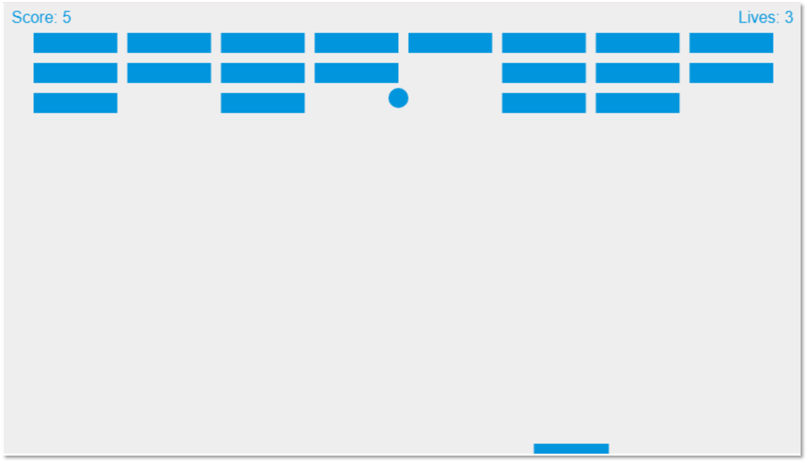

# 第5章 オブジェクト指向設計の真髄


## 章の概要

### この章の目的
オブジェクト指向設計の本質を深く理解し、Robert C. Martin(Uncle Bob)が提唱したSOLID原則を中心とした実践的な設計スキルを習得する。表面的な知識を脱却し、複雑なソフトウェアシステムを適切に構造化する高度な設計能力を身につける。

### この章で学べること
- 単一責務原則(SRP)の深層理解と責務の正確な識別法
- カプセル化と情報隠蔽の本質的価値と実装技法
- 継承と委譲の適切な使い分けの判断基準
- ポリモーフィズムによる柔軟性と拡張性の実現
- SOLID原則の統合的な適用による堅牢な設計
- アクター分析による責務の明確化技法
- 具象依存から抽象依存への転換戦略

### オブジェクト指向設計をマスターする意義
「なぜクラスを分けるのか?」「継承とコンポジションはどう使い分けるのか?」多くのプログラマがオブジェクト指向の技法を知っていても、その本質的な価値を理解していない。この章で学ぶSOLID原則は、混沌とした要求を秩序あるソフトウェア構造に変換する設計思考の基盤である。責務という概念を通じて複雑さを整理し、変更に強いシステムを構築する──これらのスキルは、あなたを単なるコーダーから真の設計者へと成長させる。

---

最初に、オブジェクト指向プログラミングの例を示したい。


- [純粋な JavaScript を使ったブロック崩しゲーム - ゲーム開発 | MDN (mozilla.org)](https://developer.mozilla.org/ja/docs/Games/Tutorials/2D_Breakout_game_pure_JavaScript)
  - https://developer.mozilla.org/ja/docs/Games/Tutorials/2D_Breakout_game_pure_JavaScript

にある JavaScript で書かれたブロック崩しという簡単なゲームのプログラムを引用し、これを筆者がオブジェクト指向で書き直した例をあげる (プログラムの機能は同じ)。

責務ごとに名前を付けてプログラムを分割する、というのは他のパラダイムと共通しているのだが、オブジェクト指向の場合、分割にクラスを用いてデータと振る舞いをカプセル化する、という特徴がある。

その辺りを感じていただけるだろうか。

**オリジナルのプログラム:**
_[JavaScript]_
```javascript
var canvas = document.getElementById("canvas");
var ctx = canvas.getContext("2d");
var ballRadius = 10;
var x = canvas.width / 2;
var y = canvas.height - 30;
var dx = 5;
var dy = -5;
var paddleHeight = 10;
var paddleWidth = 75;
var paddleX = (canvas.width-paddleWidth)/2;
var rightPressed = false;
var leftPressed = false;
var brickRowCount = 3;
var brickColumnCount = 8;
var brickHeight = 20;
var brickPadding = 10;
var brickMargin = 30;
var brickOffsetTop = brickMargin;
var brickOffsetLeft = brickMargin;
var brickWidth = (canvas.width - brickMargin * 2 - brickPadding * (brickColumnCount - 1)) / brickColumnCount;
var bricks = [];
let score = 0;
let lives = 3;

for (var c = 0; c < brickColumnCount; c++) {
    bricks[c] = [];
    for (var r = 0; r < brickRowCount; r++) {
        bricks[c][r] = { x: 0, y: 0, status: 1 };
    }
}

document.addEventListener("keydown", keyDownHandler, false);
document.addEventListener("keyup", keyUpHandler, false);
document.addEventListener("mousemove", mouseMoveHandler, false);

function keyDownHandler(e) {
    if(e.key == "Right" || e.key == "ArrowRight") {
        rightPressed = true;
    }
    else if(e.key == "Left" || e.key == "ArrowLeft") {
        leftPressed = true;
    }
}

function keyUpHandler(e) {
    if(e.key == "Right" || e.key == "ArrowRight") {
        rightPressed = false;
    }
    else if(e.key == "Left" || e.key == "ArrowLeft") {
        leftPressed = false;
    }
}

function mouseMoveHandler(e) {
    var relativeX = e.clientX - canvas.offsetLeft;
    if (relativeX > 0 && relativeX < canvas.width) {
        paddleX = relativeX - paddleWidth / 2;
    }
}

function collisionDetection() {
    for (let c = 0; c < brickColumnCount; c++) {
        for (let r = 0; r < brickRowCount; r++) {
            const b = bricks[c][r];
            if (b.status === 1) {
                if (x > b.x && x < b.x + brickWidth && y > b.y && y < b.y + brickHeight) {
                    dy = -dy;
                    b.status = 0;
                    score++;
                    if (score == brickRowCount * brickColumnCount) {
                        alert("YOU WIN, CONGRATS!");
                        document.location.reload();
                    }
                }
            }
        }
    }
}

function drawBall() {
    ctx.beginPath();
    ctx.arc(x, y, ballRadius, 0, Math.PI * 2);
    ctx.fillStyle = "#0095DD";
    ctx.fill();
    ctx.closePath();
}

function drawPaddle() {
    ctx.beginPath();
    ctx.rect(paddleX, canvas.height-paddleHeight, paddleWidth, paddleHeight);
    ctx.fillStyle = "#0095DD";
    ctx.fill();
    ctx.closePath();
}

function drawBricks() {
    for (var c = 0; c < brickColumnCount; c++) {
        for(var r = 0; r < brickRowCount; r++) {
            if (bricks[c][r].status === 1) {
                var brickX = (c * (brickWidth+brickPadding)) + brickOffsetLeft;
                var brickY = (r * (brickHeight+brickPadding)) + brickOffsetTop;
                bricks[c][r].x = brickX;
                bricks[c][r].y = brickY;
                ctx.beginPath();
                ctx.rect(brickX, brickY, brickWidth, brickHeight);
                ctx.fillStyle = "#0095DD";
                ctx.fill();
                ctx.closePath();
            }
        }
    }
}

function drawScore() {
    ctx.font = "16px Arial";
    ctx.fillStyle = "#0095DD";
    ctx.fillText(`Score: ${score}`, 8, 20);
}

function drawLives() {
    ctx.font = "16px Arial";
    ctx.fillStyle = "#0095DD";
    ctx.fillText(`Lives: ${lives}`, canvas.width - 65, 20);
}

function draw() {
    ctx.clearRect(0, 0, canvas.width, canvas.height);
    drawBricks();
    drawBall();
    drawPaddle();
    drawScore();
    drawLives();
    collisionDetection();

    if (x + dx > canvas.width - ballRadius || x + dx < ballRadius)
        dx = -dx;
    if (y + dy < ballRadius) {
        dy = -dy;
    } else if (y + dy > canvas.height - ballRadius) {
        if (x > paddleX && x < paddleX + paddleWidth) {
            dy = -dy;
        } else {
            lives--;
            if (!lives) {
                alert(`GAME OVER - Score: ${score}`);
                document.location.reload();
            } else {
                x = canvas.width / 2;
                y = canvas.height - 30;
                dx = 2;
                dy = -2;
                paddleX = (canvas.width - paddleWidth) / 2;
            }
        }
    }

    if (rightPressed) {
        paddleX += 7;
        if (paddleX + paddleWidth > canvas.width){
            paddleX = canvas.width - paddleWidth;
        }
    }
    else if (leftPressed) {
        paddleX -= 7;
        if (paddleX < 0){
            paddleX = 0;
        }
    }

    x += dx;
    y += dy;

    requestAnimationFrame(draw)
}
draw();
```

**オブジェクト指向で書き直したもの:**

_[JavaScript]_
```javascript
class Utility {
    static isBetween(value, minimum, maximum) {
        return minimum <= value && value <= maximum
    }

    static some2D(array2D, exists) {
        return array2D.some(array => array.some(exists))
    }

    static filter2D(array2D, selector) {
        return array2D.flat().filter(selector)
    }
}

class Vector2 {
    constructor(x, y) {
        this.x = x
        this.y = y
    }

    plus(vector) {
        return new Vector2(this.x + vector.x, this.y + vector.y)
    }

    plusEqual(vector) {
        this.x += vector.x
        this.y += vector.y
    }

    clone() {
        return new Vector2(this.x, this.y)
    }
}

class Circle {
    constructor(position, radius) {
        this.position = position
        this.radius   = radius
    }
}

class Rectangle {
    get rightBottom() { return this.position.plus(this.size) }

    constructor(position, size) {
        this.position = position
        this.size     = size
    }

    isOn(position) {
        const rightBottom = this.rightBottom
        return Utility.isBetween(position.x, this.position.x, rightBottom.x) &&
               Utility.isBetween(position.y, this.position.y, rightBottom.y)
    }
}

class Canvas {
    get size() { return new Vector2(this.canvas.width, this.canvas.height) }
    get offset() { return new Vector2(this.canvas.offsetLeft, this.canvas.offsetTop) }

    constructor(canvasId) {
        this.canvas  = document.getElementById(canvasId)
        this.context = this.canvas.getContext('2d')
        this.onDraw  = (canvas) => {}

        this.draw()
    }

    stop() {
        clearInterval(this.timerId)
    }

    fillCircle(circle, color) {
        this.context.beginPath()
        this.context.arc(circle.position.x, circle.position.y, circle.radius, 0, Math.PI * 2, false)
        this.context.fillStyle = color
        this.context.fill()
        this.context.closePath()
    }

    fillRectangle(rectangle, color) {
        this.context.beginPath()
        this.context.rect(rectangle.position.x, rectangle.position.y, rectangle.size.x, rectangle.size.y)
        this.context.fillStyle = color
        this.context.fill()
        this.context.closePath()
    }

    fillText(position, text, color, font) {
        this.context.font      = font
        this.context.fillStyle = color
        this.context.fillText(text, position.x, position.y)
    }

    draw() {
        this.clear()
        this.onDraw(this)
        requestAnimationFrame(() => this.draw())
    }

    clear() {
        this.context.clearRect(0, 0, this.canvas.width, this.canvas.height)
    }
}

class Paddle {
    constructor(position, size, color) {
        this.originalPosition = position
        this.position         = position
        this.size             = size
        this.color            = color
        this.rightPressed     =
        this.leftPressed      = false
    }

    draw(canvas) {
        canvas.fillRectangle(new Rectangle(new Vector2(this.position, canvas.size.y - this.size.y), this.size), this.color)
        this.moveStep(canvas)
    }

    isOn(position) {
        return Utility.isBetween(position.x, this.position, this.position + this.size.x)
    }

    reset() {
        this.position = this.originalPosition
    }

    moveStep(canvas) {
        const stepSize = 7

        if (this.rightPressed) {
            this.position += stepSize
            if (this.position + this.size.x > canvas.size.x)
                this.position = canvas.size.x - this.size.x
        } else if (this.leftPressed) {
            this.position -= stepSize
            if (this.position < 0)
                this.position = 0
        }
    }
}

class Brick {
    constructor(position, status) {
        this.position = position
        this.status   = status
    }
}

class BrickSet {
    get brickCount() { return this.rowCount * this.columnCount }

    constructor(canvas) {
        this.rowCount     =  3
        this.columnCount  =  8
        this.padding      = 10

        const margin      = 30
        this.brickOffset  = new Vector2(margin, margin)

        const brickHeight = 20
        const brickWidth  = (canvas.size.x - margin * 2 - this.padding * (this.columnCount - 1)) / this.columnCount
        this.brickSize    = new Vector2(brickWidth, brickHeight)

        this.initializeBricks()
    }

    detectCollision(ballPosition) {
        let exists = brick => {
            if (brick.status && new Rectangle(brick.position, this.brickSize).isOn(ballPosition)) {
                brick.status = false
                return true
            }
            return false
        }
        return Utility.some2D(this.bricks, exists)
    }

    draw(canvas) {
        const color  = "#0095DD"
        const bricks = Utility.filter2D(this.bricks, brick => brick.status)
        bricks.forEach(brick => canvas.fillRectangle(new Rectangle(brick.position, this.brickSize), color))
    }

    initializeBricks() {
        this.bricks = []
        for (let x = 0; x < this.columnCount; x++) {
            this.bricks[x] = []
            for (let y = 0; y < this.rowCount; y++)
                this.bricks[x][y] = new Brick(this.getBrickPosition(new Vector2(x, y)), true)
        }
    }

    getBrickPosition(position) {
        return this.brickOffset.plus(new Vector2((this.brickSize.x + this.padding) * position.x,
                                                 (this.brickSize.y + this.padding) * position.y))
    }
}

const gameStatus = Object.freeze({
    normal:  { value:  0 },
    scored:  { value:  1 },
    over  :  { value: -1 }
})

class Ball {
    constructor(position, velocity, color) {
        const radius          = 10
        this.originalPosition = position.clone()
        this.position         = position
        this.radius           = radius
        this.originalVelocity = velocity.clone()
        this.velocity         = velocity
        this.color            = color
    }

    detectCollision(canvas, paddle, brickSet) {
        if (!Utility.isBetween(this.position.x + this.velocity.x, this.radius, canvas.size.x - this.radius))
            this.velocity.x = -this.velocity.x

        if (this.position.y + this.velocity.y < this.radius) {
            this.velocity.y = -this.velocity.y
        } else if (brickSet.detectCollision(this.position)) {
            this.velocity.y = -this.velocity.y
            return gameStatus.scored
        } else if (this.position.y + this.velocity.y > canvas.size.y - this.radius) {
            if (paddle.isOn(this.position))
                this.velocity.y = -this.velocity.y
            else
                return gameStatus.over
        }
        return gameStatus.normal
    }

    reset() {
        this.position = this.originalPosition
        this.velocity = this.originalVelocity
    }

    draw(canvas) {
        canvas.fillCircle(new Circle(this.position, this.radius), this.color)
        this.moveStep()
    }

    moveStep() {
        this.position.plusEqual(this.velocity)
    }
}

class Game {
    get scoreText() {
        return `Score: ${this.score}`
    }

    constructor() {
        const liveCount = 3
        this.lives      = liveCount
        this.score      = 0
    }

    run() {
        this.createCanvas()

        const color   = "#0095DD"
        this.createBall  (color)
        this.createPaddle(color)
        this.brickSet = new BrickSet(this.canvas)
    }

    pressRight(on) {
        this.paddle.rightPressed = on
    }

    pressLeft(on) {
        this.paddle.leftPressed = on
    }

    createCanvas() {
        this.canvas        = new Canvas('canvas')
        this.canvas.onDraw = (canvas) => this.draw(canvas)
    }

    createBall(color) {
        const velocitySize = 5
        const velocity     = new Vector2(velocitySize, -velocitySize)
        this.ball          = new Ball(new Vector2(canvas.width / 2, canvas.height - 30), velocity, color)
    }

    createPaddle(color) {
        const paddleHeight = 10
        const paddleWidth  = 75
        this.paddle = new Paddle((canvas.width - paddleWidth) / 2, new Vector2(paddleWidth, paddleHeight), color)
    }

    reset() {
        this.paddle.reset()
        this.ball  .reset()
    }

    draw(canvas) {
        switch (this.ball.detectCollision(canvas, this.paddle, this.brickSet).value) {
            case gameStatus.scored.value:
                this.countUpScore()
                break
            case gameStatus.over  .value:
                this.countDownLives()
                break
            default:
                break
        }
        this.drawAll(canvas)
    }

    countUpScore() {
        this.score++
        if (this.score == this.brickSet.brickCount)
            this.gameWin()
    }

    countDownLives() {
        this.lives--
        if (!this.lives)
            this.gameOver()
        else
            this.reset()
    }

    drawAll(canvas) {
        this.ball    .draw(canvas)
        this.paddle  .draw(canvas)
        this.brickSet.draw(canvas)
        this.drawScore    (canvas)
        this.drawLives    (canvas)
    }

    drawScore(canvas) {
        this.fillText(canvas, 8, this.scoreText)
    }

    drawLives(canvas) {
        this.fillText(canvas, canvas.size.x - 65, `Lives: ${this.lives}`)
    }

    fillText(canvas, x, text) {
        const y     = 20
        const color = '#0095DD'
        const font  = '16px Arial'
        canvas.fillText(new Vector2(x, y), text, color, font)
    }

    gameOver() {
        const message = 'GAME OVER'
        this.showMessage(message)
    }

    gameWin() {
        const message = 'YOU WIN, CONGRATS!'
        this.showMessage(message)
    }

    showMessage(message) {
        alert(`${message} - ${this.scoreText}`)
        document.location.reload()
        this.canvas.stop()
    }
}

class Program {
    main() {
        this.game = new Game()
        this.initilizeHandlers()
        this.game.run()
    }

    initilizeHandlers() {
        document.addEventListener('keydown'  , e => this.onKeyDown  (e), false)
        document.addEventListener('keyup'    , e => this.onKeyUp    (e), false)
        document.addEventListener("mousemove", e => this.onMouseMove(e), false)
    }

    onKeyDown(e) {
        if      (e.key == "Right" || e.key == "ArrowRight")
            this.game.pressRight(true)
        else if (e.key == "Left"  || e.key == "ArrowLeft" )
            this.game.pressLeft(true)
    }

    onKeyUp(e) {
        if      (e.key == "Right" || e.key == "ArrowRight")
            this.game.pressRight(false)
        else if (e.key == "Left"  || e.key == "ArrowLeft" )
            this.game.pressLeft(false)
    }

    onMouseMove(e) {
        const relativeX = e.clientX - this.game.canvas.offset.x
        if (Utility.isBetween(relativeX, 0, this.game.canvas.size.x))
            this.game.paddle.position = relativeX - this.game.paddle.size.x / 2
    }
}

window.onload = () => new Program().main()
```

オブジェクト指向設計の核心は、SOLID原則に代表される設計原則の理解と適用である。本章では、これらの原則を深く理解し、実践的な設計スキルを身につける。

## 5.1 単一責務原則の深い理解

### 5.1.1 単一責務原則(SRP)の本質

Robert C. Martin(Uncle Bob)が提唱したSOLID原則の最初の原則である単一責務原則(Single Responsibility Principle)は、オブジェクト指向設計の根幹を成す重要な概念である。

> 「クラスが変更される理由は一つでなければならない」

しかし、この定義は表面的な理解にとどまりがちである。より深い理解のためには、**責務(Responsibility)**の概念を正しく把握する必要がある。

### 5.1.2 責務の定義と識別

#### 責務とは何か

責務とは、**システム内の特定のアクター(利害関係者)に対する義務**である。アクターとは、システムの変更を要求する人々やプロセスのグループを指す。

_[C#]_
```csharp
// 複数のアクターに対する責務が混在している例(SRP違反)
public class Employee
{
    public string Name { get; set; }
    public decimal BaseSalary { get; set; }
    public string Department { get; set; }

    // アクター1: 人事部門(給与計算)
    public decimal CalculateOvertimePay(int overtimeHours)
    {
        return BaseSalary / 160 * 1.5m * overtimeHours;
    }

    // アクター2: 経理部門(会計処理)
    public void SaveToDatabase()
    {
        using var connection = new SqlConnection(connectionString);
        var command = new SqlCommand(
            "INSERT INTO Employees (Name, BaseSalary, Department) VALUES (@name, @salary, @dept)",
            connection);
        command.Parameters.AddWithValue("@name", Name);
        command.Parameters.AddWithValue("@salary", BaseSalary);
        command.Parameters.AddWithValue("@dept", Department);
        command.ExecuteNonQuery();
    }

    // アクター3: ITオペレーション(レポート生成)
    public string GenerateReport()
    {
        return $"Employee Report\n" +
               $"Name: {Name}\n" +
               $"Department: {Department}\n" +
               $"Base Salary: {BaseSalary:C}";
    }
}
```

この設計の問題点:
- **人事部門**が給与計算ルールを変更したい
- **経理部門**がデータベーススキーマを変更したい
- **ITオペレーション**がレポート形式を変更したい

これらの変更は互いに無関係だが、すべて同じクラスに影響を与える。

#### SRPに従った設計

_[C#]_
```csharp
// 責務を分離した設計
public class Employee  // 純粋なデータ表現
{
    public int Id { get; }
    public string Name { get; }
    public decimal BaseSalary { get; }
    public string Department { get; }

    public Employee(int id, string name, decimal baseSalary, string department)
    {
        Id = id;
        Name = name;
        BaseSalary = baseSalary;
        Department = department;
    }
}

// アクター1: 人事部門の責務
public class PayrollCalculator
{
    public decimal CalculateOvertimePay(Employee employee, int overtimeHours)
    {
        var hourlyRate = employee.BaseSalary / 160;
        var overtimeRate = hourlyRate * 1.5m;
        return overtimeRate * overtimeHours;
    }

    public decimal CalculateTotalPay(Employee employee, int overtimeHours)
    {
        return employee.BaseSalary + CalculateOvertimePay(employee, overtimeHours);
    }
}

// アクター2: 経理部門の責務
public class EmployeeRepository
{
    private readonly string _connectionString;

    public EmployeeRepository(string connectionString)
    {
        _connectionString = connectionString;
    }

    public async Task SaveAsync(Employee employee)
    {
        using var connection = new SqlConnection(_connectionString);
        await connection.OpenAsync();

        var command = new SqlCommand(
            "INSERT INTO Employees (Id, Name, BaseSalary, Department) VALUES (@id, @name, @salary, @dept)",
            connection);
        command.Parameters.AddWithValue("@id", employee.Id);
        command.Parameters.AddWithValue("@name", employee.Name);
        command.Parameters.AddWithValue("@salary", employee.BaseSalary);
        command.Parameters.AddWithValue("@dept", employee.Department);

        await command.ExecuteNonQueryAsync();
    }

    public async Task<Employee> FindByIdAsync(int id)
    {
        using var connection = new SqlConnection(_connectionString);
        await connection.OpenAsync();

        var command = new SqlCommand("SELECT * FROM Employees WHERE Id = @id", connection);
        command.Parameters.AddWithValue("@id", id);

        using var reader = await command.ExecuteReaderAsync();
        if (await reader.ReadAsync())
        {
            return new Employee(
                reader.GetInt32("Id"),
                reader.GetString("Name"),
                reader.GetDecimal("BaseSalary"),
                reader.GetString("Department"));
        }

        return null;
    }
}

// アクター3: ITオペレーションの責務
public class EmployeeReportGenerator
{
    public string GenerateDetailedReport(Employee employee)
    {
        return $"=== Employee Report ===\n" +
               $"ID: {employee.Id}\n" +
               $"Name: {employee.Name}\n" +
               $"Department: {employee.Department}\n" +
               $"Base Salary: {employee.BaseSalary:C}\n" +
               $"Generated: {DateTime.Now:yyyy-MM-dd HH:mm:ss}";
    }

    public string GenerateSummaryReport(IEnumerable<Employee> employees)
    {
        var summary = employees
            .GroupBy(e => e.Department)
            .Select(g => new
            {
                Department = g.Key,
                Count = g.Count(),
                AverageSalary = g.Average(e => e.BaseSalary),
                TotalSalary = g.Sum(e => e.BaseSalary)
            });

        var report = "=== Department Summary ===\n";
        foreach (var dept in summary)
        {
            report += $"{dept.Department}: {dept.Count} employees, " +
                     $"Avg: {dept.AverageSalary:C}, Total: {dept.TotalSalary:C}\n";
        }

        return report;
    }
}
```

### 5.1.3 責務の粒度

#### 適切な責務レベルの判断

責務の粒度は文脈に依存する。重要なのは、**変更の理由**に着目することである。

_[C#]_
```csharp
// 粒度が細かすぎる例
public class CustomerName
{
    public string FirstName { get; }
    public string LastName { get; }

    public CustomerName(string firstName, string lastName)
    {
        FirstName = firstName;
        LastName = lastName;
    }
}

public class CustomerEmail
{
    public string Value { get; }

    public CustomerEmail(string email)
    {
        if (!IsValidEmail(email))
            throw new ArgumentException("Invalid email format");
        Value = email;
    }

    private static bool IsValidEmail(string email) =>
        System.Text.RegularExpressions.Regex.IsMatch(email, @"^[^@\s]+@[^@\s]+\.[^@\s]+$");
}

public class CustomerAddress
{
    public string Street { get; }
    public string City { get; }
    public string PostalCode { get; }

    public CustomerAddress(string street, string city, string postalCode)
    {
        Street = street;
        City = city;
        PostalCode = postalCode;
    }
}
```

_[C#]_
```csharp
// 適切な粒度の例
public class Customer
{
    public CustomerId Id { get; }
    public CustomerName Name { get; }
    public CustomerEmail Email { get; }
    public CustomerAddress Address { get; }
    public CustomerStatus Status { get; private set; }

    public Customer(CustomerId id, CustomerName name, CustomerEmail email, CustomerAddress address)
    {
        Id = id;
        Name = name;
        Email = email;
        Address = address;
        Status = CustomerStatus.Active;
    }

    // 顧客ドメインの責務:ステータス管理
    public void Deactivate(DeactivationReason reason)
    {
        if (Status == CustomerStatus.Inactive)
            throw new InvalidOperationException("Customer is already inactive");

        Status = CustomerStatus.Inactive;
        DomainEvents.Raise(new CustomerDeactivatedEvent(Id, reason));
    }

    public void Reactivate()
    {
        if (Status == CustomerStatus.Active)
            throw new InvalidOperationException("Customer is already active");

        Status = CustomerStatus.Active;
        DomainEvents.Raise(new CustomerReactivatedEvent(Id));
    }
}
```

### 5.1.4 凝集度(cohesion)と結合度(coupling)

#### 高い凝集度(high cohesion)の実現

高い凝集度とは、クラス内の要素が密接に関連し、共通の目的を持つことである。

_[C#]_
```csharp
// 高い凝集度の例
public class PriceCalculator
{
    private readonly ITaxService _taxService;
    private readonly IDiscountService _discountService;

    public PriceCalculator(ITaxService taxService, IDiscountService discountService)
    {
        _taxService = taxService;
        _discountService = discountService;
    }

    // すべてのメソッドが価格計算という共通目的を持つ
    public Money CalculateSubtotal(IEnumerable<OrderItem> items)
    {
        return items
            .Select(item => item.UnitPrice.Multiply(item.Quantity))
            .Aggregate(Money.Zero, (sum, itemTotal) => sum.Add(itemTotal));
    }

    public Money CalculateDiscount(Money subtotal, Customer customer)
    {
        return _discountService.CalculateDiscount(subtotal, customer);
    }

    public Money CalculateTax(Money subtotal, TaxAddress address)
    {
        return _taxService.CalculateTax(subtotal, address);
    }

    public Money CalculateTotal(IEnumerable<OrderItem> items, Customer customer, TaxAddress address)
    {
        var subtotal = CalculateSubtotal(items);
        var discount = CalculateDiscount(subtotal, customer);
        var taxableAmount = subtotal.Subtract(discount);
        var tax = CalculateTax(taxableAmount, address);

        return taxableAmount.Add(tax);
    }
}
```

#### 低い結合度(low coupling)の実現

_[C#]_
```csharp
// 疎結合な設計:インターフェースによる抽象化
public interface INotificationService
{
    Task SendAsync(NotificationRequest request);
}

public interface IEmailTemplateService
{
    EmailTemplate GetTemplate(string templateName);
}

public class EmailNotificationService : INotificationService
{
    private readonly IEmailClient _emailClient;
    private readonly IEmailTemplateService _templateService;
    private readonly ILogger<EmailNotificationService> _logger;

    public EmailNotificationService(
        IEmailClient emailClient,
        IEmailTemplateService templateService,
        ILogger<EmailNotificationService> logger)
    {
        _emailClient = emailClient;
        _templateService = templateService;
        _logger = logger;
    }

    public async Task SendAsync(NotificationRequest request)
    {
        try
        {
            var template = _templateService.GetTemplate(request.TemplateName);
            var email = template.Create(request.Data);

            await _emailClient.SendAsync(new EmailMessage
            {
                To = request.Recipient,
                Subject = email.Subject,
                Body = email.Body,
                IsHtml = email.IsHtml
            });

            _logger.LogInformation("Email notification sent to {Recipient}", request.Recipient);
        }
        catch (Exception ex)
        {
            _logger.LogError(ex, "Failed to send email notification to {Recipient}", request.Recipient);
            throw;
        }
    }
}
```

## 5.2 カプセル化と情報隠蔽

### 5.2.1 カプセル化の真の意味

カプセル化は単にフィールドをprivateにすることではない。それは**データと振る舞いを一つのユニットにまとめ、内部実装を外部から隠蔽する**ことである。

#### データ中心設計の問題

_[C#]_
```csharp
// アンチパターン:データ中心設計
public class Order
{
    public List<OrderItem> Items { get; set; } = new();
    public decimal Subtotal { get; set; }
    public decimal Tax { get; set; }
    public decimal Total { get; set; }
    public OrderStatus Status { get; set; }
}

// 外部でビジネスロジックを実装(問題のある設計)
public class OrderService
{
    public void AddItem(Order order, Product product, int quantity)
    {
        var item = new OrderItem
        {
            ProductId = product.Id,
            UnitPrice = product.Price,
            Quantity = quantity
        };
        order.Items.Add(item);

        // ビジネスロジックが外部に散らばる
        order.Subtotal = order.Items.Sum(i => i.UnitPrice * i.Quantity);
        order.Tax = order.Subtotal * 0.1m;
        order.Total = order.Subtotal + order.Tax;
    }

    public void RemoveItem(Order order, int productId)
    {
        var item = order.Items.FirstOrDefault(i => i.ProductId == productId);
        if (item != null)
        {
            order.Items.Remove(item);
            // 再計算も外部で実行
            order.Subtotal = order.Items.Sum(i => i.UnitPrice * i.Quantity);
            order.Tax = order.Subtotal * 0.1m;
            order.Total = order.Subtotal + order.Tax;
        }
    }
}
```

#### 振る舞い中心設計

_[C#]_
```csharp
// 改善された設計:カプセル化されたOrder
public class Order
{
    private readonly List<OrderItem> _items = new();
    private OrderStatus _status = OrderStatus.Draft;

    public OrderId Id { get; }
    public CustomerId CustomerId { get; }
    public DateTime CreatedDate { get; }
    public IReadOnlyList<OrderItem> Items => _items.AsReadOnly();
    public OrderStatus Status => _status;

    // 計算されたプロパティ:一貫性を保証
    public Money Subtotal => _items
        .Select(item => item.LineTotal)
        .Aggregate(Money.Zero, (sum, lineTotal) => sum.Add(lineTotal));

    public Money Tax => Subtotal.Multiply(0.1m);
    public Money Total => Subtotal.Add(Tax);

    public Order(OrderId id, CustomerId customerId)
    {
        Id = id;
        CustomerId = customerId;
        CreatedDate = DateTime.UtcNow;
    }

    // ビジネスルールを内包した振る舞い
    public void AddItem(Product product, int quantity)
    {
        if (_status != OrderStatus.Draft)
            throw new InvalidOperationException("Cannot modify confirmed order");

        if (quantity <= 0)
            throw new ArgumentException("Quantity must be positive", nameof(quantity));

        var existingItem = _items.FirstOrDefault(item => item.ProductId == product.Id);
        if (existingItem != null)
        {
            existingItem.UpdateQuantity(existingItem.Quantity + quantity);
        }
        else
        {
            _items.Add(new OrderItem(product.Id, product.Name, product.Price, quantity));
        }

        DomainEvents.Raise(new ItemAddedToOrderEvent(Id, product.Id, quantity));
    }

    public void RemoveItem(ProductId productId)
    {
        if (_status != OrderStatus.Draft)
            throw new InvalidOperationException("Cannot modify confirmed order");

        var item = _items.FirstOrDefault(i => i.ProductId == productId);
        if (item != null)
        {
            _items.Remove(item);
            DomainEvents.Raise(new ItemRemovedFromOrderEvent(Id, productId));
        }
    }

    public void Confirm()
    {
        if (!_items.Any())
            throw new InvalidOperationException("Cannot confirm empty order");

        if (_status != OrderStatus.Draft)
            throw new InvalidOperationException("Order is already confirmed");

        _status = OrderStatus.Confirmed;
        DomainEvents.Raise(new OrderConfirmedEvent(Id, Total));
    }
}

// OrderItemも適切にカプセル化
public class OrderItem
{
    public ProductId ProductId { get; }
    public string ProductName { get; }
    public Money UnitPrice { get; }
    public int Quantity { get; private set; }

    public Money LineTotal => UnitPrice.Multiply(Quantity);

    public OrderItem(ProductId productId, string productName, Money unitPrice, int quantity)
    {
        ProductId = productId;
        ProductName = productName;
        UnitPrice = unitPrice;
        Quantity = quantity;
    }

    public void UpdateQuantity(int newQuantity)
    {
        if (newQuantity <= 0)
            throw new ArgumentException("Quantity must be positive", nameof(newQuantity));

        Quantity = newQuantity;
    }
}
```

### 5.2.2 不変性(Immutability)の活用

#### 不変オブジェクトの利点

_[C#]_
```csharp
// 不変な値オブジェクト
public record Money(decimal Amount, Currency Currency)
{
    public static readonly Money Zero = new(0, Currency.USD);

    public Money Add(Money other)
    {
        if (Currency != other.Currency)
            throw new InvalidOperationException("Cannot add different currencies");
        return new Money(Amount + other.Amount, Currency);
    }

    public Money Subtract(Money other)
    {
        if (Currency != other.Currency)
            throw new InvalidOperationException("Cannot subtract different currencies");
        return new Money(Amount - other.Amount, Currency);
    }

    public Money Multiply(decimal multiplier)
    {
        return new Money(Amount * multiplier, Currency);
    }

    public Money Divide(decimal divisor)
    {
        if (divisor == 0)
            throw new DivideByZeroException();
        return new Money(Amount / divisor, Currency);
    }

    public static implicit operator decimal(Money money) => money.Amount;
    public static explicit operator Money(decimal amount) => new(amount, Currency.USD);
}

public enum Currency
{
    USD, EUR, JPY, GBP
}
```

#### Builder パターンによる複雑な不変オブジェクトの構築

_[C#]_
```csharp
// 複雑な不変オブジェクト
public record CustomerProfile
{
    public string FirstName { get; init; }
    public string LastName { get; init; }
    public EmailAddress Email { get; init; }
    public Address Address { get; init; }
    public PhoneNumber PhoneNumber { get; init; }
    public DateTime DateOfBirth { get; init; }
    public CustomerPreferences Preferences { get; init; }

    public string FullName => $"{FirstName} {LastName}";
    public int Age => DateTime.Today.Year - DateOfBirth.Year;
}

// Builder パターンで段階的に構築
public class CustomerProfileBuilder
{
    private string _firstName;
    private string _lastName;
    private EmailAddress _email;
    private Address _address;
    private PhoneNumber _phoneNumber;
    private DateTime _dateOfBirth;
    private CustomerPreferences _preferences = CustomerPreferences.Default;

    public CustomerProfileBuilder WithName(string firstName, string lastName)
    {
        _firstName = firstName;
        _lastName = lastName;
        return this;
    }

    public CustomerProfileBuilder WithEmail(string email)
    {
        _email = new EmailAddress(email);
        return this;
    }

    public CustomerProfileBuilder WithAddress(Address address)
    {
        _address = address;
        return this;
    }

    public CustomerProfileBuilder WithPhoneNumber(string phoneNumber)
    {
        _phoneNumber = new PhoneNumber(phoneNumber);
        return this;
    }

    public CustomerProfileBuilder WithDateOfBirth(DateTime dateOfBirth)
    {
        _dateOfBirth = dateOfBirth;
        return this;
    }

    public CustomerProfileBuilder WithPreferences(CustomerPreferences preferences)
    {
        _preferences = preferences;
        return this;
    }

    public CustomerProfile Build()
    {
        ValidateRequiredFields();

        return new CustomerProfile
        {
            FirstName = _firstName,
            LastName = _lastName,
            Email = _email,
            Address = _address,
            PhoneNumber = _phoneNumber,
            DateOfBirth = _dateOfBirth,
            Preferences = _preferences
        };
    }

    private void ValidateRequiredFields()
    {
        var errors = new List<string>();

        if (string.IsNullOrWhiteSpace(_firstName))
            errors.Add("First name is required");
        if (string.IsNullOrWhiteSpace(_lastName))
            errors.Add("Last name is required");
        if (_email == null)
            errors.Add("Email is required");
        if (_dateOfBirth == default)
            errors.Add("Date of birth is required");

        if (errors.Any())
            throw new InvalidOperationException($"Invalid customer profile: {string.Join(", ", errors)}");
    }
}

// 使用例
var customer = new CustomerProfileBuilder()
    .WithName("John", "Doe")
    .WithEmail("john.doe@example.com")
    .WithDateOfBirth(new DateTime(1985, 3, 15))
    .WithAddress(new Address("123 Main St", "Anytown", "12345"))
    .WithPhoneNumber("+1-555-123-4567")
    .Build();
```

## 5.3 継承と委譲の適切な使い分け

### 5.3.1 継承の適切な使用場面

#### 「is-a」関係の実装

_[C#]_
```csharp
// 適切な継承の例:明確な「is-a」関係
public abstract class Vehicle
{
    public string Make { get; }
    public string Model { get; }
    public int Year { get; }
    public VehicleStatus Status { get; protected set; }

    protected Vehicle(string make, string model, int year)
    {
        Make = make;
        Model = model;
        Year = year;
        Status = VehicleStatus.Parked;
    }

    public virtual void Start()
    {
        if (Status != VehicleStatus.Parked)
            throw new InvalidOperationException($"Cannot start vehicle in {Status} status");

        Status = VehicleStatus.Running;
        OnEngineStarted();
    }

    public virtual void Stop()
    {
        if (Status != VehicleStatus.Running)
            throw new InvalidOperationException($"Cannot stop vehicle in {Status} status");

        Status = VehicleStatus.Parked;
        OnEngineStopped();
    }

    protected abstract void OnEngineStarted();
    protected abstract void OnEngineStopped();

    public abstract FuelConsumption CalculateFuelConsumption(Distance distance);
}

// 具体的な実装:「Car is a Vehicle」
public class Car : Vehicle
{
    public Engine Engine { get; }
    public FuelType FuelType { get; }

    public Car(string make, string model, int year, Engine engine, FuelType fuelType)
        : base(make, model, year)
    {
        Engine = engine;
        FuelType = fuelType;
    }

    protected override void OnEngineStarted()
    {
        Console.WriteLine($"{Make} {Model}: Engine started with {Engine.Displacement}L {FuelType} engine");
    }

    protected override void OnEngineStopped()
    {
        Console.WriteLine($"{Make} {Model}: Engine stopped");
    }

    public override FuelConsumption CalculateFuelConsumption(Distance distance)
    {
        var efficiency = Engine.CalculateEfficiency(FuelType);
        return new FuelConsumption(distance.Kilometers / efficiency, FuelType);
    }

    // Car固有の振る舞い
    public void OpenTrunk()
    {
        Console.WriteLine("Trunk opened");
    }
}

// 別の実装:「Motorcycle is a Vehicle」
public class Motorcycle : Vehicle
{
    public int EngineSize { get; }

    public Motorcycle(string make, string model, int year, int engineSize)
        : base(make, model, year)
    {
        EngineSize = engineSize;
    }

    protected override void OnEngineStarted()
    {
        Console.WriteLine($"{Make} {Model}: {EngineSize}cc motorcycle engine started");
    }

    protected override void OnEngineStopped()
    {
        Console.WriteLine($"{Make} {Model}: Motorcycle engine stopped");
    }

    public override FuelConsumption CalculateFuelConsumption(Distance distance)
    {
        var efficiency = CalculateMotorcycleEfficiency();
        return new FuelConsumption(distance.Kilometers / efficiency, FuelType.Gasoline);
    }

    private double CalculateMotorcycleEfficiency()
    {
        // エンジンサイズに基づく効率計算
        return EngineSize switch
        {
            <= 250 => 35.0,  // km/L
            <= 500 => 25.0,
            <= 1000 => 20.0,
            _ => 15.0
        };
    }

    // Motorcycle固有の振る舞い
    public void PopWheeling()
    {
        if (Status == VehicleStatus.Running)
            Console.WriteLine("Wheelie performed!");
    }
}
```

### 5.3.2 委譲(Delegation)の活用

#### 「has-a」関係の実装

_[C#]_
```csharp
// 委譲を使った柔軟な設計
public interface IPaymentProcessor
{
    Task<PaymentResult> ProcessAsync(PaymentRequest request);
}

public interface IInventoryService
{
    Task<InventoryResult> ReserveAsync(ProductId productId, int quantity);
    Task ReleaseAsync(ProductId productId, int quantity);
}

public interface INotificationService
{
    Task SendOrderConfirmationAsync(Order order);
}

// 継承ではなく委譲を使用
public class OrderService
{
    private readonly IPaymentProcessor _paymentProcessor;
    private readonly IInventoryService _inventoryService;
    private readonly INotificationService _notificationService;
    private readonly IOrderRepository _orderRepository;
    private readonly ILogger<OrderService> _logger;

    public OrderService(
        IPaymentProcessor paymentProcessor,
        IInventoryService inventoryService,
        INotificationService notificationService,
        IOrderRepository orderRepository,
        ILogger<OrderService> logger)
    {
        _paymentProcessor = paymentProcessor;
        _inventoryService = inventoryService;
        _notificationService = notificationService;
        _orderRepository = orderRepository;
        _logger = logger;
    }

    public async Task<OrderProcessingResult> ProcessOrderAsync(CreateOrderCommand command)
    {
        try
        {
            // 1. 注文作成
            var order = Order.Create(command.CustomerId, command.Items);

            // 2. 在庫引当(委譲)
            var inventoryResult = await ReserveInventoryAsync(order);
            if (!inventoryResult.IsSuccess)
                return OrderProcessingResult.Failed(inventoryResult.ErrorMessage);

            // 3. 決済処理(委譲)
            var paymentResult = await ProcessPaymentAsync(order);
            if (!paymentResult.IsSuccess)
            {
                await ReleaseInventoryAsync(order);
                return OrderProcessingResult.Failed(paymentResult.ErrorMessage);
            }

            // 4. 注文確定
            order.Confirm();
            await _orderRepository.SaveAsync(order);

            // 5. 通知送信(委譲)
            await _notificationService.SendOrderConfirmationAsync(order);

            _logger.LogInformation("Order {OrderId} processed successfully", order.Id);
            return OrderProcessingResult.Success(order);
        }
        catch (Exception ex)
        {
            _logger.LogError(ex, "Failed to process order for customer {CustomerId}", command.CustomerId);
            return OrderProcessingResult.Failed("An unexpected error occurred");
        }
    }

    private async Task<InventoryResult> ReserveInventoryAsync(Order order)
    {
        foreach (var item in order.Items)
        {
            var result = await _inventoryService.ReserveAsync(item.ProductId, item.Quantity);
            if (!result.IsSuccess)
            {
                // 既に引当済みのアイテムを戻す
                await ReleaseInventoryAsync(order);
                return result;
            }
        }
        return InventoryResult.Success();
    }

    private async Task ReleaseInventoryAsync(Order order)
    {
        foreach (var item in order.Items)
        {
            try
            {
                await _inventoryService.ReleaseAsync(item.ProductId, item.Quantity);
            }
            catch (Exception ex)
            {
                _logger.LogWarning(ex, "Failed to release inventory for product {ProductId}", item.ProductId);
            }
        }
    }

    private async Task<PaymentResult> ProcessPaymentAsync(Order order)
    {
        var paymentRequest = new PaymentRequest
        {
            OrderId = order.Id,
            Amount = order.Total,
            CustomerId = order.CustomerId,
            PaymentMethod = order.PaymentMethod
        };

        return await _paymentProcessor.ProcessAsync(paymentRequest);
    }
}
```

### 5.3.3 Composition over Inheritance

#### Strategy パターンによる柔軟な設計

_[C#]_
```csharp
// 継承ベースの設計(硬直的)
public abstract class ShippingCalculator
{
    public abstract decimal CalculateShippingCost(Package package, Address destination);
}

public class StandardShippingCalculator : ShippingCalculator
{
    public override decimal CalculateShippingCost(Package package, Address destination)
    {
        return package.Weight * 5.0m;
    }
}

public class ExpressShippingCalculator : ShippingCalculator
{
    public override decimal CalculateShippingCost(Package package, Address destination)
    {
        return package.Weight * 15.0m + 25.0m;
    }
}

// 委譲ベースの設計(柔軟)
public interface IShippingStrategy
{
    decimal CalculateCost(Package package, Address destination);
    TimeSpan EstimateDeliveryTime(Address destination);
    bool IsAvailableFor(Address destination);
}

public class ShippingService
{
    private readonly Dictionary<ShippingType, IShippingStrategy> _strategies;

    public ShippingService(IEnumerable<IShippingStrategy> strategies)
    {
        _strategies = strategies.ToDictionary(s => s.GetType().Name switch
        {
            nameof(StandardShippingStrategy) => ShippingType.Standard,
            nameof(ExpressShippingStrategy) => ShippingType.Express,
            nameof(OvernightShippingStrategy) => ShippingType.Overnight,
            _ => throw new ArgumentException($"Unknown strategy: {s.GetType().Name}")
        });
    }

    public IEnumerable<ShippingOption> GetAvailableOptions(Package package, Address destination)
    {
        return _strategies
            .Where(kvp => kvp.Value.IsAvailableFor(destination))
            .Select(kvp => new ShippingOption
            {
                Type = kvp.Key,
                Cost = kvp.Value.CalculateCost(package, destination),
                EstimatedDelivery = DateTime.Now.Add(kvp.Value.EstimateDeliveryTime(destination))
            });
    }

    public ShippingQuote CalculateShipping(Package package, Address destination, ShippingType type)
    {
        if (!_strategies.TryGetValue(type, out var strategy))
            throw new ArgumentException($"Unsupported shipping type: {type}");

        if (!strategy.IsAvailableFor(destination))
            throw new InvalidOperationException($"{type} shipping is not available for the destination");

        return new ShippingQuote
        {
            Type = type,
            Cost = strategy.CalculateCost(package, destination),
            EstimatedDelivery = DateTime.Now.Add(strategy.EstimateDeliveryTime(destination))
        };
    }
}

// 具体的な戦略実装
public class StandardShippingStrategy : IShippingStrategy
{
    public decimal CalculateCost(Package package, Address destination)
    {
        var baseCost = package.Weight * 5.0m;
        var distanceMultiplier = destination.IsRemote ? 1.5m : 1.0m;
        return baseCost * distanceMultiplier;
    }

    public TimeSpan EstimateDeliveryTime(Address destination)
    {
        return destination.IsRemote ? TimeSpan.FromDays(7) : TimeSpan.FromDays(5);
    }

    public bool IsAvailableFor(Address destination)
    {
        return true; // 標準配送はどこでも利用可能
    }
}

public class ExpressShippingStrategy : IShippingStrategy
{
    public decimal CalculateCost(Package package, Address destination)
    {
        var baseCost = package.Weight * 15.0m;
        var expressFee = 25.0m;
        var urgentFee = destination.IsRemote ? 10.0m : 0m;
        return baseCost + expressFee + urgentFee;
    }

    public TimeSpan EstimateDeliveryTime(Address destination)
    {
        return destination.IsRemote ? TimeSpan.FromDays(2) : TimeSpan.FromDays(1);
    }

    public bool IsAvailableFor(Address destination)
    {
        return !destination.IsInternational; // 国内のみ
    }
}
```

## 5.4 ポリモーフィズムの効果的活用

### 5.4.1 ポリモーフィズムの種類

#### サブタイプポリモーフィズム

_[C#]_
```csharp
// 基底インターフェース
public interface IReportGenerator
{
    Task<Report> GenerateAsync(ReportRequest request);
    string GetSupportedFormat();
}

// 異なる実装
public class PdfReportGenerator : IReportGenerator
{
    private readonly IPdfEngine _pdfEngine;

    public PdfReportGenerator(IPdfEngine pdfEngine)
    {
        _pdfEngine = pdfEngine;
    }

    public async Task<Report> GenerateAsync(ReportRequest request)
    {
        var document = await CreatePdfDocumentAsync(request);
        var bytes = await _pdfEngine.RenderToBytesAsync(document);

        return new Report
        {
            Content = bytes,
            ContentType = "application/pdf",
            FileName = $"{request.Title}.pdf"
        };
    }

    public string GetSupportedFormat() => "PDF";

    private async Task<PdfDocument> CreatePdfDocumentAsync(ReportRequest request)
    {
        // PDF固有の処理
        return new PdfDocument(request.Title, request.Data);
    }
}

public class ExcelReportGenerator : IReportGenerator
{
    private readonly IExcelEngine _excelEngine;

    public ExcelReportGenerator(IExcelEngine excelEngine)
    {
        _excelEngine = excelEngine;
    }

    public async Task<Report> GenerateAsync(ReportRequest request)
    {
        var workbook = await CreateExcelWorkbookAsync(request);
        var bytes = await _excelEngine.SaveToStreamAsync(workbook);

        return new Report
        {
            Content = bytes,
            ContentType = "application/vnd.openxmlformats-officedocument.spreadsheetml.sheet",
            FileName = $"{request.Title}.xlsx"
        };
    }

    public string GetSupportedFormat() => "Excel";

    private async Task<ExcelWorkbook> CreateExcelWorkbookAsync(ReportRequest request)
    {
        // Excel固有の処理
        return new ExcelWorkbook(request.Title, request.Data);
    }
}

// ポリモーフィズムを活用するクライアント
public class ReportService
{
    private readonly Dictionary<string, IReportGenerator> _generators;

    public ReportService(IEnumerable<IReportGenerator> generators)
    {
        _generators = generators.ToDictionary(g => g.GetSupportedFormat().ToUpper());
    }

    public async Task<Report> GenerateReportAsync(ReportRequest request, string format)
    {
        if (!_generators.TryGetValue(format.ToUpper(), out var generator))
        {
            var supportedFormats = string.Join(", ", _generators.Keys);
            throw new ArgumentException($"Unsupported format: {format}. Supported formats: {supportedFormats}");
        }

        // 具体的な実装に関係なく同じインターフェースで処理
        return await generator.GenerateAsync(request);
    }

    public IEnumerable<string> GetSupportedFormats()
    {
        return _generators.Keys;
    }
}
```

#### パラメトリックポリモーフィズム(ジェネリクス)

_[C#]_
```csharp
// ジェネリック型による抽象化
public interface IRepository<TEntity, TKey> where TEntity : class
{
    Task<TEntity> FindByIdAsync(TKey id);
    Task<IEnumerable<TEntity>> FindAllAsync();
    Task<TEntity> SaveAsync(TEntity entity);
    Task DeleteAsync(TKey id);
}

public abstract class RepositoryBase<TEntity, TKey> : IRepository<TEntity, TKey>
    where TEntity : class
{
    protected readonly DbContext _context;
    protected readonly DbSet<TEntity> _dbSet;

    protected RepositoryBase(DbContext context)
    {
        _context = context;
        _dbSet = context.Set<TEntity>();
    }

    public virtual async Task<TEntity> FindByIdAsync(TKey id)
    {
        return await _dbSet.FindAsync(id);
    }

    public virtual async Task<IEnumerable<TEntity>> FindAllAsync()
    {
        return await _dbSet.ToListAsync();
    }

    public virtual async Task<TEntity> SaveAsync(TEntity entity)
    {
        var entry = _context.Entry(entity);
        if (entry.State == EntityState.Detached)
        {
            _dbSet.Add(entity);
        }
        else
        {
            _dbSet.Update(entity);
        }

        await _context.SaveChangesAsync();
        return entity;
    }

    public virtual async Task DeleteAsync(TKey id)
    {
        var entity = await FindByIdAsync(id);
        if (entity != null)
        {
            _dbSet.Remove(entity);
            await _context.SaveChangesAsync();
        }
    }
}

// 具体的な実装
public class CustomerRepository : RepositoryBase<Customer, int>
{
    public CustomerRepository(DbContext context) : base(context) { }

    // Customer固有のメソッド
    public async Task<Customer> FindByEmailAsync(string email)
    {
        return await _dbSet.FirstOrDefaultAsync(c => c.Email == email);
    }

    public async Task<IEnumerable<Customer>> FindByStatusAsync(CustomerStatus status)
    {
        return await _dbSet.Where(c => c.Status == status).ToListAsync();
    }
}

public class ProductRepository : RepositoryBase<Product, Guid>
{
    public ProductRepository(DbContext context) : base(context) { }

    // Product固有のメソッド
    public async Task<IEnumerable<Product>> FindByCategoryAsync(int categoryId)
    {
        return await _dbSet.Where(p => p.CategoryId == categoryId).ToListAsync();
    }

    public async Task<IEnumerable<Product>> FindByPriceRangeAsync(decimal minPrice, decimal maxPrice)
    {
        return await _dbSet.Where(p => p.Price >= minPrice && p.Price <= maxPrice).ToListAsync();
    }
}
```

### 5.4.2 Visitor パターンによる操作の拡張

_[C#]_
```csharp
// Visitor パターン:型に新しい操作を追加
public interface IShapeVisitor<T>
{
    T VisitCircle(Circle circle);
    T VisitRectangle(Rectangle rectangle);
    T VisitTriangle(Triangle triangle);
}

public abstract class Shape
{
    public abstract T Accept<T>(IShapeVisitor<T> visitor);
}

public class Circle : Shape
{
    public double Radius { get; }
    public Point Center { get; }

    public Circle(double radius, Point center)
    {
        Radius = radius;
        Center = center;
    }

    public override T Accept<T>(IShapeVisitor<T> visitor)
    {
        return visitor.VisitCircle(this);
    }
}

public class Rectangle : Shape
{
    public double Width { get; }
    public double Height { get; }
    public Point TopLeft { get; }

    public Rectangle(double width, double height, Point topLeft)
    {
        Width = width;
        Height = height;
        TopLeft = topLeft;
    }

    public override T Accept<T>(IShapeVisitor<T> visitor)
    {
        return visitor.VisitRectangle(this);
    }
}

public class Triangle : Shape
{
    public Point[] Vertices { get; }

    public Triangle(Point[] vertices)
    {
        if (vertices.Length != 3)
            throw new ArgumentException("Triangle must have exactly 3 vertices");
        Vertices = vertices;
    }

    public override T Accept<T>(IShapeVisitor<T> visitor)
    {
        return visitor.VisitTriangle(this);
    }
}

// 面積計算のVisitor
public class AreaCalculatorVisitor : IShapeVisitor<double>
{
    public double VisitCircle(Circle circle)
    {
        return Math.PI * circle.Radius * circle.Radius;
    }

    public double VisitRectangle(Rectangle rectangle)
    {
        return rectangle.Width * rectangle.Height;
    }

    public double VisitTriangle(Triangle triangle)
    {
        // ヘロンの公式を使用
        var a = Distance(triangle.Vertices[0], triangle.Vertices[1]);
        var b = Distance(triangle.Vertices[1], triangle.Vertices[2]);
        var c = Distance(triangle.Vertices[2], triangle.Vertices[0]);

        var s = (a + b + c) / 2;
        return Math.Sqrt(s * (s - a) * (s - b) * (s - c));
    }

    private double Distance(Point p1, Point p2)
    {
        return Math.Sqrt(Math.Pow(p2.X - p1.X, 2) + Math.Pow(p2.Y - p1.Y, 2));
    }
}

// 描画のVisitor
public class DrawVisitor : IShapeVisitor<string>
{
    public string VisitCircle(Circle circle)
    {
        return $"Drawing circle with radius {circle.Radius} at ({circle.Center.X}, {circle.Center.Y})";
    }

    public string VisitRectangle(Rectangle rectangle)
    {
        return $"Drawing rectangle {rectangle.Width}x{rectangle.Height} at ({rectangle.TopLeft.X}, {rectangle.TopLeft.Y})";
    }

    public string VisitTriangle(Triangle triangle)
    {
        var points = string.Join(", ", triangle.Vertices.Select(v => $"({v.X}, {v.Y})"));
        return $"Drawing triangle with vertices: {points}";
    }
}

// 使用例
public class ShapeProcessor
{
    public void ProcessShapes(IEnumerable<Shape> shapes)
    {
        var areaCalculator = new AreaCalculatorVisitor();
        var drawer = new DrawVisitor();

        foreach (var shape in shapes)
        {
            var area = shape.Accept(areaCalculator);
            var drawCommand = shape.Accept(drawer);

            Console.WriteLine($"{drawCommand} (Area: {area:F2})");
        }
    }
}
```

## 5.5 実践演習:オブジェクト指向設計

### 5.5.1 要求分析から設計へ

#### 演習:ECサイトの注文処理システム

**要求**:
1. 顧客は商品をカートに追加できる
2. 複数の支払い方法に対応(クレジットカード、PayPal、銀行振込)
3. 配送方法を選択できる(標準、速達、翌日配送)
4. 割引システム(会員割引、数量割引、キャンペーン割引)
5. 在庫管理と引当
6. 注文状況の追跡

#### Step 1: ドメインモデルの抽出

_[C#]_
```csharp
// 核心となるドメインオブジェクト
public class Customer
{
    public CustomerId Id { get; }
    public string Name { get; }
    public EmailAddress Email { get; }
    public CustomerType Type { get; private set; }
    public Address DefaultAddress { get; private set; }

    public Customer(CustomerId id, string name, EmailAddress email, CustomerType type)
    {
        Id = id;
        Name = name;
        Email = email;
        Type = type;
    }

    public void UpgradeToMember(CustomerType newType)
    {
        if (newType <= Type)
            throw new InvalidOperationException("Cannot downgrade customer type");

        Type = newType;
        DomainEvents.Raise(new CustomerUpgradedEvent(Id, newType));
    }
}

public class ShoppingCart
{
    private readonly Dictionary<ProductId, CartItem> _items = new();

    public CustomerId CustomerId { get; }
    public IReadOnlyCollection<CartItem> Items => _items.Values;
    public Money Total => Items.Select(item => item.LineTotal).Aggregate(Money.Zero, (sum, total) => sum.Add(total));

    public ShoppingCart(CustomerId customerId)
    {
        CustomerId = customerId;
    }

    public void AddItem(Product product, int quantity)
    {
        if (_items.TryGetValue(product.Id, out var existingItem))
        {
            existingItem.UpdateQuantity(existingItem.Quantity + quantity);
        }
        else
        {
            _items[product.Id] = new CartItem(product, quantity);
        }
    }

    public Order CreateOrder(Address shippingAddress, PaymentMethod paymentMethod, ShippingMethod shippingMethod)
    {
        if (!Items.Any())
            throw new InvalidOperationException("Cannot create order from empty cart");

        return Order.Create(CustomerId, Items.ToList(), shippingAddress, paymentMethod, shippingMethod);
    }
}
```

#### Step 2: 責務の分離

_[C#]_
```csharp
// 支払い処理の抽象化
public interface IPaymentProcessor
{
    Task<PaymentResult> ProcessAsync(PaymentRequest request);
    PaymentMethod SupportedMethod { get; }
}

public class CreditCardPaymentProcessor : IPaymentProcessor
{
    private readonly ICreditCardGateway _gateway;

    public PaymentMethod SupportedMethod => PaymentMethod.CreditCard;

    public CreditCardPaymentProcessor(ICreditCardGateway gateway)
    {
        _gateway = gateway;
    }

    public async Task<PaymentResult> ProcessAsync(PaymentRequest request)
    {
        var cardInfo = (CreditCardInfo)request.PaymentDetails;

        var gatewayRequest = new CreditCardChargeRequest
        {
            Amount = request.Amount,
            CardNumber = cardInfo.Number,
            ExpiryDate = cardInfo.ExpiryDate,
            CVV = cardInfo.CVV,
            HolderName = cardInfo.HolderName
        };

        var gatewayResponse = await _gateway.ChargeAsync(gatewayRequest);

        return gatewayResponse.IsSuccess
            ? PaymentResult.Success(gatewayResponse.TransactionId)
            : PaymentResult.Failure(gatewayResponse.ErrorMessage);
    }
}

// 割引計算の抽象化
public interface IDiscountCalculator
{
    Money CalculateDiscount(Order order, Customer customer);
    bool IsApplicable(Order order, Customer customer);
}

public class MemberDiscountCalculator : IDiscountCalculator
{
    public Money CalculateDiscount(Order order, Customer customer)
    {
        var discountRate = customer.Type switch
        {
            CustomerType.Silver => 0.05m,
            CustomerType.Gold => 0.10m,
            CustomerType.Platinum => 0.15m,
            _ => 0m
        };

        return order.Subtotal.Multiply(discountRate);
    }

    public bool IsApplicable(Order order, Customer customer)
    {
        return customer.Type != CustomerType.Regular;
    }
}

public class VolumeDiscountCalculator : IDiscountCalculator
{
    public Money CalculateDiscount(Order order, Customer customer)
    {
        var totalQuantity = order.Items.Sum(item => item.Quantity);

        var discountRate = totalQuantity switch
        {
            >= 20 => 0.15m,
            >= 10 => 0.10m,
            >= 5 => 0.05m,
            _ => 0m
        };

        return order.Subtotal.Multiply(discountRate);
    }

    public bool IsApplicable(Order order, Customer customer)
    {
        return order.Items.Sum(item => item.Quantity) >= 5;
    }
}
```

#### Step 3: ポリモーフィズムの活用

_[C#]_
```csharp
// 注文処理サービス
public class OrderProcessingService
{
    private readonly IEnumerable<IPaymentProcessor> _paymentProcessors;
    private readonly IEnumerable<IDiscountCalculator> _discountCalculators;
    private readonly IInventoryService _inventoryService;
    private readonly IShippingService _shippingService;
    private readonly IOrderRepository _orderRepository;

    public OrderProcessingService(
        IEnumerable<IPaymentProcessor> paymentProcessors,
        IEnumerable<IDiscountCalculator> discountCalculators,
        IInventoryService inventoryService,
        IShippingService shippingService,
        IOrderRepository orderRepository)
    {
        _paymentProcessors = paymentProcessors;
        _discountCalculators = discountCalculators;
        _inventoryService = inventoryService;
        _shippingService = shippingService;
        _orderRepository = orderRepository;
    }

    public async Task<OrderResult> ProcessOrderAsync(ProcessOrderCommand command)
    {
        try
        {
            // 1. 注文作成
            var order = CreateOrderFromCommand(command);

            // 2. 割引計算(複数の計算機を適用)
            var totalDiscount = CalculateDiscounts(order, command.Customer);
            order.ApplyDiscount(totalDiscount);

            // 3. 配送料計算
            var shippingCost = await _shippingService.CalculateShippingCostAsync(order);
            order.AddShippingCost(shippingCost);

            // 4. 在庫引当
            var inventoryResult = await _inventoryService.ReserveItemsAsync(order);
            if (!inventoryResult.IsSuccess)
                return OrderResult.InventoryFailure(inventoryResult.ErrorMessage);

            // 5. 決済処理(適切なプロセッサーを選択)
            var paymentProcessor = _paymentProcessors.First(p => p.SupportedMethod == order.PaymentMethod.Type);
            var paymentResult = await paymentProcessor.ProcessAsync(CreatePaymentRequest(order));

            if (!paymentResult.IsSuccess)
            {
                await _inventoryService.ReleaseItemsAsync(order);
                return OrderResult.PaymentFailure(paymentResult.ErrorMessage);
            }

            // 6. 注文確定
            order.ConfirmPayment(paymentResult.TransactionId);
            await _orderRepository.SaveAsync(order);

            return OrderResult.Success(order);
        }
        catch (Exception ex)
        {
            return OrderResult.SystemFailure(ex.Message);
        }
    }

    private Money CalculateDiscounts(Order order, Customer customer)
    {
        return _discountCalculators
            .Where(calc => calc.IsApplicable(order, customer))
            .Select(calc => calc.CalculateDiscount(order, customer))
            .Aggregate(Money.Zero, (sum, discount) => sum.Add(discount));
    }
}
```

#### Step 4: 拡張性の確保

_[C#]_
```csharp
// 新しい支払い方法の追加(既存コードの変更不要)
public class PayPalPaymentProcessor : IPaymentProcessor
{
    private readonly IPayPalService _paypalService;

    public PaymentMethod SupportedMethod => PaymentMethod.PayPal;

    public PayPalPaymentProcessor(IPayPalService paypalService)
    {
        _paypalService = paypalService;
    }

    public async Task<PaymentResult> ProcessAsync(PaymentRequest request)
    {
        var paypalInfo = (PayPalInfo)request.PaymentDetails;

        var paypalRequest = new PayPalChargeRequest
        {
            Amount = request.Amount.Amount,
            Currency = request.Amount.Currency.ToString(),
            PayPalEmail = paypalInfo.Email,
            PayPalToken = paypalInfo.Token
        };

        var response = await _paypalService.ProcessPaymentAsync(paypalRequest);

        return response.Success
            ? PaymentResult.Success(response.TransactionId)
            : PaymentResult.Failure(response.ErrorCode);
    }
}

// 新しい割引ルールの追加(既存コードの変更不要)
public class CampaignDiscountCalculator : IDiscountCalculator
{
    private readonly ICampaignService _campaignService;

    public CampaignDiscountCalculator(ICampaignService campaignService)
    {
        _campaignService = campaignService;
    }

    public Money CalculateDiscount(Order order, Customer customer)
    {
        var activeCampaigns = _campaignService.GetActiveCampaigns(DateTime.Now);

        var bestDiscount = Money.Zero;
        foreach (var campaign in activeCampaigns)
        {
            if (campaign.IsEligible(order, customer))
            {
                var discount = campaign.CalculateDiscount(order);
                if (discount.Amount > bestDiscount.Amount)
                    bestDiscount = discount;
            }
        }

        return bestDiscount;
    }

    public bool IsApplicable(Order order, Customer customer)
    {
        var activeCampaigns = _campaignService.GetActiveCampaigns(DateTime.Now);
        return activeCampaigns.Any(campaign => campaign.IsEligible(order, customer));
    }
}
```

## まとめ

第5章では、オブジェクト指向設計の真髄について学んだ。単一責務原則、カプセル化、継承と委譲の適切な使い分け、そしてポリモーフィズムの効果的な活用方法を理解した。

### 重要なポイント

1. **単一責務原則**:変更の理由に着目し、アクターごとに責務を分離する
2. **カプセル化**:データと振る舞いを適切に組み合わせ、内部実装を隠蔽する
3. **継承vs委譲**:「is-a」関係には継承、「has-a」関係には委譲を使用
4. **ポリモーフィズム**:異なる実装を統一的なインターフェースで扱い、拡張性を確保

これらの原則を適切に適用することで、保守性が高く、拡張しやすいソフトウェアを構築できる。

次章では、これらの設計原則を活かしながら「テスト駆動開発とTestable設計」について学ぶ。美しいコードの七箇条の最後の項目である「Testable」を実現するための具体的な技法と、テストファーストによる開発手法を身につけていく。

---

**[← 目次に戻る](table-of-contents.md)**