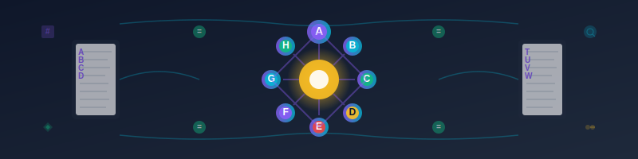

# 付録F 用語集

## A

### Abstract(抽象)
具体的な実装詳細を隠蔽し、本質的な特徴のみを表現すること。オブジェクト指向プログラミングでは、抽象クラスやインターフェースを用いて実現される。

### Accountability(説明責任)
書かれたソースコードについて、プログラマーがその意図や機能、存在理由を明確に説明できる状態。美しいコードの要件の一つ。

### Agile(アジャイル)
反復的で漸進的なソフトウェア開発手法。変化に対応しながら、顧客価値を継続的に提供することを重視する。

### Algorithm(アルゴリズム)
問題を解決するための手順や計算方法。効率性と正確性が重要な評価基準となる。

### API(Application Programming Interface)
アプリケーション間でデータや機能を連携させるためのインターフェース仕様。

### Architecture(アーキテクチャ)
システム全体の構造設計。コンポーネント間の関係や責務分担を定義する。

### Async/Await(非同期/待機)
非同期プログラミングを簡潔に記述するための言語機能。C#やJavaScriptなどで提供される。

## B

### Boolean(ブール値)
真(true)または偽(false)の二値を表すデータ型。条件判定に使用される。

### Bug(バグ)
プログラムの欠陥や不具合。予期しない動作や結果を引き起こす。

### Build(ビルド)
ソースコードから実行可能なプログラムを作成すること。コンパイル、リンク、テストを含む場合がある。

## C

### Camel Case(キャメルケース)
単語の境界を大文字で表現する命名規則。最初の文字は小文字(例:customerName)。

### CI/CD(継続的インテグレーション/継続的デプロイ)
- **CI**: コードの統合を継続的に行う手法
- **CD**: アプリケーションの継続的なデプロイを自動化する手法

### Class(クラス)
オブジェクト指向プログラミングにおけるオブジェクトの設計図。属性(プロパティ)と操作(メソッド)を定義する。

### Clean Code(クリーンコード)
読みやすく、理解しやすく、保守しやすいコード。Robert C. Martinが提唱する概念。

### Closure(クロージャ)
関数とそれを取り囲む環境(変数)を組み合わせた構造。関数型プログラミングの重要な概念。

### Cohesion(凝集度)
モジュール内の要素同士の関連の強さ。高凝集が理想的とされる。

### Complexity(複雑性)
ソフトウェアの理解や変更の困難さ。時間的複雑性と空間的複雑性がある。

### Constructor(コンストラクタ)
オブジェクト生成時に呼び出される特別なメソッド。初期化処理を行う。

### Coupling(結合度)
モジュール間の依存関係の強さ。疎結合(低結合)が理想的とされる。

## D

### Debugging(デバッグ)
プログラムのバグを発見し、修正すること。デバッガやログを使用して行う。

### Dependency Injection(依存性注入)
オブジェクトの依存関係を外部から注入する設計パターン。テスタビリティと柔軟性を向上させる。

### Design Pattern(デザインパターン)
よく発生する設計問題に対する再利用可能な解決策。Gang of Four(GoF)の23パターンが有名。

### Domain(ドメイン)
ソフトウェアが解決しようとする業務領域や問題領域。

### Domain-Driven Design(ドメイン駆動設計、DDD)
ドメインエキスパートと開発者が協力してドメインモデルを構築し、それを中心としてソフトウェアを設計する手法。

### DRY(Don't Repeat Yourself)
同じことを繰り返さない原則。重複を避けることで保守性を向上させる。

### DSL(Domain Specific Language)
特定のドメインの問題を解決するために設計されたプログラミング言語。

## E

### Encapsulation(カプセル化)
オブジェクトの内部実装を隠蔽し、外部からは公開されたインターフェースのみを通じてアクセスできるようにすること。

### Entity(エンティティ)
識別子を持つドメインオブジェクト。同じ識別子を持つエンティティは同一のものとして扱われる。

### Exception(例外)
プログラム実行中に発生する異常な状況。例外処理により適切に対応する必要がある。

## F

### Factory Pattern(ファクトリーパターン)
オブジェクトの生成処理を専用のクラス(ファクトリー)に委譲するデザインパターン。

### Feedback(フィードバック)
システムの出力を入力に戻すこと。プログラミングでは、テストやレビューによる品質向上メカニズム。

### Function(関数)
特定の処理を実行し、結果を返すコードブロック。純粋関数は副作用を持たない。

### Functional Programming(関数型プログラミング)
関数を第一級オブジェクトとして扱い、イミューターブルなデータ構造を重視するプログラミングパラダイム。

## G

### Generic(ジェネリック)
型パラメータを使用して、複数の型に対して同じコードを再利用できる仕組み。

### Git
分散型バージョン管理システム。ソースコードの履歴管理と複数人での協同開発を支援する。

## H

### High Cohesion(高凝集)
モジュール内の要素が密接に関連し、単一の明確な目的を持つ状態。設計の理想とされる。

### Hungarian Notation(ハンガリアン記法)
変数名の先頭に型や用途を示す接頭辞を付ける命名規則。現代では推奨されない場合が多い。

## I

### Immutable(イミューターブル)
作成後に状態を変更できないオブジェクト。関数型プログラミングで重視される概念。

### Inheritance(継承)
既存のクラスの特性を引き継いで新しいクラスを作成すること。is-a関係を表現する。

### Interface(インターフェース)
クラスが実装すべきメソッドの契約を定義する仕組み。実装の詳細は含まない。

### IoC(Inversion of Control)
制御の反転。オブジェクトの生成や依存関係の管理を外部のコンテナに委譲すること。

## J

### JSON(JavaScript Object Notation)
軽量なデータ交換フォーマット。Web APIでよく使用される。

## K

### KISS(Keep It Simple, Stupid)
シンプルで分かりやすい設計を心がける原則。複雑さを避けることを重視する。

## L

### Lambda Expression(ラムダ式)
無名関数を簡潔に記述するための構文。関数型プログラミングの要素の一つ。

### Legacy Code(レガシーコード)
古い技術で書かれた、または保守が困難なコード。段階的な改善が必要。

### LINQ(Language Integrated Query)
C#における統合クエリ機能。コレクションやデータベースに対する宣言的な操作を可能にする。

### Low Coupling(疎結合)
モジュール間の依存関係が少ない状態。変更の影響を局所化できる。

## M

### Memoization(メモ化)
計算結果をキャッシュして、同じ入力に対する再計算を避ける最適化技法。

### Method(メソッド)
クラス内で定義される関数。オブジェクトの操作や振る舞いを表現する。

### Microservices(マイクロサービス)
大きなアプリケーションを小さな独立したサービスに分割するアーキテクチャパターン。

### Model(モデル)
現実世界の概念やビジネスルールをプログラムで表現したもの。MVCパターンの一要素。

### Multi-paradigm Programming(マルチパラダイムプログラミング)
複数のプログラミングパラダイム(手続き型、オブジェクト指向、関数型等)を組み合わせること。

## N

### Name and Conquer(定義攻略)
複雑な問題に名前を付けることで理解しやすくする手法。

### Naming Convention(命名規則)
変数、メソッド、クラス等の名前付けに関する統一的なルール。

### Namespace(名前空間)
名前の衝突を避けるために、識別子を論理的にグループ化する仕組み。

### Null
値が存在しないことを表す特別な値。null参照例外の原因になりやすい。

## O

### Object(オブジェクト)
データ(属性)と処理(メソッド)を組み合わせた実体。クラスからインスタンス化される。

### Object-Oriented Programming(オブジェクト指向プログラミング、OOP)
オブジェクトを中心とした設計・実装手法。カプセル化、継承、ポリモーフィズムが特徴。

### Once And Only Once
同じ意図のコードが重複しないようにする原則。DRY原則と類似。

## P

### Package(パッケージ)
関連するクラスやインターフェースをまとめる仕組み。Javaの概念。

### Pair Programming(ペアプログラミング)
二人の開発者が一台のコンピュータで協力してプログラミングを行う手法。

### Pascal Case(パスカルケース)
各単語の先頭を大文字にする命名規則(例:CustomerName)。

### Pattern(パターン)
繰り返し発生する問題に対する再利用可能な解決策。デザインパターンが代表例。

### Polymorphism(ポリモーフィズム)
同じインターフェースで異なる実装を呼び出せる仕組み。オブジェクト指向の重要な特徴。

### Property(プロパティ)
オブジェクトの属性を表現し、アクセス制御を提供する仕組み。

## Q

### Quality(品質)
ソフトウェアの機能性、信頼性、保守性等の総合的な評価。

### Query(クエリ)
データベースやコレクションからデータを検索・取得するための要求。

## R

### Refactoring(リファクタリング)
外部の動作を変えずに、内部構造を改善すること。コードの品質向上が目的。

### Repository Pattern(リポジトリパターン)
データアクセスロジックをカプセル化し、ドメインロジックから分離するデザインパターン。

## S

### SOLID Principles(SOLID原則)
オブジェクト指向設計の5つの基本原則:
- **S**: Single Responsibility Principle(単一責務原則)
- **O**: Open/Closed Principle(開放閉鎖原則)
- **L**: Liskov Substitution Principle(リスコフの置換原則)
- **I**: Interface Segregation Principle(インターフェース分離原則)
- **D**: Dependency Inversion Principle(依存関係逆転原則)

### Service Oriented Naming(サービス指向名前付け、SON)
著者が提唱する概念。クライアント視点でプログラムの名前を決定する手法。

### Single Responsibility Principle(単一責務原則、SRP)
一つのクラスは一つの責務のみを持つべきという原則。変更理由は一つであるべき。

### Static(静的)
コンパイル時に決定される特性。インスタンス化せずにアクセスできるメンバ。

### Strategy Pattern(ストラテジーパターン)
アルゴリズムを交換可能にするデザインパターン。実行時に動作を変更できる。

## T

### TDD(Test-Driven Development)
テスト駆動開発。テストを先に書いてから実装を行う開発手法。

### Testable(テスタブル)
テストしやすい設計。依存関係が明確で、検証可能な構造を持つ。

### Think Simple
複雑さを避け、シンプルな解決策を選択する考え方。

## U

### Ubiquitous Language(ユビキタス言語)
ドメインエキスパートと開発者が共通して使用する言語。ドメイン駆動設計の重要な概念。

### Unit Test(単体テスト)
個々のモジュールやメソッドを独立してテストすること。

## V

### Value Object(値オブジェクト)
識別子を持たず、属性の値によって同一性が決まるオブジェクト。

### Variable(変数)
データを格納するための名前付きの記憶領域。

### Version Control(バージョン管理)
ソースコードの変更履歴を管理するシステム。Gitが代表例。

## W

### Workflow(ワークフロー)
業務プロセスを自動化するための処理の流れ。

## Y

### YAGNI(You Aren't Gonna Need It)
今必要でない機能は実装しない原則。過剰設計を避ける。

## その他の重要な概念

### 美しいソースコードのための七箇条
著者が提唱するコード品質の7つの原則:
1. 意図を表現
2. 単一責務の原則
3. 的確な名前付け
4. Once And Only Once
5. 的確に記述されたメソッド
6. ルールの統一
7. Testable

### 守破離(しゅはり)
日本の伝統的な技術習得の三段階:
- **守**: 基本的な型を忠実に守る
- **破**: 基本を習得した上で型を破り応用する
- **離**: 型から離れて独自の境地を開く

### フィードバックの最大化
開発プロセスにおいて、テストやレビューを通じてフィードバックを最速で得る原則。継続的改善の基盤となる。

---

この用語集は、本書で使用される技術用語と概念の理解を深めるために作成された。各用語は実際の開発現場で使用される文脈で説明されており、理論と実践の橋渡しの役割を果たす。プログラミングの学習と実践において、これらの用語を正確に理解し適切に使用することで、より効果的なコミュニケーションと品質の高いソフトウェア開発が可能になる。

---

**[← 目次に戻る](目次.md)**