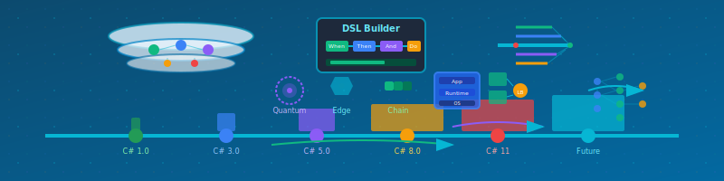
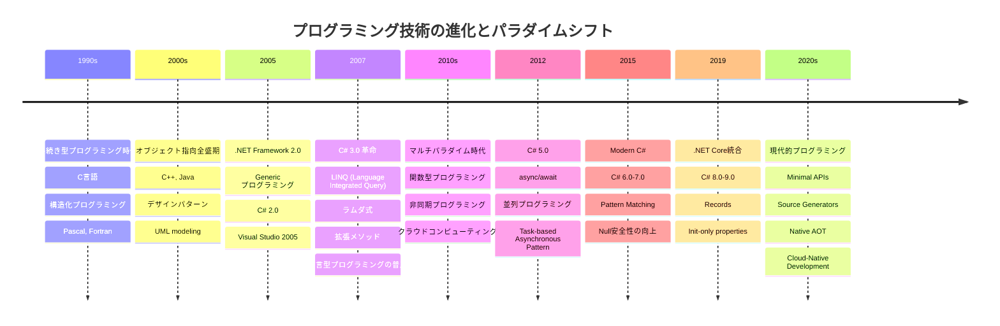

# 第10章 現代的なプログラミング技術と将来展望



## 章の概要

### この章の目的
プログラミング技術の進化が美しいコードの実現に与える影響を理解し、現代的な言語機能や開発手法を活用した次世代の開発アプローチを習得する。C#の進化を軸に、マルチパラダイム化、DSL活用、並列プログラミング、クラウドアーキテクチャなど、現代的技術と美しいコードの原則の統合を実現する。

### この章で学べること
- C#の進化過程と美しいコード実現への貢献
- ドメイン特化言語(DSL)による表現力の向上
- 並列プログラミングにおける複雑さ管理技法
- クラウド時代のアーキテクチャ設計原則
- 将来のプログラミング技術動向の予測と対応戦略
- 機械学習・AIとプログラミングパラダイムの融合
- 言語機能進化と設計思想の関係性

### なぜ技術進化を理解することが重要なのか
「新しい技術が次々と現れるが、どれが本当に価値があるのか分からない」「美しいコードの原則は時代と共に変わってしまうのではないか」──技術の急速な進歩に戸惑いを感じる開発者は多い。しかし、本質的な設計原則は不変であり、新しい技術はその原則をより自然に実現する手段を提供している。この章で得られる技術進化への洞察は、流行に惑わされることなく、本当に価値ある技術を見極め、美しいコードの理想を次世代の技術で実現する眼力を与えてくれる。

---

## 10.1 C#の進化とマルチパラダイム化

### 10.1.1 言語の進化と美しいコードの関係

プログラミング言語の進化は、**美しいソースコードのための七箇条**をより自然に実現することを可能にする。C#の進化を振り返ると、各バージョンアップが開発者の「意図を表現」することを支援し、「ノイズを減らす」ことに貢献してきたことがわかる。

**「言語は考え方のフレームワーク」**

人は言語によって考えることが多く、どのような言語を話すか、ということが考え方に大きな影響を与える。

プログラミング言語も同様で、どのようなプログラミング言語を用いるか、によって、プログラミングの時の考え方が大きく変わってくる。

言語の変化によって、プログラミングが影響を受ける。

>"if all you have is a hammer, Everything looks like a nail."<br>
>(金槌しか持っていなければ、全ての問題は釘に見えてくる)

という言葉がある。良い道具を選ぶことが大切である。

#### C# 技術進化タイムライン



#### C# パラダイムの進化概要

##### 1. 手続き型 → オブジェクト指向 (1990s - 2000s)
```
複雑性の管理手法の変化:
手続き分解 → オブジェクトとしての抽象化
```

##### 2. オブジェクト指向 → マルチパラダイム (2005 - 2010s) 
```
表現力の拡張:
単一パラダイム → 複数パラダイムの選択的適用
```

##### 3. C# 3.0における革新 (2007)

| 機能 | 従来の書き方 | C# 3.0以降 |
|------|--------------|------------|
| **コレクション操作** | foreach + if | LINQ Where |
| **匿名メソッド** | delegate(int x) { } | x => {} |
| **型推論** | List<Customer> customers | var customers |

###### C# 1.0からC# 3.0への進化

_[C#]_
```csharp
// C# 1.0時代: forループによる反復処理
List<string> validEmails = new List<string>();
for (int i = 0; i < emails.Count; i++)
{
    if (IsValidEmail(emails[i]))
    {
        validEmails.Add(emails[i]);
    }
}

// C# 3.0時代: LINQ による宣言的記述
var validEmails = emails.Where(IsValidEmail).ToList();
```

この例が示すように、LINQ導入により「何をしたいか(What)」に集中でき、forループのインデックス変数といった**ノイズが大幅に削減**された。これは参考資料で言及されている「SN比(意図とノイズの比)」の向上を具体的に実現している。

##### 4. 宣言型プログラミングの台頭

_[C#]_
```csharp
// 命令型(How): どうやってやるか
var result = new List<string>();
foreach (var customer in customers)
{
    if (customer.IsActive && customer.Region == "Asia")
        result.Add(customer.Name);
}

// 宣言型(What): 何をしたいか 
var result = customers
    .Where(c => c.IsActive && c.Region == "Asia")
    .Select(c => c.Name)
    .ToList();
```

##### 5. 非同期プログラミングの進化

_[C#]_
```csharp
// .NET 1.0-2.0 時代
IAsyncResult BeginOperation(AsyncCallback callback, object state);
void EndOperation(IAsyncResult result);

// .NET 4.0 Task時代 
Task<string> OperationAsync();

// .NET 4.5 async/await時代
async Task<string> OperationAsync() => await SomeOperationAsync();
```

##### 6. 現代的技術トレンド (2020s)
- **Cloud-Native**: マイクロサービス、コンテナ化
- **DevOps統合**: CI/CD、Infrastructure as Code
- **AIアシスト**: GitHub Copilot、Code Generation
- **型安全性**: Nullable Reference Types
- **パフォーマンス**: Native AOT、Span<T>

##### 将来展望 (2030s予測)

###### 技術トレンド
```
1. AIによるコード生成の普及
2. 量子コンピューティング対応
3. よりDeclarative(宣言的)な開発手法
4. ローコード/ノーコード統合
5. 自動テスト・自動リファクタリング
```

###### プログラミングパラダイムの進化
```
コード中心 → 意図中心
実装詳細 → ビジネス価値
How(どうやって) → What(何を) + Why(なぜ)
```

### 10.1.2 型推論とコードの簡潔性

_[C#]_
```csharp
// C# 2.0以前: 冗長な型宣言
Dictionary<string, List<CustomerOrder>> customerOrders =
    new Dictionary<string, List<CustomerOrder>>();

// C# 3.0以降: var による型推論
var customerOrders = new Dictionary<string, List<CustomerOrder>>();

// C# 9.0以降: さらなる簡潔性
Dictionary<string, List<CustomerOrder>> customerOrders = new();
```

型推論の導入は単なる構文糖衣ではない。**意図を表現する**という七箇条の第一原則において、開発者がビジネスロジックに集中し、技術的な詳細に注意を奪われることを防ぐ重要な機能である。

### 10.1.3 関数型プログラミングの導入

_[C#]_
```csharp
// 命令型スタイル
public decimal CalculateTotalPrice(List<Product> products)
{
    decimal total = 0;
    foreach (var product in products)
    {
        if (product.IsActive && product.Price > 0)
        {
            total += product.Price * (1 - product.DiscountRate);
        }
    }
    return total;
}

// 関数型スタイル(C# 3.0以降)
public decimal CalculateTotalPrice(List<Product> products) =>
    products
        .Where(p => p.IsActive && p.Price > 0)
        .Sum(p => p.Price * (1 - p.DiscountRate));
```

関数型アプローチは、**一度だけ書く(Once And Only Once)**という原則に従いながら、意図をより明確に表現することを可能にする。

## 10.2 DSL(ドメイン特化言語)の活用

### 10.2.1 DSLとモデリングの関係

参考資料では「ソースコードを書く」という行為が**モデリング**であると説明されている。DSL(Domain Specific Language)は、この考え方を極限まで推し進めた結果として登場する概念である。

> 「ドメイン特化言語の方が、汎用言語よりもよりピュアにモデルを記述できる可能性がある」

#### 内部DSLの例:Fluent Interface

_[C#]_
```csharp
// 従来の設定記述
var emailSettings = new EmailSettings();
emailSettings.SmtpServer = "smtp.example.com";
emailSettings.Port = 587;
emailSettings.UseSSL = true;
emailSettings.Username = "user@example.com";
emailSettings.Password = "password";

// DSLスタイルの設定記述
var emailSettings = EmailConfiguration
    .ForServer("smtp.example.com")
    .OnPort(587)
    .WithSSL()
    .AuthenticateWith("user@example.com", "password");
```

この例では、DSLにより**ドメインの概念がより自然に表現**され、設定の意図が格段に理解しやすくなっている。

### 10.2.2 C#における内部DSLの構築

_[C#]_
```csharp
// テストケース記述のためのDSL
public class EmailValidationTests
{
    [Test]
    public void EmailValidation_Should_SucceedForValidEmails()
    {
        // Given-When-Then パターンによるDSL
        Given.Email("test@example.com")
            .When.Validated()
            .Then.ShouldBeValid();
           
        Given.Email("user.name+tag@domain.co.jp")
            .When.Validated()
            .Then.ShouldBeValid();
    }
}

// DSLの実装例
public static class Given
{
    public static EmailTestContext Email(string email) =>
        new EmailTestContext(email);
}

public class EmailTestContext
{
    private readonly string email;
    private bool isValid;
   
    public EmailTestContext(string email) => this.email = email;
   
    public EmailTestContext When => this;
   
    public EmailTestContext Validated()
    {
        isValid = EmailValidator.IsValid(email);
        return this;
    }
   
    public EmailTestContext Then => this;
   
    public void ShouldBeValid() => Assert.IsTrue(isValid);
}
```

このDSLは、**的確な名前付け**と**ルールの統一**という七箇条の原則に従いながら、テストの意図を極めて自然に表現している。

## 10.3 並列プログラミングとスケーラビリティ

### 10.3.1 非同期プログラミングの美学

現代のソフトウェア開発において、並列処理と非同期処理は避けて通れない要素となった。C#のasync/awaitパターンは、複雑な非同期処理を**意図を表現する**コードとして記述することを可能にする。

_[C#]_
```csharp
// 同期処理(旧来のアプローチ)
public List<CustomerData> GetCustomerDataSync(List<int> customerIds)
{
    var results = new List<CustomerData>();
    foreach (var id in customerIds)
    {
        var customer = customerService.GetCustomer(id);        // ブロッキング
        var orders = orderService.GetOrders(id);               // ブロッキング
        var preferences = preferenceService.GetPreferences(id); // ブロッキング
       
        results.Add(new CustomerData(customer, orders, preferences));
    }
    return results;
}

// 非同期処理(現代のアプローチ)
public async Task<List<CustomerData>> GetCustomerDataAsync(List<int> customerIds)
{
    var tasks = customerIds.Select(async id =>
    {
        var customerTask = customerService.GetCustomerAsync(id);
        var ordersTask = orderService.GetOrdersAsync(id);
        var preferencesTask = preferenceService.GetPreferencesAsync(id);
       
        await Task.WhenAll(customerTask, ordersTask, preferencesTask);
       
        return new CustomerData(
            await customerTask,
            await ordersTask,
            await preferencesTask);
    });
   
    return (await Task.WhenAll(tasks)).ToList();
}
```

### 10.3.2 並列LINQの活用

_[C#]_
```csharp
// CPU集約的処理の並列化
public class DataProcessor
{
    private readonly double threshold = 0.7; // 閾値の定義
    
    public List<ProcessedData> ProcessLargeDataSet(List<RawData> rawData)
    {
        return rawData
            .AsParallel()
            .Where(data => data.IsValid)
            .Select(data => ProcessComplexCalculation(data))
            .Where(result => result.Score > threshold)
            .OrderByDescending(result => result.Score)
            .ToList();
    }
    
    private ProcessedData ProcessComplexCalculation(RawData data)
    {
        // 複雑な計算処理の実装
        return new ProcessedData { Score = data.Value * 1.5 };
    }
}
```

並列LINQは、**関心の分離**を実現しながら、パフォーマンスの向上も同時に達成する例である。処理の並列化という技術的な複雑さを隠蔽し、開発者はビジネスロジックに集中できる。

### 10.3.3 Channelによる生産者-消費者パターン

_[C#]_
```csharp
public class DataProcessingPipeline
{
    private readonly Channel<RawData> inputChannel;
    private readonly Channel<ProcessedData> outputChannel;
    private readonly IDataSource dataSource; // データソースの定義
   
    public DataProcessingPipeline(IDataSource dataSource)
    {
        this.dataSource = dataSource;
        
        var options = new BoundedChannelOptions(1000)
        {
            FullMode = BoundedChannelFullMode.Wait,
            SingleReader = false,
            SingleWriter = false
        };
       
        inputChannel = Channel.CreateBounded<RawData>(options);
        outputChannel = Channel.CreateBounded<ProcessedData>(options);
    }
   
    public async Task StartProcessingAsync(CancellationToken cancellationToken)
    {
        var producerTask = ProduceDataAsync(cancellationToken);
        var processorTask = ProcessDataAsync(cancellationToken);
        var consumerTask = ConsumeDataAsync(cancellationToken);
       
        await Task.WhenAll(producerTask, processorTask, consumerTask);
    }
   
    private async Task ProduceDataAsync(CancellationToken cancellationToken)
    {
        var writer = inputChannel.Writer;
        try
        {
            while (!cancellationToken.IsCancellationRequested)
            {
                var data = await dataSource.GetNextDataAsync(cancellationToken);
                if (data == null) break;
               
                await writer.WriteAsync(data, cancellationToken);
            }
        }
        finally
        {
            writer.Complete();
        }
    }
    
    private async Task ProcessDataAsync(CancellationToken cancellationToken)
    {
        var reader = inputChannel.Reader;
        var writer = outputChannel.Writer;
        
        try
        {
            await foreach (var data in reader.ReadAllAsync(cancellationToken))
            {
                var processed = new ProcessedData { Value = data.Value * 2 };
                await writer.WriteAsync(processed, cancellationToken);
            }
        }
        finally
        {
            writer.Complete();
        }
    }
    
    private async Task ConsumeDataAsync(CancellationToken cancellationToken)
    {
        var reader = outputChannel.Reader;
        
        await foreach (var data in reader.ReadAllAsync(cancellationToken))
        {
            // 処理済みデータの消費
            Console.WriteLine($"Processed: {data.Value}");
        }
    }
}
```

この例は、**単一責務の原則**に従いながら、複雑な並列処理を管理する方法を示している。各メソッドが明確な責務を持ち、全体として協調して動作する。

## 10.4 クラウド時代のアーキテクチャ

### 10.4.1 マイクロサービスと美しいコードの原則

クラウドネイティブなアプリケーション開発において、マイクロサービスアーキテクチャは**関心の分離**と**単一責務の原則**を、システムレベルで適用する手法として注目されている。

_[C#]_
```csharp
// モノリシックなアプローチ(従来)
public class OrderService
{
    public async Task<OrderResult> ProcessOrderAsync(Order order)
    {
        // 在庫確認
        var inventory = await inventoryRepository.CheckAvailabilityAsync(order.Items);
        if (!inventory.IsAvailable) return OrderResult.OutOfStock;
       
        // 決済処理
        var payment = await paymentService.ProcessPaymentAsync(order.Payment);
        if (!payment.IsSuccessful) return OrderResult.PaymentFailed;
       
        // 配送手配
        var shipping = await shippingService.ArrangeShippingAsync(order.DeliveryInfo);
       
        // 通知送信
        await notificationService.SendOrderConfirmationAsync(order.CustomerId);
       
        return OrderResult.Success;
    }
}

// マイクロサービスアプローチ(現代)
public class OrderOrchestrationService
{
    private readonly IInventoryService inventoryService;
    private readonly IPaymentService paymentService;
    private readonly IShippingService shippingService;
    private readonly INotificationService notificationService;
   
    public async Task<OrderResult> ProcessOrderAsync(Order order)
    {
        var workflow = OrderWorkflow
            .StartWith(order)
            .CheckInventory(inventoryService)
            .ProcessPayment(paymentService)
            .ArrangeShipping(shippingService)
            .SendNotification(notificationService);
           
        return await workflow.ExecuteAsync();
    }
}
```

### 10.4.2 イベント駆動アーキテクチャの実装

_[C#]_
```csharp
// ドメインイベントの定義
public record OrderPlaced(
    string OrderId,
    string CustomerId,
    List<OrderItem> Items,
    DateTime PlacedAt
) : IDomainEvent;

// イベントハンドラー
public class InventoryUpdateHandler : IEventHandler<OrderPlaced>
{
    private readonly IInventoryService inventoryService;
   
    public InventoryUpdateHandler(IInventoryService inventoryService)
    {
        this.inventoryService = inventoryService;
    }
   
    public async Task HandleAsync(OrderPlaced orderPlaced)
    {
        foreach (var item in orderPlaced.Items)
        {
            await inventoryService.ReserveInventoryAsync(
                item.ProductId,
                item.Quantity);
        }
    }
}

// イベントバスの実装
public class InMemoryEventBus : IEventBus
{
    private readonly Dictionary<Type, List<Func<object, Task>>> handlers = new();
   
    public void Subscribe<T>(IEventHandler<T> handler) where T : IDomainEvent
    {
        var eventType = typeof(T);
        if (!handlers.ContainsKey(eventType))
        {
            handlers[eventType] = new List<Func<object, Task>>();
        }
       
        handlers[eventType].Add(async (evt) => await handler.HandleAsync((T)evt));
    }
   
    public async Task PublishAsync<T>(T domainEvent) where T : IDomainEvent
    {
        var eventType = typeof(T);
        if (handlers.ContainsKey(eventType))
        {
            var tasks = handlers[eventType].Select(h => h(domainEvent));
            await Task.WhenAll(tasks);
        }
    }
}
```

### 10.4.3 クラウドリソースの抽象化

_[C#]_
```csharp
// クラウドストレージの抽象化
public interface ICloudStorage
{
    Task<string> UploadFileAsync(Stream fileStream, string fileName);
    Task<Stream> DownloadFileAsync(string fileId);
    Task DeleteFileAsync(string fileId);
}

// Azure Blob Storage実装
public class AzureBlobStorage : ICloudStorage
{
    private readonly BlobServiceClient blobServiceClient;
    private readonly string containerName;
   
    public AzureBlobStorage(string connectionString, string containerName)
    {
        this.blobServiceClient = new BlobServiceClient(connectionString);
        this.containerName = containerName;
    }
   
    public async Task<string> UploadFileAsync(Stream fileStream, string fileName)
    {
        var containerClient = blobServiceClient.GetBlobContainerClient(containerName);
        var blobClient = containerClient.GetBlobClient(fileName);
       
        await blobClient.UploadAsync(fileStream, overwrite: true);
        return blobClient.Uri.ToString();
    }
}

// AWS S3実装
public class AwsS3Storage : ICloudStorage
{
    private readonly AmazonS3Client s3Client;
    private readonly string bucketName;
   
    public AwsS3Storage(string accessKey, string secretKey, string bucketName)
    {
        this.s3Client = new AmazonS3Client(accessKey, secretKey, RegionEndpoint.USWest2);
        this.bucketName = bucketName;
    }
   
    public async Task<string> UploadFileAsync(Stream fileStream, string fileName)
    {
        var request = new PutObjectRequest
        {
            BucketName = bucketName,
            Key = fileName,
            InputStream = fileStream
        };
       
        await s3Client.PutObjectAsync(request);
        return $"https://{bucketName}.s3.amazonaws.com/{fileName}";
    }
}
```

このような抽象化により、**的確な名前付け**と**ルールの統一**を保ちながら、クラウドプロバイダーの違いを吸収できる。

## 10.5 将来のプログラミング技術動向

### 10.5.1 AIとコード生成の時代

人工知能の進歩により、コード生成ツールが実用レベルに達している現在、プログラマーの役割も変化している。しかし、**美しいソースコードのための七箇条**の重要性は、むしろ増している。

_[C#]_
```csharp
// AI生成コードの例(改善前)
public void ProcessData(List<object> data)
{
    for (int i = 0; i < data.Count; i++)
    {
        if (data[i] != null)
        {
            var item = data[i];
            // 複雑な処理...
        }
    }
}

// 人間による意図の明確化(改善後)
public void ProcessValidCustomerData(List<Customer> customers)
{
    var validCustomers = customers.Where(IsValidCustomer);
   
    foreach (var customer in validCustomers)
    {
        ProcessCustomerBusinessLogic(customer);
    }
}

private bool IsValidCustomer(Customer customer) =>
    customer != null &&
    !string.IsNullOrEmpty(customer.Email) &&
    customer.RegistrationDate <= DateTime.Now;
```

AIが生成するコードを、人間が**意図を表現する**ように改善することが、これからの重要なスキルとなる。

#### Vibe Codingの実践

「Vibe Coding」とは、AIとの自然言語対話によってプログラミングを行う新しいスタイルである。ここでも**美しいソースコードのための七箇条**が威力を発揮する。

_[C#]_
```csharp
// プロンプト例:
// "顧客の購買履歴から、リピート購入の可能性が高い顧客を特定し、
//  パーソナライズされたレコメンデーションを生成するシステムを作成してください"

// AI生成コード(初期版)
public class DataProcessor
{
    public void ProcessCustomerData(List<object> customers) { /* ... */ }
}

// 人間による意図の明確化
public class CustomerRetentionAnalyzer
{
    public PersonalizedRecommendation GenerateRecommendation(
        Customer customer, 
        PurchaseHistory history)
    {
        var purchasePatterns = AnalyzePurchasePatterns(history);
        var preferences = ExtractCustomerPreferences(customer);
        var recommendations = GeneratePersonalizedSuggestions(
            purchasePatterns, 
            preferences
        );
        
        return new PersonalizedRecommendation(customer.Id, recommendations);
    }
}
```

効果的なVibe CodingのためのAIプロンプト設計原則:

1. **具体的なドメイン語彙を使用する**
   - ❌ "データを処理する"
   - ✅ "顧客の購買パターンを分析する"

2. **責務の分離を明示する**
   - ❌ "全部やってくれる関数"
   - ✅ "分析、フィルタリング、出力をそれぞれ独立したメソッドに"

3. **型安全性を要求する**
   - ❌ "objectで汎用的に"
   - ✅ "CustomerやPurchaseHistoryなど具体的な型で"

4. **業務文脈を明確に伝える**
   - ❌ "計算してください"
   - ✅ "顧客満足度スコアを算出してください"

### 10.5.2 低コード・ノーコード開発の位置づけ

_[C#]_
```csharp
// 従来の手続き的記述
public class WorkflowEngine
{
    public async Task ExecuteApprovalWorkflowAsync(Document document)
    {
        // ステップ1: マネージャー承認
        var managerApproval = await GetManagerApprovalAsync(document);
        if (!managerApproval.IsApproved) return;
       
        // ステップ2: 法務確認
        var legalReview = await GetLegalReviewAsync(document);
        if (!legalReview.IsApproved) return;
       
        // ステップ3: 最終承認
        var finalApproval = await GetFinalApprovalAsync(document);
        if (finalApproval.IsApproved)
        {
            await PublishDocumentAsync(document);
        }
    }
}

// ワークフロー定義による宣言的記述
public class DeclarativeWorkflow
{
    public WorkflowDefinition CreateApprovalWorkflow() =>
        Workflow.Define("DocumentApproval")
            .StartWith<ManagerApprovalStep>()
            .Then<LegalReviewStep>()
            .Then<FinalApprovalStep>()
            .OnSuccess<PublishDocumentStep>()
            .Build();
}
```

低コード・ノーコード開発も、結局は**ドメイン特化言語**の一種として理解できる。重要なのは、どのようなレベルの抽象化を選択するかである。

### 10.5.3 量子コンピューティングとプログラミングパラダイム

_[C#]_
```csharp
// 古典的な最適化問題
public class ClassicalOptimization
{
    public Solution FindOptimalSolution(Problem problem)
    {
        var bestSolution = new Solution();
        var bestScore = double.MinValue;
       
        // 全探索(指数的計算量)
        foreach (var candidate in GenerateAllCandidates(problem))
        {
            var score = EvaluateSolution(candidate, problem);
            if (score > bestScore)
            {
                bestScore = score;
                bestSolution = candidate;
            }
        }
       
        return bestSolution;
    }
}

// 量子アルゴリズムの概念的表現
public class QuantumOptimization
{
    public Solution FindOptimalSolution(Problem problem)
    {
        return QuantumCircuit
            .Initialize(problem.Variables)
            .ApplySuperposition()
            .ApplyOptimizationOracle(problem.ObjectiveFunction)
            .ApplyAmplitudeAmplification()
            .Measure()
            .GetBestSolution();
    }
}
```

量子コンピューティングは新しいパラダイムを提供するが、**意図を表現する**という根本的な原則は変わらない。

## 10.6 実践演習:現代技術の統合

### 10.6.1 演習課題:リアルタイム分析システム

以下の要件を満たすシステムを、現代的な技術を使用して設計・実装せよ:

#### 要件
1. **リアルタイムデータ処理**: ストリーミングデータの即座な分析
2. **スケーラビリティ**: 負荷に応じた自動スケーリング
3. **耐障害性**: 部分的な障害に対する耐性
4. **保守性**: 美しいソースコードの七箇条に準拠

#### 実装例

_[C#]_
```csharp
// サポートインターフェースの定義
public interface IDataSource
{
    Task<RawData> GetNextDataAsync(CancellationToken cancellationToken);
}

public class RawData
{
    public double Value { get; set; }
    public bool IsValid { get; set; }
}

public class ProcessedData
{
    public double Value { get; set; }
    public double Score { get; set; }
}

// 1. ドメインモデルの定義
public record SensorReading(
    string SensorId,
    DateTime Timestamp,
    double Value,
    SensorType Type
);

public record AnalysisResult(
    string SensorId,
    DateTime AnalyzedAt,
    double AverageValue,
    double MaxValue,
    double MinValue,
    List<Anomaly> Anomalies
);

public record Anomaly(
    DateTime Timestamp,
    double ActualValue,
    double PredictedValue,
    AnomalyType Type
);

public enum SensorType { Temperature, Pressure, Humidity }
public enum AnomalyType { Statistical, Contextual, Collective }

// 2. 分析エンジンの抽象化
public interface IAnalysisEngine
{
    Task<AnalysisResult> AnalyzeAsync(IEnumerable<SensorReading> readings);
}

public interface IEventPublisher
{
    Task PublishAsync<T>(T eventData);
}

public record AnalysisCompleted(AnalysisResult Result);

// 3. ストリーム処理パイプライン
public class RealTimeAnalysisPipeline
{
    private readonly IAnalysisEngine analysisEngine;
    private readonly IEventPublisher eventPublisher;
    private readonly ILogger<RealTimeAnalysisPipeline> logger;
   
    public RealTimeAnalysisPipeline(
        IAnalysisEngine analysisEngine,
        IEventPublisher eventPublisher,
        ILogger<RealTimeAnalysisPipeline> logger)
    {
        this.analysisEngine = analysisEngine;
        this.eventPublisher = eventPublisher;
        this.logger = logger;
    }
   
    public async Task ProcessStreamAsync(
        IAsyncEnumerable<SensorReading> dataStream,
        CancellationToken cancellationToken)
    {
        await foreach (var batch in dataStream.Buffer(TimeSpan.FromSeconds(5))
                                             .WithCancellation(cancellationToken))
        {
            try
            {
                var groupedData = batch.GroupBy(r => r.SensorId);
               
                var analysisTask = groupedData.Select(async group =>
                {
                    var result = await analysisEngine.AnalyzeAsync(group);
                    await eventPublisher.PublishAsync(new AnalysisCompleted(result));
                    return result;
                });
               
                await Task.WhenAll(analysisTask);
            }
            catch (Exception ex)
            {
                logger.LogError(ex, "分析処理中にエラーが発生しました");
                // 障害の分離 - 1つのバッチの失敗が全体に影響しない
            }
        }
    }
}

// 4. 機械学習を用いた異常検知
public interface IMLModel
{
    Task<double[]> PredictAsync(SensorReading[] readings);
}

public class MLAnomalyDetectionEngine : IAnalysisEngine
{
    private readonly IMLModel model;
    private readonly double threshold = 2.0; // 異常検知の閾値
   
    public MLAnomalyDetectionEngine(IMLModel model)
    {
        this.model = model;
    }
   
    public async Task<AnalysisResult> AnalyzeAsync(IEnumerable<SensorReading> readings)
    {
        var values = readings.Select(r => r.Value).ToArray();
        var statistics = CalculateStatistics(values);
       
        var anomalies = await DetectAnomaliesAsync(readings);
       
        return new AnalysisResult(
            readings.First().SensorId,
            DateTime.UtcNow,
            statistics.Average,
            statistics.Max,
            statistics.Min,
            anomalies
        );
    }
   
    private async Task<List<Anomaly>> DetectAnomaliesAsync(IEnumerable<SensorReading> readings)
    {
        var predictions = await model.PredictAsync(readings.ToArray());
       
        return readings
            .Zip(predictions, (reading, prediction) => new { reading, prediction })
            .Where(x => Math.Abs(x.reading.Value - x.prediction) > threshold)
            .Select(x => new Anomaly(
                x.reading.Timestamp,
                x.reading.Value,
                x.prediction,
                AnomalyType.Statistical))
            .ToList();
    }
    
    private (double Average, double Max, double Min) CalculateStatistics(double[] values)
    {
        return (
            Average: values.Average(),
            Max: values.Max(),
            Min: values.Min()
        );
    }
}
```

### 10.6.2 現代技術における美しいコードの実現

この実装例では、以下のような現代的技術と美しいコードの原則が融合されている:

1. **意図を表現**: メソッド名とクラス名が明確にその目的を示している
2. **単一責務**: 各クラスが明確な責務を持っている
3. **的確な名前**: ドメインの概念が正確に名前に反映されている
4. **Once And Only Once**: 共通的な処理が適切に抽象化されている
5. **Testable**: 依存関係が注入可能で、テストしやすい構造になっている

_[C#]_
```csharp
// テストコード例
[Test]
public async Task ProcessStreamAsync_ShouldHandleNormalData()
{
    // Arrange
    var mockEngine = new Mock<IAnalysisEngine>();
    var mockPublisher = new Mock<IEventPublisher>();
    var mockLogger = new Mock<ILogger<RealTimeAnalysisPipeline>>();
   
    var pipeline = new RealTimeAnalysisPipeline(
        mockEngine.Object,
        mockPublisher.Object,
        mockLogger.Object);
   
    var testData = GenerateTestSensorReadings();
   
    // Act
    await pipeline.ProcessStreamAsync(testData, CancellationToken.None);
   
    // Assert
    mockEngine.Verify(e => e.AnalyzeAsync(It.IsAny<IEnumerable<SensorReading>>()),
                     Times.AtLeastOnce);
    mockPublisher.Verify(p => p.PublishAsync(It.IsAny<AnalysisCompleted>()),
                        Times.AtLeastOnce);
}
```

## まとめ

現代のプログラミング技術の進歩は目覚ましいが、**美しいソースコードのための七箇条**という根本的な原則は普遍的である。新しい技術やパラダイムも、この原則を実現するための**手段**として捉えることで、一貫した高品質なコードを書き続けることができる。

重要なのは、技術そのものに惑わされることなく、常に「**意図を表現**」し、「**単一責務**」を守り、「**的確な名前**」を付けることである。言語やフレームワークがどのように進化しようとも、これらの原則を軸とした開発を続けることで、保守性が高く、理解しやすい、真に美しいソースコードを作り続けることができるのである。

次章では、これまでに学んだすべての原則と技術を振り返り、継続的な学習と成長のための指針を示す。
