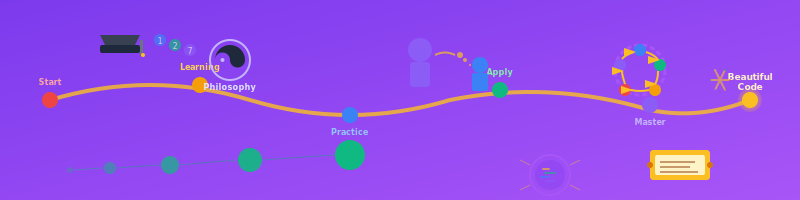

# 第11章 終わりに



## 章の概要

### この章の目的
美しいコードの原則を人生の指針として定着させ、継続的な学習と成長のためのフレームワークを構築する。プログラミングを単なる職業技能から、創造的で哲学的な活動として捉え直し、次世代の開発者に向けたメッセージを共有する。

### この章で学べること
- 美しいコードの原則の普遍性と時代を超えた価値
- 継続的学習の戦略と成長マインドセット
- フィードバック最大化による継続的改善サイクル
- プログラミングの哲学的側面と創造性
- 次世代開発者への知識継承の責任と方法
- 技術進歩の中で変わらない本質的価値の見極め
- 個人とチーム、そして業界全体への貢献の道筋

### プログラミング人生を変える最後のメッセージ
本書を通じて学んだ原則と技法は、単なる技術知識ではなく、あなたのプログラミング人生を支える哲学となる。美しいコードを追求する旅路に終わりはない──常に学び、常に改善し、常に次世代に伝える。この章では、あなたが歩むべき継続的成長の道筋と、プログラミングという創造活動の本質的価値を再確認する。技術者としての誇りと責任を胸に、美しいコードの理想を実現し続けるためのコンパスがここにある。

---

## 11.1 美しいコードへの道のり

この本を通じて、我々は**美しいソースコードのための七箇条**を軸として、プログラミングにおける様々な原則と技術を学んできた。ここで改めて、その道のりを振り返ってみよう。

### 11.1.1 原則の普遍性

第1章で提示した**美しいソースコードのための七箇条**は、特定の技術やフレームワークに依存しない普遍的な原則である。

> **美しいソースコードのための七箇条**
> 1. 意図を表現
> 2. 単一責務の原則
> 3. 的確な名前付け
> 4. Once And Only Once
> 5. 的確に記述されたメソッド
> 6. ルールの統一
> 7. Testable

これらの原則は、プログラミング言語が何であれ、開発している対象システムが何であれ、常に適用できる指針である。C#からPython、JavaからJavaScriptに至るまで、どの言語においても、これらの原則に従うことで品質の高いコードを書くことができる。

### 11.1.2 技術の進歩と不変の真理

第10章で見たように、プログラミング技術は絶えず進歩している。新しいパラダイム、新しいフレームワーク、新しいアーキテクチャパターンが次々と登場する。しかし、それらはすべて、より良いソフトウェアを、より効率的に開発するための**手段**に過ぎない。

_[C#]_
```csharp
// 1990年代のアプローチ
for (int i = 0; i < customers.Length; i++)
{
    if (customers[i].IsActive)
    {
        SendEmail(customers[i].Email);
    }
}

// 2000年代のアプローチ
foreach (Customer customer in customers)
{
    if (customer.IsActive)
    {
        SendEmail(customer.Email);
    }
}

// 2010年代のアプローチ
customers
    .Where(c => c.IsActive)
    .ToList()
    .ForEach(c => SendEmail(c.Email));

// 2020年代のアプローチ
await customers
    .Where(c => c.IsActive)
    .ToAsyncEnumerable()
    .ForEachAwaitAsync(async c => await SendEmailAsync(c.Email));
```

構文は変化しているが、「アクティブな顧客にメールを送信する」という**意図**は一貫している。どの時代のコードも、その時代なりに意図を表現しようとしている。

### 11.1.3 守破離の実践

**守破離の原則**は、プログラミング学習の道筋を示している。

#### 守(基本の習得)
最初は、基本的なパターンを忠実に守ることから始める。命名規則、コーディング規約、設計パターンなど、先人が築いた「型」を正確に習得する段階である。

_[C#]_
```csharp
// 守:基本パターンの習得
public class CustomerService
{
    private readonly ICustomerRepository repository;
   
    public CustomerService(ICustomerRepository repository)
    {
        this.repository = repository ?? throw new ArgumentNullException(nameof(repository));
    }
   
    public Customer GetCustomer(int customerId)
    {
        if (customerId <= 0)
            throw new ArgumentException("Customer ID must be positive", nameof(customerId));
           
        return repository.GetById(customerId);
    }
}
```

#### 破(応用と工夫)
基本を習得した後は、状況に応じてパターンを変化させ、より適切な解決策を見つける段階である。

_[C#]_
```csharp
// 破:状況に応じた応用
public class CustomerService
{
    private readonly ICustomerRepository repository;
    private readonly ILogger<CustomerService> logger;
    private readonly IMemoryCache cache;
   
    public async Task<Result<Customer>> GetCustomerAsync(CustomerId customerId)
    {
        if (customerId.IsEmpty)
            return Result<Customer>.Failure("Invalid customer ID");
           
        var cacheKey = $"customer_{customerId.Value}";
        if (cache.TryGetValue(cacheKey, out Customer cachedCustomer))
        {
            logger.LogDebug("Customer {CustomerId} retrieved from cache", customerId);
            return Result<Customer>.Success(cachedCustomer);
        }
       
        try
        {
            var customer = await repository.GetByIdAsync(customerId);
            if (customer != null)
            {
                cache.Set(cacheKey, customer, TimeSpan.FromMinutes(15));
            }
           
            return customer != null
                ? Result<Customer>.Success(customer)
                : Result<Customer>.NotFound("Customer not found");
        }
        catch (Exception ex)
        {
            logger.LogError(ex, "Error retrieving customer {CustomerId}", customerId);
            return Result<Customer>.Failure("Failed to retrieve customer");
        }
    }
}
```

#### 離(独自の境地)
最終的には、既存のパターンから離れて、問題に最適化された独自のアプローチを開発する段階に至る。

_[C#]_
```csharp
// 離:問題ドメインに特化した独自アプローチ
public class CustomerAggregateService
{
    public async Task<CustomerView> GetCustomerViewAsync(CustomerId customerId)
    {
        return await CustomerViewBuilder
            .ForCustomer(customerId)
            .WithBasicInfo(customerRepo)
            .WithOrderHistory(orderRepo, maxOrders: 10)
            .WithPreferences(preferenceRepo)
            .WithRecommendations(recommendationEngine)
            .BuildAsync();
    }
}
```

## 11.2 継続的な学習と成長

### 11.2.1 フィードバックの最大化

**フィードバックの最大化**は、継続的な成長のための鍵である。

_[C#]_
```csharp
// フィードバックループの実装例
public class DevelopmentFeedbackLoop
{
    public async Task<DevelopmentMetrics> ExecuteFeedbackCycleAsync(CodeChange change)
    {
        // 1. 即座のフィードバック(コンパイラ、IDE)
        var compileResult = await CompileCodeAsync(change);
        if (!compileResult.IsSuccess)
            return DevelopmentMetrics.CompilationFailed(compileResult.Errors);
       
        // 2. 自動テストによるフィードバック
        var testResult = await RunAutomatedTestsAsync(change);
        if (!testResult.IsSuccess)
            return DevelopmentMetrics.TestsFailed(testResult.FailedTests);
       
        // 3. 静的解析によるフィードバック
        var analysisResult = await RunStaticAnalysisAsync(change);
       
        // 4. コードレビューによるフィードバック
        var reviewResult = await SubmitForReviewAsync(change);
       
        return new DevelopmentMetrics(
            compileResult,
            testResult,
            analysisResult,
            reviewResult
        );
    }
}
```

### 11.2.2 知識のTestable化

「知識のTestable化」は、自分の理解度を客観的に測る重要な手法である。

#### テストケース1:説明できるか?
_[C#]_
```csharp
// ✗ 説明できない状態
public void SomeMethod()
{
    // なんとなく動いているコード
    var result = data.Where(x => x.Property > 0).Select(x => x.Value).Sum();
}

// ✓ 説明できる状態
public decimal CalculateTotalActiveCustomerValue()
{
    var activeCustomers = customers.Where(IsActiveCustomer);
    var customerValues = activeCustomers.Select(GetCustomerValue);
    return customerValues.Sum();
}

private bool IsActiveCustomer(Customer customer) =>
    customer.LastOrderDate > DateTime.Now.AddMonths(-6);
   
private decimal GetCustomerValue(Customer customer) =>
    customer.TotalOrderAmount;
```

#### テストケース2:現場で使えるか?
実際のプロジェクトで適用できない知識は、真の意味で理解しているとは言えない。理論と実践のギャップを埋める努力が重要である。

### 11.2.3 言語学習の戦略

言語は考え方のフレームワークである。複数の言語を学ぶことで、思考の幅を広げることができる。

_[Python]_
```python
# Python: 関数型アプローチの学習
def calculate_customer_metrics(customers):
    return {
        'total_customers': len(customers),
        'active_customers': sum(1 for c in customers if is_active(c)),
        'total_revenue': sum(c.total_spent for c in customers),
        'average_order_value': statistics.mean(c.average_order for c in customers if c.orders)
    }
```

_[JavaScript]_
```javascript
// JavaScript: 非同期処理の学習
const processCustomerData = async (customerIds) => {
    const customerPromises = customerIds.map(id =>
        fetchCustomerData(id).catch(err => ({ id, error: err }))
    );
   
    const results = await Promise.all(customerPromises);
   
    return results.reduce((acc, result) => {
        if (result.error) {
            acc.errors.push(result);
        } else {
            acc.customers.push(result);
        }
        return acc;
    }, { customers: [], errors: [] });
};
```

```go
// Go: 並行処理の学習
func ProcessCustomersAsync(customerIds []int) <-chan CustomerResult {
    results := make(chan CustomerResult, len(customerIds))
   
    var wg sync.WaitGroup
    for _, id := range customerIds {
        wg.Add(1)
        go func(customerId int) {
            defer wg.Done()
            customer, err := fetchCustomer(customerId)
            results <- CustomerResult{Customer: customer, Error: err}
        }(id)
    }
   
    go func() {
        wg.Wait()
        close(results)
    }()
   
    return results
}
```

## 11.3 プログラミングの哲学

### 11.3.1 モデリングとしてのプログラミング

プログラミングは単なる「コンピュータへの指示」ではない。それは**モデリング**、つまり現実世界の複雑さを抽象化し、理解可能な形で表現する行為である。

_[C#]_
```csharp
// ❌ 機械的な処理の羅列
public void ProcessOrder(int orderId)
{
    var order = GetOrderById(orderId);
    var customer = GetCustomerById(order.CustomerId);
    var items = GetOrderItems(orderId);
    var total = 0;
    foreach (var item in items)
    {
        total += item.Price * item.Quantity;
    }
    // ...続く処理
}

// ✅ ドメインモデルの表現
public void ProcessOrder(OrderId orderId)
{
    var order = orderRepository.GetById(orderId);
    var customer = customerRepository.GetById(order.CustomerId);
   
    var orderTotal = order.CalculateTotal();
    var paymentResult = paymentService.ProcessPayment(customer, orderTotal);
   
    if (paymentResult.IsSuccessful)
    {
        order.MarkAsPaid();
        shippingService.ArrangeShipping(order);
        notificationService.SendOrderConfirmation(customer);
    }
}
```

後者の例では、コードが**ビジネスドメインの言葉**で書かれており、そのコードを読むことで、注文処理のビジネスプロセスが理解できる。これこそが、モデリングとしてのプログラミングの真髄である。

### 11.3.2 複雑さとの永続的な戦い

ソフトウェア開発は、本質的に**複雑さとの戦い**である。エントロピーは時間とともに増大し、システムは複雑化する傾向にある。しかし、適切な原則と技法を用いることで、この複雑さを管理することができる。

#### 分割攻略(Divide and Conquer)
_[C#]_
```csharp
// 複雑な処理を分割
public class CustomerOnboardingOrchestrator
{
    public async Task<OnboardingResult> OnboardNewCustomerAsync(CustomerApplication application)
    {
        var validationResult = await ValidateApplicationAsync(application);
        if (!validationResult.IsValid)
            return OnboardingResult.ValidationFailed(validationResult.Errors);
           
        var verificationResult = await VerifyIdentityAsync(application);
        if (!verificationResult.IsVerified)
            return OnboardingResult.VerificationFailed(verificationResult.Reason);
           
        var setupResult = await SetupCustomerAccountAsync(application);
        if (!setupResult.IsSuccessful)
            return OnboardingResult.SetupFailed(setupResult.Error);
           
        await SendWelcomeMessageAsync(setupResult.Customer);
       
        return OnboardingResult.Success(setupResult.Customer);
    }
}
```

#### 定義攻略(Name and Conquer)
_[C#]_
```csharp
// 概念に名前を付けて明確化
public class CreditScoreCalculator
{
    public CreditScore CalculateScore(Customer customer)
    {
        var paymentHistory = customer.GetPaymentHistory();
        var creditUtilization = customer.GetCreditUtilization();
        var accountAge = customer.GetAccountAge();
        var creditMix = customer.GetCreditMix();
        var recentInquiries = customer.GetRecentCreditInquiries();
       
        return new CreditScore(
            paymentHistory: CalculatePaymentHistoryScore(paymentHistory),
            creditUtilization: CalculateCreditUtilizationScore(creditUtilization),
            accountAge: CalculateAccountAgeScore(accountAge),
            creditMix: CalculateCreditMixScore(creditMix),
            recentInquiries: CalculateRecentInquiriesScore(recentInquiries)
        );
    }
}
```

### 11.3.3 Think Simpleの実践

複雑な問題に対して「どうしよう」と悩むのではなく、複雑になるような羽目に陥らないようにし、常にシンプルに考えよう。

_[C#]_
```csharp
// ❌ 過度に複雑化された実装
public class AdvancedCustomerManagerWithMultipleResponsibilitiesAndComplexLogic
{
    public async Task<ComplexResult<CustomerDataTransferObjectWithAllProperties>>
        GetCustomerWithAllRelatedDataIncludingOrdersAndPreferencesAndRecommendationsAsync(
            CustomerIdentificationParameterObject parameters)
    {
        // 100行以上の複雑な処理...
    }
}

// ✅ シンプルで明確な実装
public class CustomerService
{
    public async Task<Customer> GetCustomerAsync(CustomerId customerId) =>
        await customerRepository.GetByIdAsync(customerId);
       
    public async Task<List<Order>> GetCustomerOrdersAsync(CustomerId customerId) =>
        await orderRepository.GetByCustomerIdAsync(customerId);
       
    public async Task<CustomerPreferences> GetCustomerPreferencesAsync(CustomerId customerId) =>
        await preferenceRepository.GetByCustomerIdAsync(customerId);
}
```

シンプルさは、理解しやすさ、テストしやすさ、保守しやすさにつながる。複雑な問題に対しても、シンプルな部品の組み合わせで解決することを心がけるべきである。

ただし、シンプルに考えることは、必ずしも容易なことではない。むしろ、プログラマーの腕の見せ所となるのだと思う。

**Simple ≠ Easy**


## 11.4 次世代への提言

### 11.4.1 AIとプログラマーの共存

現在、AI技術の発展により、コード生成やコード補完の精度が飛躍的に向上している。しかし、これはプログラマーの価値を下げるものではない。むしろ、プログラマーの本質的な価値が浮き彫りになる。

_[C#]_
```csharp
// AI生成コード(典型例)
public void ProcessData(List<object> data)
{
    foreach (var item in data)
    {
        if (item != null)
        {
            // 何らかの処理
            DoSomething(item);
        }
    }
}

// 人間による意図の明確化
public void ProcessValidCustomerFeedback(List<CustomerFeedback> feedbackList)
{
    var validFeedback = feedbackList.Where(IsValidFeedback);
   
    foreach (var feedback in validFeedback)
    {
        CategorizeFeedback(feedback);
        UpdateCustomerSatisfactionMetrics(feedback);
        TriggerFollowUpActionsIfNeeded(feedback);
    }
}
```

AIは構文的に正しいコードを生成できるが、ビジネスドメインの深い理解と、適切な抽象化レベルでの**意図の表現**は、依然として人間の領域である。

#### AIペアプログラミングの実践

AIをペアプログラミングのパートナーとして活用する際、本書の原則は以下のように適用される：

**1. プロンプト設計フェーズ**
```
// 効果的なプロンプト例
「顧客注文処理システムで、以下の責務を持つクラスを設計してください：
- 注文の妥当性検証
- 在庫確認と引当
- 支払い処理の調整
- 出荷指示の生成

各責務は独立したメソッドとし、Single Responsibility Principleに従ってください。
エラーハンドリングは例外ベースで、ドメイン固有の例外クラスを使用してください。」
```

**2. AIコードレビューフェーズ**
_[C#]_
```csharp
// AIが生成したコード
public class OrderManager
{
    public bool ProcessOrder(object order) { /* ... */ }
}

// 人間によるレビューと改善指示
「OrderManagerクラスは責務が曖昧です。
OrderValidatorとOrderProcessorに分離し、
型安全性のためobjectではなくOrder型を使用してください。
また、戻り値はResult<T>パターンで詳細な結果を返すようにしてください。」
```

**3. 継続的改善フェーズ**
_[C#]_
```csharp
// 改善サイクル
Human: "このメソッドはWhat(何をするか)ではなくHow(どうやるか)を表現しています。
        Name and Conquer技法を適用してリファクタリングしてください"

AI: "理解しました。複雑なロジックを意図を表現する小さなメソッドに分解します..."
```

このようなAIとの協働により、**人間は設計者・品質管理者**として、**AIは実装者・提案者**として、それぞれの強みを活かしたプログラミングが可能になる。

### 11.4.2 教育への提言

#### 新人技術者への指導

新人技術者への指導において最も重要なのは**名前付けの技法**である。

_[C#]_
```csharp
// ❌ 初心者によくある命名
public class DataManager
{
    public void ProcessData(object data)
    {
        var result = DoStuff(data);
        SaveData(result);
    }
}

// ✅ 指導後の改善版
public class CustomerRegistrationProcessor
{
    public void ProcessCustomerRegistration(CustomerRegistrationRequest request)
    {
        var validatedCustomer = ValidateCustomerInformation(request);
        var savedCustomer = SaveCustomerToDatabase(validatedCustomer);
        SendWelcomeEmail(savedCustomer);
    }
}
```

#### 段階的な学習プロセス
1. **基本構文の習得**: まずは言語の基本構文を確実に覚える
2. **命名の重要性の理解**: 適切な名前付けの技法を身につける
3. **設計原則の学習**: SOLID原則などの基本的な設計原則を学ぶ
4. **パターンの習得**: よく使われる設計パターンを覚える
5. **実践とフィードバック**: 実際のプロジェクトで実践し、フィードバックを得る

### 11.4.3 技術者としての成長マインドセット

#### 継続的な改善(カイゼン)
_[C#]_
```csharp
// Version 1.0: 動作する最小限の実装
public bool ValidateEmail(string email)
{
    return email.Contains("@");
}

// Version 2.0: より厳密な検証
public bool ValidateEmail(string email)
{
    if (string.IsNullOrEmpty(email))
        return false;
       
    var emailRegex = new Regex(@"^[^@\s]+@[^@\s]+\.[^@\s]+$");
    return emailRegex.IsMatch(email);
}

// Version 3.0: 包括的な検証
public ValidationResult ValidateEmail(EmailAddress email)
{
    if (email == null)
        return ValidationResult.Failure("Email address is required");
       
    if (string.IsNullOrWhiteSpace(email.Value))
        return ValidationResult.Failure("Email address cannot be empty");
       
    if (!EmailFormatValidator.IsValidFormat(email.Value))
        return ValidationResult.Failure("Email address format is invalid");
       
    if (DisposableEmailChecker.IsDisposableEmail(email.Value))
        return ValidationResult.Warning("Disposable email address detected");
       
    return ValidationResult.Success();
}
```

#### 失敗からの学習
プログラミングにおいて、失敗は避けられない。重要なのは、失敗から学び、同じ過ちを繰り返さないことである。

_[C#]_
```csharp
// 失敗例から学んだ教訓
public class LearningFromFailures
{
    // 教訓1: null チェックの重要性
    public string FormatCustomerName(Customer customer)
    {
        if (customer == null)
            throw new ArgumentNullException(nameof(customer));
           
        if (string.IsNullOrEmpty(customer.FirstName) || string.IsNullOrEmpty(customer.LastName))
            return "Unknown Customer";
           
        return $"{customer.LastName}, {customer.FirstName}";
    }
   
    // 教訓2: 例外処理の適切な実装
    public async Task<ApiResponse<Customer>> GetCustomerAsync(int customerId)
    {
        try
        {
            var customer = await customerService.GetCustomerAsync(customerId);
            return ApiResponse<Customer>.Success(customer);
        }
        catch (CustomerNotFoundException ex)
        {
            logger.LogWarning(ex, "Customer {CustomerId} not found", customerId);
            return ApiResponse<Customer>.NotFound("Customer not found");
        }
        catch (Exception ex)
        {
            logger.LogError(ex, "Unexpected error retrieving customer {CustomerId}", customerId);
            return ApiResponse<Customer>.Error("An unexpected error occurred");
        }
    }
}
```

## まとめ:美しいコードへの永続的な旅

この本の最後に至って明確になるのは、**美しいコードを書くことは目的地ではなく、旅である**ということだ。技術は絶えず進歩し、要件は変化し、我々の理解も深まっていく。しかし、その変化の中にあっても、以下の原則は変わることがない:

### 永続的な原則

1. **意図を明確に表現すること**
2. **単一の責務に集中すること**
3. **適切な名前を付けること**
4. **重複を避けること**
5. **適切な抽象化レベルを選択すること**
6. **一貫性を保つこと**
7. **検証可能であること**

### 継続的な実践

_[C#]_
```csharp
// 美しいコードへの旅は続く
public class ProgrammerJourney
{
    public async Task<Programmer> ContinueLearningAsync(Programmer currentSelf)
    {
        var improvedSelf = currentSelf;
       
        while (true)
        {
            var newKnowledge = await LearnSomethingNewAsync();
            var practicalExperience = await ApplyKnowledgeAsync(newKnowledge);
            var feedback = await GetFeedbackAsync(practicalExperience);
           
            improvedSelf = improvedSelf
                .Incorporate(newKnowledge)
                .Learn(practicalExperience)
                .Improve(feedback);
               
            await ShareKnowledgeAsync(improvedSelf.GetLearnings());
        }
    }
}
```

### 最後のメッセージ

プログラミングは、論理と創造性が交差する稀有な分野である。我々が書くコードは、単なる命令の羅列ではない。それは、我々の思考プロセスの結晶であり、問題解決へのアプローチの表現であり、そして未来の開発者への贈り物である。

**美しいソースコードのための七箇条**を心に刻み、**フィードバックの最大化**を実践し、**継続的な改善**を心がけることで、我々は単なるプログラマーを超えて、真の**ソフトウェア職人**となることができる。

これからも、美しいコードを追求する旅を続けていこう。その旅路で出会うすべての課題が、我々をより良い技術者に成長させてくれるはずである。

**「システムの品質はコードに宿る」**

この言葉を胸に、今日もまた、美しいコードを書き続けよう。
