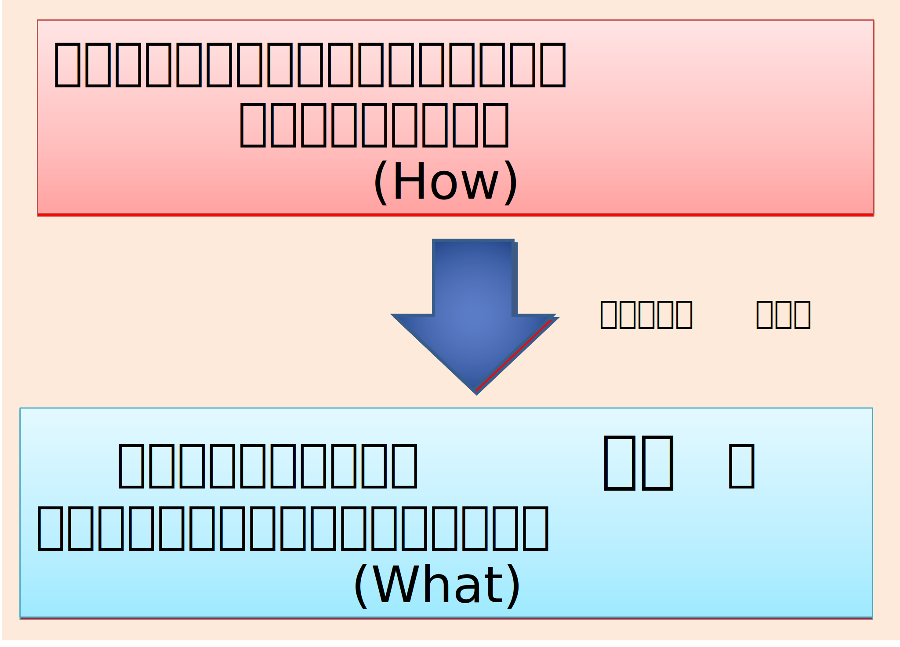
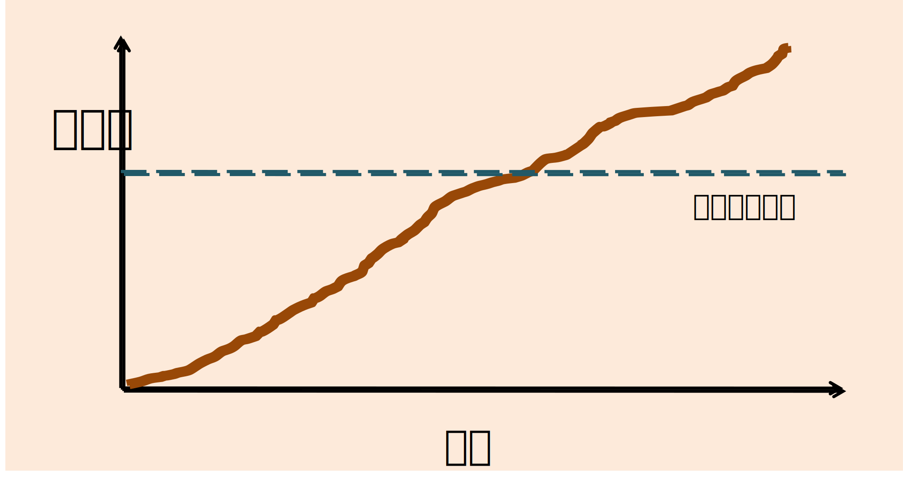
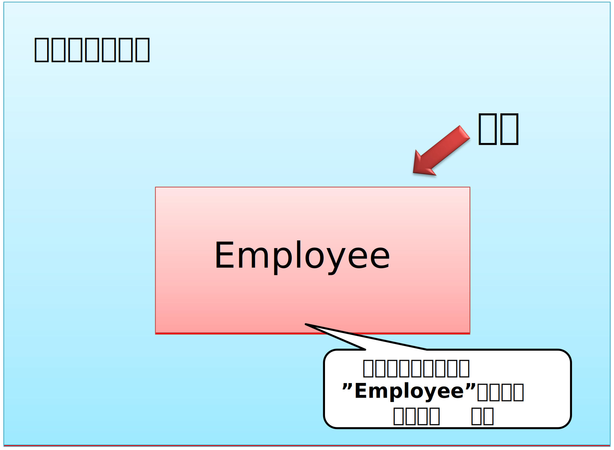
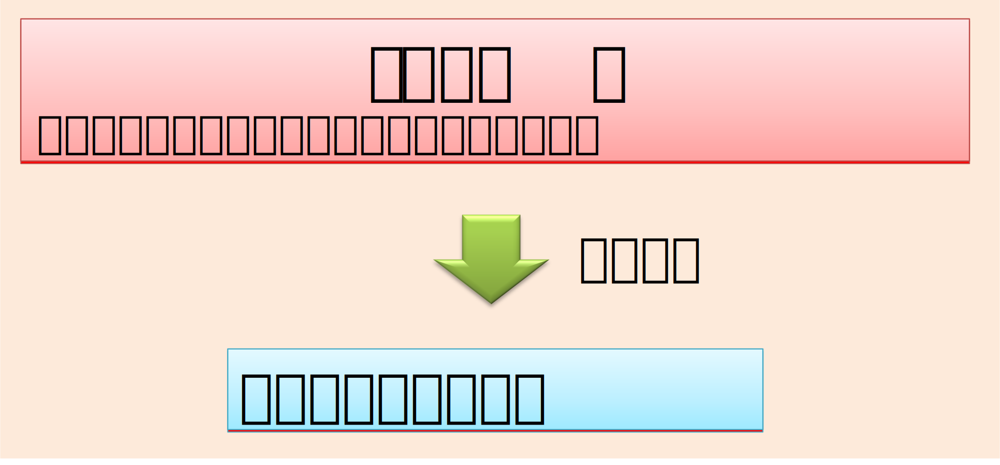
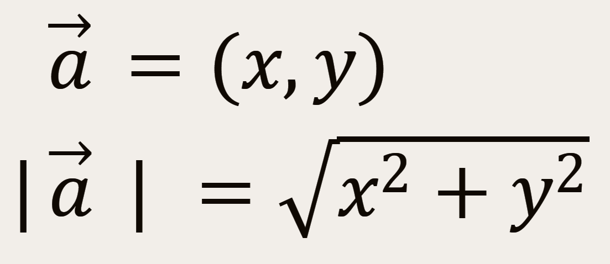
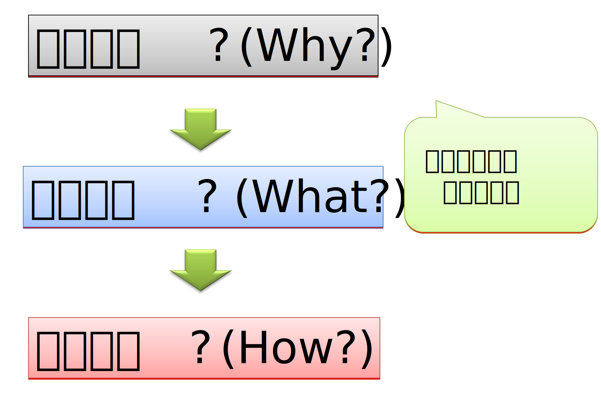
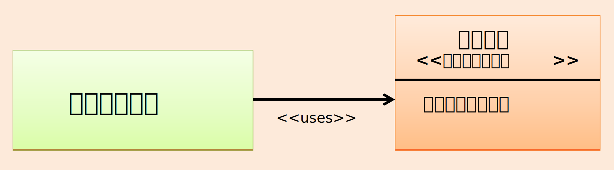
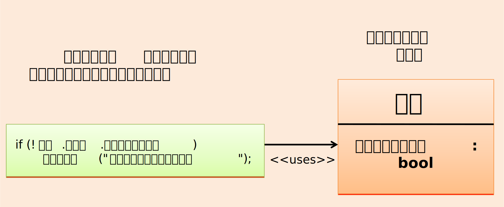
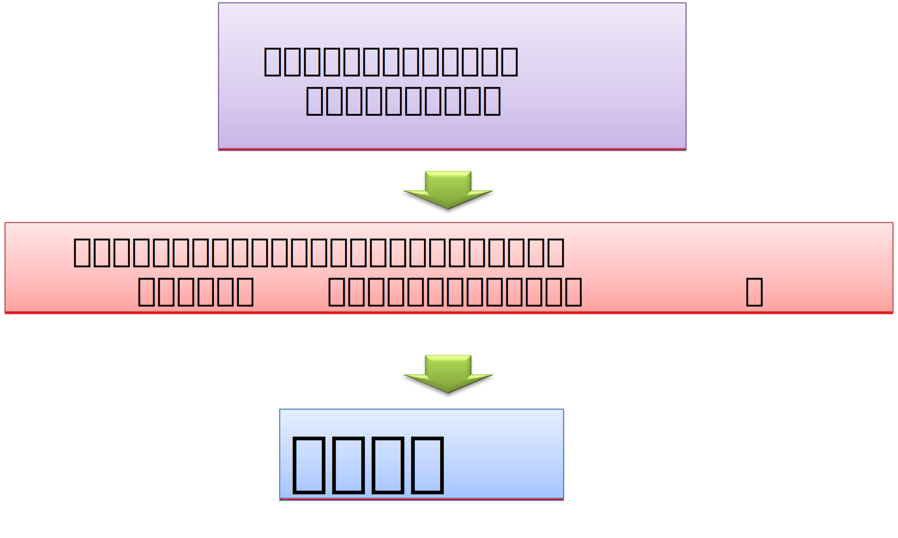
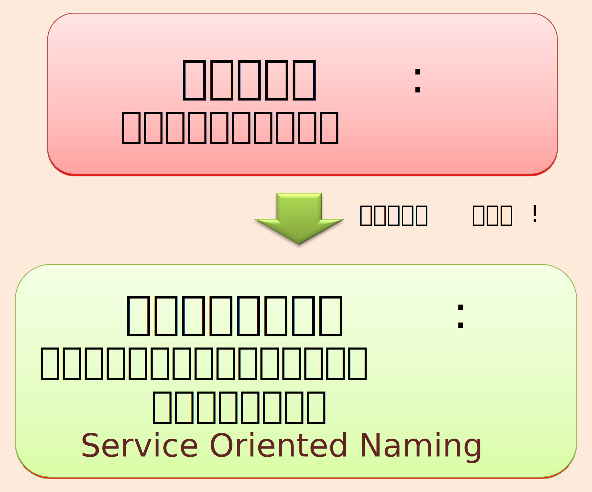

# 第2章 命名の重要性とベストプラクティス


## 章の概要

### この章の目的
プログラミングにおける命名の本質的な重要性を理解し、単なる識別子の選択を超えた「モデリングの核心」としての命名技法を習得する。Ruby作者のまつもとゆきひろ氏が「名前重要。」と断言する理由を深く理解し、実践的な命名スキルを身につける。

### この章で学べること
- 命名とモデリングの密接な関係性
- 「Name and Conquer(定義攻略)」という革新的な問題解決技法
- サービス指向名前付け(SON)による効果的な設計手法
- 語彙(vocabulary)を整えることによる思考の明確化
- 命名のアンチパターンとその対策法
- 分析モデル、設計モデル、実装モデル間の一貫性維持技法

### なぜ命名がこれほど重要なのか
「`tmpWork`や`flg`といった意味不明な変数名を見るたびに、なぜこうなってしまうのか?」あなたもこんな経験があるはずである。命名は、コードの複雑さが最初に現れる場所である。この章で学ぶ命名技法は、単にコードを読みやすくするだけではない。思考を整理し、設計を明確にし、チーム開発における認識の齟齬を解決する強力な武器となる。優れた名前は、優れた設計への第一歩なのである。

---

## 2.1 説明責任(Accountability)

プログラミングでは、意図を伝えることが重要である。


例を見てみよう。

次のような日付チェックをしたいとする。

例. 「日付チェック」
- ○ 2007/02/14
- × 2007/13/32
- × 2007/02/29
- × 2100/02/29
- ○ 2000/02/29

1つ目のプログラムは、こんな感じである。

例 1. 「日付チェック (1)」

_[C#]_
```csharp
static void ChkFunc2(int y, int m, int d)
{
    string txt = "エラー: 日付が正しくありません。";
    if (y < 1)
        Console.WriteLine(txt);
    else if (m < 1 || m > 12)
        Console.WriteLine(txt);
    else if (m == 2) {
        if (y % 4 == 0 && y % 100 != 0 || y % 400 == 0)  {
            if (d < 1 || d > 29)
                Console.WriteLine(txt);
        } else {
            if (d < 1 || d > 28)
                Console.WriteLine(txt);
        }
    } else if (m == 4 || m == 6 || m == 9 || m == 11) {
        if (d < 1 || d > 30)
            Console.WriteLine(txt);
    } else {
        if (d < 1 || d > 31)
            Console.WriteLine(txt);
    }
}
```

_[C#]_
```csharp
int y, m, d;
GetDat(out y, out m, out d);
ChkFunc2(y, m, d);
```

どうだろうか? 意図がシンプルに表現されているだろうか?

2つ目のプログラムを見てみよう。

例 2. 「日付チェック (2)」

_[C#]_
```csharp
public class 日付
{
    public int 年 { get; init; } = 2000;
    public int 月 { get; init; } =    1;
    public int 日 { get; init; } =    1;

    public bool 日付として正しい => 年が正しい && 月が正しい && 日が正しい;

    bool 年が正しい => 年 >= 1;

    bool 月が正しい => 月 >= 1 && 月 <= 12;

    bool 日が正しい => 日 >= 1 && 日 <= 月の最終日;

    int 月の最終日 => 月 switch {
        2                 => 二月の最終日,
        4 or 6 or 9 or 11 => 30,
        _                 => 31
    };

    int 二月の最終日 => うるう年か ? 29 : 28;

    bool うるう年か => 年 % 4 == 0 && 年 % 100 != 0 || 年 % 400 == 0;
}
```

どうだろうか? どちらの意図が明確だろうか。

ソースコードは次のことが重要である:
- 意図が明確であること
- 何がやりたいのか?
- 責務の範囲が明確であること
- 何をする?
- 何をしない?

ソースコードが、自らそれらを語るように書こう。**アフォーダンス**(affordance)という言葉でも表現できるかもしれない。
- ソースコードは設計を語るべき
- ソースコードは意図を語るべき

ソースコード自身が**説明責任**を果たすように記述しよう。

## 2.2 命名はモデリングの核心

### 2.2.1 命名とモデリングの関係

「**名前重要。**」

プログラミングにおいて命名は根本的に重要である。Ruby の作者のまつもとゆきひろ氏 (Matz) も「プログラマが知るべき97のこと」という書籍の中で「名前重要」という言葉を使っている。

命名は単なる識別子の選択ではない。それは**モデリングの中心的な行為**である。プログラミングにおけるモデリングとは、現実世界の複雑さから必要な要素を抽出し、コンピュータで扱える形に抽象化することである。

#### よくない名前の例
- int i, i2, i3;    意図がない
- tmpWork           内容物を表していない
- lclusrdafName     読みにくい
- bool flg = false; 一体何のフラグか分らない

### 2.2.2 「プログラミング」という行為はモデリング

「プログラミング」という行為を次のように定義したい:

> 「プログラミング」という行為は**設計+実装+テスト**である

これは単純なコーディング作業ではなく、**検証可能な設計/実装モデル**を作成する知的活動である。このモデルは以下の特徴を持つ:

1. **人間が理解できる**:開発者が意図を把握できる
2. **機械が実行できる**:コンピュータが処理できる
3. **検証可能である**:テストによって正しさを確認できる

そして、人間が理解しやすいのは、人の「頭の中のモデルにもっとも近いもの」である。

「意図をもっとも自然に、頭の中で表現するとどうなる」が、「その人のモデル」であり、その人にとって分かりやすいものになる。

### 2.2.3 モデルとしてのソースコード

ソフトウェア開発には複数のモデルが存在する:

#### 分析モデル(Analysis Model)
- **目的**:顧客の問題領域を理解する
- **視点**:ビジネス要求、ユーザーのニーズ
- **表現**:要求仕様書、ユースケース図

#### 設計モデル(Design Model)
- **目的**:ITの世界での解決策を設計する
- **視点**:アーキテクチャ、コンポーネント設計
- **表現**:クラス図、シーケンス図

#### 実装モデル(Implementation Model)
- **目的**:具体的な動作するシステムを構築する
- **視点**:プログラミング言語による実装
- **表現**:ソースコード

これらのモデル間で**一貫性**を保つことが重要であり、命名はその一貫性を保つ最も重要な手段である。

_[C#]_
```csharp
// 分析モデルの概念をそのまま実装モデルに反映
public class Customer  // 顧客という分析モデルの概念
{
    public void PlaceOrder(Product product)  // 注文するという業務行為
    {
        var order = new Order(this, product);  // 注文という業務概念
        order.Submit();  // 提出するという業務プロセス
    }
}
```

### 2.2.4 関心の分離(Separation of Concerns)

モデリングの基本原理は**関心の分離**である。複雑なシステムから特定の関心事を切り出し、それぞれを独立して扱うことで複雑さを管理する。

_[C#]_
```csharp
// 悪い例:複数の関心事が混在
public class OrderProcessor
{
    public void ProcessOrder(string orderData)
    {
        // データ解析の関心事
        var parts = orderData.Split(',');
       
        // ビジネスルールの関心事
        if (decimal.Parse(parts[2]) > 1000)
        {
            // データ永続化の関心事
            SaveToDatabase(parts);
           
            // 通知の関心事
            SendEmail(parts[0]);
        }
    }
}
```

_[C#]_
```csharp
// 良い例:関心事を分離
public class OrderProcessor
{
    private readonly IOrderParser _parser;
    private readonly IOrderValidator _validator;
    private readonly IOrderRepository _repository;
    private readonly INotificationService _notificationService;
   
    public void ProcessOrder(string orderData)
    {
        var order = _parser.Parse(orderData);      // データ解析
        _validator.Validate(order);               // ビジネスルール
        _repository.Save(order);                  // データ永続化
        _notificationService.NotifyCustomer(order); // 通知
    }
}
```

## 2.3 Name and Conquer:定義攻略の技法

### 2.3.1 Name and Conquerの概念

ソフトウェア開発は複雑さとの戦いの連続である。

時間とともにソフトウェアのエントロピーは増大する傾向にある。


ソフトウェア開発の複雑さに対処するための基本戦略は2つある:

1. **Divide and Conquer(分割攻略)**:大きな問題を小さな問題に分割する
2. **Name and Conquer(定義攻略)**:注目すべきものを見つけて名前を付ける

Name and Conquer: 
-「ある注目すべきもの」を見つけ、それに名前を付ける
- 概念を切り出す。ある概念を「他のものから」切り分ける。

名前を付けることは、概念を確定させることである。

例えば、クラス/オブジェクト/メソッドを作り、それに名前を付けるということは、プログラムにおける或る範囲の概念とそれ以外の間の境界を決めることである。

境界を決めるということは、

- それは何か?
- それは何でないか?

を決めるということである。

例えば、或るクラスに “Employee" という名前を付けるということは、

- 「システムの中のこの範囲の概念を  “Employee" と呼ぶことにする」ということ
  - システム全体という混沌の中から “Employee" という概念を切り出す
  - “Employee" とそれ以外との間に境界を与え、“Employee" の概念の範囲を決める
  -「Employee なもの」と「それ以外」を決定



そうして “Employee" という名前付けによって、概念が認識できるようになる。これは、暗黙知の形式知化であるとも言えるであろう。


### 2.3.2 概念の確定と境界設定

名前を付けるということは、システム全体という「混沌」の中から特定の概念を切り出し、その概念の範囲を確定させる行為である。

_[C#]_
```csharp
// 混沌とした状態:責務が不明確
public class SystemManager
{
    public void DoWork(object input)
    {
        // 何をするクラスなのか不明
        // 何を受け取るメソッドなのか不明
    }
}
```

_[C#]_
```csharp
// 概念を確定:責務が明確
public class CustomerOrderValidator  // 「顧客注文検証」という概念を確定
{
    public ValidationResult Validate(CustomerOrder order)  // 境界を明確に設定
    {
        // この範囲の概念を「CustomerOrderValidator」と呼ぶことを定義
        // 「顧客注文検証」に関することと「それ以外」の境界が明確
    }
}
```

### 2.3.3 概念の抽象化レベル

Name and Conquerを効果的に適用するには、**適切な抽象化レベル**で概念を切り出すことが重要である。抽象化レベルが高すぎると概念が曖昧になり、低すぎると実装の詳細に縛られてしまう。

_[C#]_
```csharp
// 抽象化レベルが高すぎる例:概念が曖昧
public class DataProcessor  // 何のデータを処理するのか不明
{
    public void Process(object data) { }  // 何をする処理なのか不明
}

// 抽象化レベルが低すぎる例:実装詳細に縛られている
public class SqlServerCustomerTableSelecter  // データベースの実装詳細を含む
{
    public DataTable SelectFromCustomerTable(string sql) { }  // SQL実行に特化しすぎ
}

// 適切な抽象化レベルの例
public class CustomerRepository  // ドメイン概念を適切に表現
{
    public Customer FindById(int customerId) { }  // ビジネス操作を表現
    public void Save(Customer customer) { }       // 実装詳細は隠蔽
}
```

**適切な抽象化レベルの指針:**
- **ドメイン概念**: ビジネス領域の自然な概念に対応
- **操作の意図**: 技術的な手段ではなく、何をしたいかを表現
- **実装非依存**: 特定の技術や実装方法に依存しない

### 2.3.4 名前による責務の限定

適切な名前は、そのコンポーネントが**何をするか**と同時に**何をしないか**を明確にする。

_[C#]_
```csharp
// 名前による責務の限定の例
public class PriceCalculator  // 価格計算に責務を限定
{
    public decimal CalculateTotal(List<OrderItem> items)
    {
        // 価格計算に関することのみを実装
        // データ保存や通知は責務外
        return items.Sum(item => item.Price * item.Quantity);
    }
   
    // 以下のようなメソッドは責務外なので含めない
    // void SaveOrder(Order order)  ← データ保存は別の責務
    // void SendEmail(string email)  ← 通知も別の責務
}
```

### 2.3.5 概念階層の構築

Name and Conquerを適用することで、概念の階層構造を構築できる:

_[C#]_
```csharp
// 概念階層の例
namespace OrderManagement  // 注文管理という大きな概念
{
    // 注文処理という中レベルの概念
    public class OrderProcessor
    {
        private readonly OrderValidator _validator;     // 注文検証という小さな概念
        private readonly PriceCalculator _calculator;   // 価格計算という小さな概念
        private readonly InventoryChecker _inventory;   // 在庫確認という小さな概念
    }
   
    // 各概念がさらに細かい概念に分解される
    public class OrderValidator
    {
        private readonly CustomerValidator _customerValidator;  // 顧客検証
        private readonly ProductValidator _productValidator;    // 商品検証
        private readonly PaymentValidator _paymentValidator;    // 支払い検証
    }
}

```

## 2.4 名前付けで 語彙 (vocabulary) を整える

型やメソッド、変数を作るときに、適切な名前を付ける。そうすることで、プログラムの一部を抽象化し、部品として扱えるようにする。そして、それらでプログラムを記述できるようにする。つまり、型やメソッド、変数が、プログラムを記述するための語彙になるのである。

設計で重要な行為が、この「プログラムを記述する語彙を作る作業」である。クラスやメソッド、変数を設計するときに、関心事を切り出して (或いは分割して) 名前を付ける。それは、プログラムを記述する語彙を作ってることになる。名前付けによって、語彙を整えるのである。

**「どんな語彙で記述したいか」**

プログラムをどういう語彙で記述したいか、という基準で型やメソッド、変数を切り出すようにする。

例えば、

_[C#]_
```csharp
if (name.Length > 0) …
```

ではなく、

_[C#]_
```csharp
if (IsValid(name)) …
```

とわざわざ IsValid メソッドを作ってまで書くのは、「このロジックをその語彙で書きたい」時、つまり「その抽象度で書きたい」時である。

「では、どの抽象度で書きたいのか?」といえば、それは「人がそれを記述するときにもっとも自然な抽象度」ということになる。例えば、「最寄りの空港に行く」というメソッド内部は、それを自然言語で「もっとも簡潔に」記述するときの粒度で書きたい。

何故かというと、「それが我々には解りやすい」からである。

### 例. 三角形

三角形の周囲(周の長さ)を求めるプログラムを例にあげてみよう。
三角形の周囲は、3辺の長さの合計であり、各辺の長さは、「三平方の定理(ピタゴラスの定理)」で求められる。

最初のサンプルは、次のものである。

_[C#]_
```csharp
public static double GetTrianglePerimeter(double x1, double y1, double x2, double y2, double x3, double y3)
    => Math.Sqrt((x1 - x2) * (x1 - x2) + (y1 - y2) * (y1 - y2)) +
        Math.Sqrt((x2 - x3) * (x2 - x3) + (y2 - y3) * (y2 - y3)) +
        Math.Sqrt((x3 - x1) * (x3 - x1) + (y3 - y1) * (y3 - y1));
```

次では、このメソッドを使って、三角形の周囲を求めている:

_[C#]_
```csharp
var perimeter = GetTrianglePerimeter(x1: 1.0, y1: -1.0, x2: 5.0, y2: -1.0, x3: 5.0, y3: 2.0);
```

ここから、名前付けで、語彙を作ってみよう。

x と y のペアを「二次元ベクトル」と名付けてみよう。

_[C#]_
```csharp
public struct Vector2D
{
    public double X { get; init; }
    public double Y { get; init; }
}
```

すると、元のプログラムはこうなる:

_[C#]_
```csharp
public static double GetTrianglePerimeter(Vector2D vector1, Vector2D vector2, Vector2D vector3)
    => Math.Sqrt((vector1.X - vector2.X) * (vector1.X - vector2.X) + (vector1.Y - vector2.Y) * (vector1.Y - vector2.Y)) +
        Math.Sqrt((vector2.X - vector3.X) * (vector2.X - vector3.X) + (vector2.Y - vector3.Y) * (vector2.Y - vector3.Y)) +
        Math.Sqrt((vector3.X - vector1.X) * (vector3.X - vector1.X) + (vector3.Y - vector1.Y) * (vector3.Y - vector1.Y));
```

_[C#]_
```csharp
var perimeter = GetTrianglePerimeter(new() { X = 1.0, Y = -1.0}, new() { X = 5.0, Y = -1.0 }, new() { X = 5.0, Y = 2.0 });
```

ここで、数学的なモデルによって、処理を抽象化してみよう。

**二次元ベクトルの絶対値**
<!-- ```math
\vec{a} = (x, y)
```
```math
\lvert \vec{a} \rvert = \sqrt{x^2+y^2} \
``` -->


**2点 a とb の距離 d**
<!-- ```math
d = \lvert \vec{a} - \vec{b} \rvert
``` -->


これを、Vector2D の責務として、追記する:

_[C#]_
```csharp
public struct Vector2D
{
    public double X { get; init; }
    public double Y { get; init; }

    public double Absolute => Math.Sqrt(X * X + Y * Y);

    public static Vector2D operator -(Vector2D vector1, Vector2D vector2)
        => new Vector2D { X = vector1.X - vector2.X,
                          Y = vector1.Y - vector2.Y };

    public static double GetDistance(Vector2D vector1, Vector2D vector2)
        => (vector1 - vector2).Absolute;
}
```

すると、プログラムはこうなる:

_[C#]_
```csharp
public static double GetTrianglePerimeter(Vector2D vector1, Vector2D vector2, Vector2D vector3)
    => Vector2D.GetDistance(vector1, vector2) +
        Vector2D.GetDistance(vector2, vector3) +
        Vector2D.GetDistance(vector3, vector1);
```

更に、3点を「三角形」と名付けよう:

_[C#]_
```csharp
    public struct Triangle
    {
        public Vector2D Vertex1 { get; init; }
        public Vector2D Vertex2 { get; init; }
        public Vector2D Vertex3 { get; init; }

        public double Perimeter
            => Vector2D.GetDistance(Vertex1, Vertex2) +
               Vector2D.GetDistance(Vertex2, Vertex3) +
               Vector2D.GetDistance(Vertex3, Vertex1);
    }
```

すると、こうなる:

_[C#]_
```csharp
var perimeter = new Triangle { Vertex1 = new() { X = 1.0, Y = -1.0 }, Vertex2 = new() { X = 5.0, Y = -1.0 }, Vertex3 = new() { X = 5.0, Y = 2.0 } }.Perimeter;
```

数学的なモデルを記述したい場合は、このような記述の方が意図を表現できていると言える。

## 2.5 サービス指向名前付け(Service Oriented Naming: SON)

### 2.5.1 インターフェイスによる名前付け

考えてみよう。

- 「テレビ」って何?
- 「電話」って何?

本来は、
tele-vision、tele-phone
⇒「遠くに映像や音声をとどけるシステム全体の名前」
の筈である。

では、次の認識は間違いなのだろうか?

これがテレビ? これが電話?


いや、そうではない。それこそがエンジニアの持つべき視点なのである。

それらは、システムがユーザーに提供するインターフェイスである。


ユーザー インターフェイスが名前になっている。


つまり、ユーザーにとっては、ユーザー インターフェイスの名前がそのものの名前となるのである。

ところで、システムを開発する目的は、顧客の問題をITで解決することである。

従って、目的 (=顧客の問題解決) が手段 (=開発) を駆動するべきであり、クライアント視点が重要である。


プログラムの内部でも同様に考えてみよう。利用する側のモジュールがクライアントであり、利用される側がサービス提供側である。

例えば、メソッドを呼ぶ側がクライアント モジュールであり、呼ばれるメソッドはサービス提供側である。

**クライアントにサービスを提供**


クライアント視点でみると、プログラムで使われている名前は、サービス提供モジュールがクライアント モジュールに提供するインタフェイスであり、クライアントに提供するサービスの名称である。

- **名前=インタフェイス**
- **名前=サービス**

#### 名前重要。

名前はクライアント視点で付けよう。

**名前は顧客側の視点で決定**


**サービス指向の名前付け**


**Service Oriented Naming**



### 2.5.2 SONの基本思想

Service Oriented Naming(SON)は、**クライアント(利用者)の視点**で名前を決定するアプローチである。重要なのは「提供者がどう実装するか」ではなく、「利用者がどう使いたいか」である。

### 2.5.3 ユーザーインターフェースとしての名前

プログラムの名前は、そのコンポーネントの**ユーザーインターフェース**である:

_[C#]_
```csharp
// 実装者視点の命名(悪い例)
public class SqlCustomerDataAccessObject
{
    public DataTable ExecuteSqlQuery(string sql) { }
    public int ExecuteSqlNonQuery(string sql) { }
}

// クライアント視点の命名(良い例)
public class CustomerRepository
{
    public Customer FindById(int customerId) { }
    public List<Customer> FindByName(string name) { }
    public void Save(Customer customer) { }
    public void Delete(int customerId) { }
}
```

クライアントコードを比較すると違いは明確である:

_[C#]_
```csharp
// 実装者視点の名前を使ったクライアントコード
var dao = new SqlCustomerDataAccessObject();
var table = dao.ExecuteSqlQuery("SELECT * FROM Customers WHERE Id = " + customerId);
// クライアントがSQLを書く必要がある
// データベースの実装詳細が露出している

// ユーザー視点の名前を使ったクライアントコード
var repository = new CustomerRepository();
var customer = repository.FindById(customerId);
// クライアントはビジネス概念で操作できる
// 実装詳細は隠蔽されている
```

### 2.5.4 サービスとしてのメソッド

各メソッドは、クライアントに対する**サービス**として設計すべきである:

_[C#]_
```csharp
public class EmailService  // クライアントにメール機能を提供
{
    // クライアントが欲しいサービス:「お客様に通知する」
    public void NotifyCustomer(Customer customer, string message)
    {
        // 実装詳細(SMTPサーバー、メールテンプレートなど)は隠蔽
    }
   
    // クライアントが欲しいサービス:「管理者に警告する」
    public void AlertAdministrator(string alertMessage)
    {
        // 実装詳細は隠蔽
    }
}
```

### 2.5.5 ドメイン固有の語彙

サービス指向の命名では、そのドメイン(問題領域)で使われる自然な語彙を採用する:

_[C#]_
```csharp
// 銀行システムの例:銀行業界の語彙を使用
public class Account  // 口座
{
    public void Deposit(decimal amount)    // 預金
    public void Withdraw(decimal amount)   // 引き出し
    public decimal GetBalance()            // 残高照会
    public void Transfer(Account to, decimal amount)  // 振込
}

// ECサイトの例:小売業界の語彙を使用
public class ShoppingCart  // ショッピングカート
{
    public void AddItem(Product product)     // 商品をカートに追加
    public void RemoveItem(Product product)  // 商品をカートから削除
    public void Checkout()                   // レジに進む
    public decimal GetTotal()                // 合計金額
}
```

## 2.6 命名のアンチパターンと対策

### 2.6.1 数字を付ける

#### アンチパターン
_[C#]_
```csharp
public class CustomerService1
{
    public void ProcessCustomer1(Customer customer) { }
}

public class CustomerService2 
{
    public void ProcessCustomer2(Customer customer) { }
}
```

#### 問題点
- 違いが分からない
- 責務の境界が不明確
- どちらを使うべきか判断できない

#### 対策
_[C#]_
```csharp
public class CustomerRegistrationService
{
    public void RegisterNewCustomer(Customer customer) { }
}

public class CustomerNotificationService
{
    public void NotifyCustomerStatusChange(Customer customer) { }
}
```

### 2.6.2 省略する

#### アンチパターン
_[C#]_
```csharp
public class CustMgr
{
    public void ProcOrd(Ord ord) { }
    private List<Cust> custs;
    private Dict<string, Prod> prods;
}
```

#### 問題点
- 読みにくい
- 意味の推測が必要
- チーム内で解釈が分かれる

#### 対策
_[C#]_
```csharp
public class CustomerManager
{
    public void ProcessOrder(Order order) { }
    private List<Customer> customers;
    private Dictionary<string, Product> products;
}
```

### 2.6.3 意味不明な名前

#### アンチパターン
_[C#]_
```csharp
public class Thing
{
    public object Data { get; set; }
    public void DoStuff(object input) { }
    public List<object> Items { get; set; }
}
```

#### 問題点
- 何をするクラスか分からない
- 責務が特定できない
- 保守が困難

#### 対策
_[C#]_
```csharp
public class OrderValidationResult
{
    public List<ValidationError> Errors { get; set; }
    public bool IsValid => !Errors.Any();
    public void AddError(ValidationError error) { }
}
```

### 2.6.4 型名を含める

#### アンチパターン
_[C#]_
```csharp
public class CustomerList : List<Customer> { }
public class OrderDictionary : Dictionary<int, Order> { }
public class ProductInterface { }
public class OrderClass { }
```

#### 問題点
- 実装の詳細が名前に漏れている
- 実装変更時に名前も変更が必要
- 抽象化レベルが適切でない

#### 対策
_[C#]_
```csharp
public class Customers : IEnumerable<Customer>  // 概念を表現
{
    private readonly List<Customer> _customers = new();
   
    public void Add(Customer customer) => _customers.Add(customer);
    public Customer FindByEmail(string email) =>
        _customers.FirstOrDefault(c => c.Email == email);
}

public interface IOrderLookup  // 振る舞いを表現
{
    Order FindById(int orderId);
}
```

### 2.6.5 統一感がない

#### アンチパターン
_[C#]_
```csharp
public class CustomerService
{
    public Customer GetCustomer(int id) { }      // Get prefix
    public Order RetrieveOrder(int id) { }      // Retrieve prefix 
    public Product FetchProduct(int id) { }     // Fetch prefix
    public void SaveCustomer(Customer c) { }    // Save verb
    public void StoreOrder(Order o) { }         // Store verb
    public void PersistProduct(Product p) { }   // Persist verb
}
```

#### 問題点
- 学習コストが高い
- 予測できない
- チーム内で混乱が生じる

#### 対策
_[C#]_
```csharp
public class CustomerService
{
    // 統一されたFind/Saveパターン
    public Customer FindById(int customerId) { }
    public Order FindOrderById(int orderId) { }
    public Product FindProductById(int productId) { }
   
    public void Save(Customer customer) { }
    public void Save(Order order) { }
    public void Save(Product product) { }
}
```

## 2.7 実践演習:効果的な命名技法

### 2.7.1 命名の段階的改善

#### Step 1: 現状分析

以下のコードの命名上の問題点を特定せよ:

_[C#]_
```csharp
public class DataProcessor
{
    private List<object> list1;
    private Dictionary<string, object> dict1;
   
    public void Process(object input)
    {
        // データ処理
        var result = DoWork(input);
        Save(result);
        Send(result);
    }
   
    private object DoWork(object data)
    {
        // 複雑な処理
        return null;
    }
   
    private void Save(object obj) { }
    private void Send(object obj) { }
}
```

#### Step 2: 問題点の特定

1. **意味不明な名前**: `DataProcessor`, `DoWork`
2. **一般的すぎる名前**: `Process`, `Save`, `Send`
3. **型情報の不足**: すべて`object`型
4. **番号付け**: `list1`, `dict1`
5. **責務が不明確**: 何のデータを処理するのか不明

#### Step 3: 段階的改善

**段階1: 意味のある名前に変更**
_[C#]_
```csharp
public class OrderProcessor  // より具体的な名前
{
    private List<Order> pendingOrders;        // 具体的な型と意味
    private Dictionary<string, Product> productCatalog;  // 意味のある名前
   
    public void ProcessOrder(Order order)    // 具体的な引数型
    {
        var validatedOrder = ValidateOrder(order);  // 明確な処理内容
        SaveOrder(validatedOrder);
        SendConfirmation(validatedOrder);
    }
   
    private Order ValidateOrder(Order order)  // 処理内容が明確
    {
        // 注文検証処理
        return order;
    }
   
    private void SaveOrder(Order order) { }
    private void SendConfirmation(Order order) { }
}
```

**段階2: 責務をさらに分離**
_[C#]_
```csharp
public class OrderProcessingWorkflow  // ワークフロー全体を管理
{
    private readonly IOrderValidator _validator;
    private readonly IOrderRepository _repository;
    private readonly ICustomerNotificationService _notificationService;
   
    public async Task<OrderProcessingResult> ProcessNewOrder(Order order)
    {
        var validationResult = await _validator.ValidateAsync(order);
        if (!validationResult.IsValid)
            return OrderProcessingResult.ValidationFailed(validationResult.Errors);
           
        await _repository.SaveAsync(order);
        await _notificationService.SendOrderConfirmationAsync(order);
       
        return OrderProcessingResult.Success(order);
    }
}
```

### 2.7.2 ドメイン概念の抽出

#### 演習: ECサイトの概念モデリング

以下の要求から適切なクラス名とメソッド名を抽出せよ:

**要求**:
「顧客は商品をショッピングカートに追加し、決済を行い、注文を確定する。注文が確定すると在庫から商品が引き当てられ、出荷準備が開始される。」

#### 解答例:

_[C#]_
```csharp
// ドメイン概念を自然な名前で表現
public class Customer
{
    public ShoppingCart CreateShoppingCart() { }
    public Order PlaceOrder(ShoppingCart cart, PaymentMethod payment) { }
}

public class ShoppingCart
{
    public void AddProduct(Product product, int quantity) { }
    public void RemoveProduct(Product product) { }
    public void UpdateQuantity(Product product, int newQuantity) { }
    public CheckoutSession StartCheckout() { }
}

public class CheckoutSession
{
    public PaymentResult ProcessPayment(PaymentMethod method) { }
    public Order ConfirmOrder() { }
}

public class Order
{
    public OrderStatus Status { get; private set; }
    public void Confirm() { }
    public void Cancel() { }
}

public class InventoryService
{
    public ReservationResult ReserveProducts(Order order) { }
    public void ReleaseReservation(Order order) { }
}

public class ShippingService
{
    public void PrepareShipment(Order order) { }
    public TrackingNumber CreateShipment(Order order) { }
}
```

### 2.7.3 メタファ(隠喩)の活用

#### 概念

抽象的すぎて伝わりにくい概念は、**身近なメタファ**で表現することで理解しやすくなる。

#### 例1: デザインパターンのメタファ

_[C#]_
```csharp
// Factory(工場)のメタファ
public class CustomerFactory
{
    public Customer CreatePremiumCustomer(string name, string email) { }
    public Customer CreateRegularCustomer(string name, string email) { }
}

// Observer(観察者)のメタファ
public interface IOrderStatusObserver
{
    void OnOrderStatusChanged(Order order, OrderStatus newStatus);
}

// Strategy(戦略)のメタファ
public interface IDiscountStrategy
{
    decimal ApplyDiscount(decimal originalPrice);
}
```

#### 例2: ビジネス概念のメタファ

_[C#]_
```csharp
// Pipeline(パイプライン)のメタファ
public class DataProcessingPipeline
{
    public void AddStage(IProcessingStage stage) { }
    public ProcessingResult Execute(InputData data) { }
}

// Cache(キャッシュ)のメタファ
public class ProductCatalogCache
{
    public Product Get(int productId) { }
    public void Invalidate(int productId) { }
    public void Refresh() { }
}
```

### 2.7.4 命名の一貫性チェックリスト

以下のチェックリストを使用して命名の品質を評価せよ:

#### 意図の表現
- [ ] 名前を見ただけで何をするか分かるか?
- [ ] Why(なぜ)、What(何を)が表現されているか?
- [ ] How(どうやって)の詳細は隠蔽されているか?

#### 責務の明確性
- [ ] 単一の明確な責務を表現しているか?
- [ ] その責務の境界が明確か?
- [ ] 責務外のことは含まれていないか?

#### ドメイン適合性
- [ ] ドメインエキスパートが使う用語と一致しているか?
- [ ] ビジネス概念を適切に表現しているか?
- [ ] 技術的詳細ではなくビジネス価値を表現しているか?

#### 一貫性
- [ ] 同じ概念には同じ名前を使っているか?
- [ ] 異なる概念には異なる名前を使っているか?
- [ ] プロジェクト全体で命名ルールが統一されているか?

#### 発見可能性
- [ ] 他の開発者が容易に見つけられるか?
- [ ] 推測可能な名前になっているか?
- [ ] 略語や暗号的な表現を避けているか?

### 2.7.5 実践的命名パターン

以下の総合的な比較表を参考に、プロジェクトに適した命名戦略を選択できる:


#### パターン1: 正しい英語文法の適用

プログラミングにおいて、**普通の英語**の文法規則を適用することで、自然で理解しやすい命名ができる。

##### SV構造(主語-動詞):自動詞の使用

_[C#]_
```csharp
// 正しい例:自動詞の使用
public class Line
{
    // 自動詞 + 前置詞の形
    public bool IntersectsWith(Line anotherLine) { }  // ✓ 正しい
    public bool CollidesWith(Shape shape) { }        // ✓ 正しい
    public bool ConnectsTo(Point point) { }          // ✓ 正しい
}

// 間違った例:文法的に不正確
public class Line
{
    public bool Intersect(Line anotherLine) { }      // × 自動詞なのに目的語を取っている
    public bool Collide(Shape shape) { }            // × 自動詞なのに目的語を取っている
}
```

##### SVO構造(主語-動詞-目的語):他動詞の使用

_[C#]_
```csharp
// 正しい例:他動詞の使用
public class OrderProcessor
{
    public void ProcessOrder(Order order) { }        // ✓ 他動詞 + 目的語
    public void ValidateInput(UserInput input) { }   // ✓ 他動詞 + 目的語
    public Order CreateOrder(Customer customer) { }  // ✓ 他動詞 + 目的語
}

// 日本語的発想による間違った例
public class OrderProcessor
{
    public void OrderProcess(Order order) { }        // × 日本語語順
    public void InputValidate(UserInput input) { }   // × 日本語語順
}
```

##### 三人称単数形の注意

_[C#]_
```csharp
// 正しい例:三人称単数のsを付ける
public class GeometryChecker
{
    public bool ContainsPoint(Point point) { }       // ✓ Contains (三人称単数)
    public bool IntersectsWith(Line line) { }        // ✓ Intersects (三人称単数)
    public decimal CalculatesArea() { }              // ✓ Calculates (三人称単数)
}

// 間違った例:三人称単数のsがない
public class GeometryChecker
{
    public bool ContainPoint(Point point) { }        // × Contain (sがない)
    public bool IntersectWith(Line line) { }         // × Intersect (sがない)
}
```

##### 自然な英語による命名例

_[C#]_
```csharp
// ファイル操作:自然な英語表現
public class FileManager
{
    // ファイルが存在するかチェック
    public bool FileExists(string filePath) { }      // ✓ 自然な表現
   
    // ファイルを削除する
    public void DeleteFile(string filePath) { }      // ✓ SVO構造
   
    // ファイルをコピーする
    public void CopyFile(string source, string destination) { } // ✓ SVO構造
   
    // ファイルが別のファイルと同じかチェック
    public bool FileEqualsWith(string file1, string file2) { }  // ✓ 自動詞+前置詞
}

// データベース操作:自然な英語表現
public class CustomerRepository
{
    // 顧客を見つける
    public Customer FindCustomer(int id) { }         // ✓ SVO構造
   
    // 顧客が存在するかチェック
    public bool CustomerExists(int id) { }           // ✓ 自然な表現
   
    // 顧客を保存する
    public void SaveCustomer(Customer customer) { }  // ✓ SVO構造
   
    // 顧客と関連するかチェック
    public bool RelatesTo(Order order) { }           // ✓ 自動詞+前置詞
}
```

#### パターン2: レイヤー別命名

_[C#]_
```csharp
// プレゼンテーション層
public class CustomerController        // ~Controller
public class OrderViewModel           // ~ViewModel
public class ProductDisplayModel      // ~DisplayModel

// ビジネス層
public class OrderProcessingService   // ~Service
public class PriceCalculationEngine   // ~Engine
public class InventoryManager         // ~Manager

// データ層
public class CustomerRepository       // ~Repository
public class OrderDataAccess         // ~DataAccess
public class ProductDao              // ~Dao (Data Access Object)
```

#### パターン3: 処理タイプ別命名

_[C#]_
```csharp
// 生成・作成
public class OrderBuilder            // ~Builder
public class CustomerFactory         // ~Factory
public class ReportGenerator         // ~Generator

// 変換・処理
public class OrderProcessor          // ~Processor
public class DataTransformer         // ~Transformer
public class MessageHandler          // ~Handler

// 検証・判定
public class OrderValidator          // ~Validator
public class EligibilityChecker      // ~Checker
public class SecurityGuard           // ~Guard
```

#### パターン4: 状態・結果別命名

_[C#]_
```csharp
// 結果クラス
public class ValidationResult        // ~Result
public class ProcessingOutcome       // ~Outcome
public class OperationStatus         // ~Status

// 設定クラス
public class DatabaseConfiguration   // ~Configuration
public class EmailSettings          // ~Settings
public class SecurityOptions        // ~Options
```

## まとめ

第2章では、命名がプログラミングにおける最も重要な活動の一つであることを学んだ。効果的な命名により、コードは「検証可能な設計モデル」となり、チーム全体でのコミュニケーションが向上する。

### 重要なポイント

1. **命名はモデリング**:名前を付けることで概念を確定し、境界を明確にする
2. **サービス指向**:利用者の視点で名前を決定する
3. **一貫性が重要**:プロジェクト全体で統一されたルールを適用する
4. **継続的改善**:命名は一度決めて終わりではなく、理解が深まるにつれて改善していく

次章では、この命名の技法を基盤として、「モデリングとしてのプログラミング」について詳しく学ぶ。プログラミングが単なる実装作業ではなく、現実世界をソフトウェアで表現するモデリング活動であることを理解していく。

---

**[← 目次に戻る](目次.md)**
