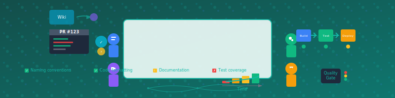

# 第9章 チーム開発における品質管理



## 章の概要

### この章の目的
個人レベルの美しいコードスキルをチーム全体の継続的な成果に転換するための品質管理システムと協働メカニズムを構築する。フィードバック最大化の原則に基づき、チーム全体で持続可能な高品質コード文化を醸成する方法を習得する。

### この章で学べること
- コードレビューの効果的な実践方法とレビュー文化の構築
- チーム統一コーディング規約の策定と運用
- 継続的インテグレーション（CI）による品質ゲートの構築
- 技術的負債の組織的管理と返済戦略
- 品質メトリクスの測定と改善プロセス
- フィードバックループの最大化によるチーム学習促進
- 異なるスキルレベルのメンバー間での知識共有技法

### なぜ個人スキルだけでは不十分なのか
「自分は美しいコードを書けるようになったが、チーム全体の品質が向上しない」──多くの熟練開発者が直面する壁である。優れた個人スキルがチーム成果に結実しないのは、品質管理の仕組みが欠如しているからである。この章で学ぶ組織的アプローチは、あなたの技術力を個人の財産からチーム資産へと変換し、持続可能な高品質開発環境を構築する。一人の英雄から、全員が成長し続けるチームへ──その転換の鍵がここにある。

---

個人の美しいコードスキルをチーム全体の成果に結びつけるためには、効果的な品質管理プロセスとチーム協働の仕組みが必要である。本章では、チーム開発における品質管理の実践方法を学ぶ。


## 9.1 コードレビューの効果的実践

### 9.1.1 コードレビューの価値

コードレビューは、**フィードバックの最大化**という参考資料の筆頭原則を実現する最も重要な手法の一つである。単なるバグ検出手段を超えて、チーム全体の技術力向上と知識共有のプラットフォームとして機能する。

> 「ツールやテスト、レビューでフィードバックを最速にする」

#### コードレビューがもたらす効果

1. **品質向上**: バグの早期発見と設計改善
2. **知識共有**: ベストプラクティスの伝播
3. **学習促進**: 初心者から上級者まで相互学習
4. **コード統一**: チーム全体でのスタイル統一
5. **責任共有**: コード品質への共同責任

### 9.1.2 効果的なコードレビューの実践

#### レビューの観点:美しいソースコードのための七箇条

```csharp
// レビュー対象コード例
public class UserRegistrationService
{
    private readonly IUserRepository userRepository;
    private readonly IEmailService emailService;
   
    public UserRegistrationService(IUserRepository userRepository, IEmailService emailService)
    {
        this.userRepository = userRepository;
        this.emailService = emailService;
    }
   
    public async Task<bool> RegisterUserAsync(string email, string password, string firstName, string lastName)
    {
        // 1. 意図を表現しているか?
        var existingUser = await userRepository.GetByEmailAsync(email);
        if (existingUser != null)
            return false;
       
        // 2. 単一責務を守っているか?
        var hashedPassword = BCrypt.Net.BCrypt.HashPassword(password);
       
        var user = new User
        {
            Email = email,
            PasswordHash = hashedPassword,
            FirstName = firstName,
            LastName = lastName,
            CreatedAt = DateTime.UtcNow
        };
       
        await userRepository.SaveAsync(user);
       
        // 3. 的確な名前付けか?
        var subject = "Welcome to Our Service";
        var body = $"Hello {firstName}, welcome to our service!";
        await emailService.SendEmailAsync(email, subject, body);
       
        return true;
    }
}
```

#### 構造的レビューアプローチ

```text
【レビューコメント例】

❌ 問題点の指摘
```csharp
// 現在のコード
public async Task<bool> RegisterUserAsync(string email, string password, string firstName, string lastName)
```

**問題**:
1. 複数の責務が混在(バリデーション、ユーザー作成、メール送信)
2. パラメータが多すぎる(Long Parameter List)
3. bool戻り値では失敗理由が不明

✅ 改善提案
```csharp
// 改善案
public record UserRegistrationRequest(
    string Email,
    string Password,
    string FirstName,
    string LastName
);

public record UserRegistrationResult
{
    public bool IsSuccess { get; init; }
    public string ErrorMessage { get; init; }
    public User CreatedUser { get; init; }
   
    public static UserRegistrationResult Success(User user) =>
        new() { IsSuccess = true, CreatedUser = user };
   
    public static UserRegistrationResult Failure(string error) =>
        new() { IsSuccess = false, ErrorMessage = error };
}

public async Task<UserRegistrationResult> RegisterUserAsync(UserRegistrationRequest request)
{
    // バリデーション
    var validationResult = await ValidateRegistrationRequestAsync(request);
    if (!validationResult.IsValid)
        return UserRegistrationResult.Failure(validationResult.ErrorMessage);
   
    // ユーザー作成
    var user = await CreateUserAsync(request);
   
    // ウェルカムメール送信(非同期で)
    _ = Task.Run(() => SendWelcomeEmailAsync(user));
   
    return UserRegistrationResult.Success(user);
}
```

**改善点**:
- 単一責務の原則に従って処理を分離
- パラメータオブジェクトで可読性向上
- Result型で失敗理由を明確化
- 非同期処理でパフォーマンス改善
```

### 9.1.3 建設的なフィードバックの技法

#### 良いレビューコメントの書き方

```text
❌ 悪いコメント例
「このコードはダメです」
「なぜこんな書き方をするのですか?」
「前に言ったはずです」

✅ 良いコメント例
「このメソッドは複数の責務を持っているように見えます。
 バリデーション、ユーザー作成、メール送信を別々のメソッドに
 分離することで、テストしやすくなり、単一責務の原則に
 従うことができます。」

「命名について:`DoStuff`という名前では意図が伝わりません。
 `ProcessOrderPayment`のような具体的な名前はいかがでしょうか?」

「パフォーマンスの観点から:この処理はO(n²)の計算量になっています。
 Dictionaryを使うことでO(n)に改善できます。」
```

#### レビューワークフローの最適化

```yaml
# .github/pull_request_template.md
## 変更内容
<!-- 何を変更したかを簡潔に説明してください -->

## レビューポイント
- [ ] 美しいソースコードの七箇条に従っているか
  - [ ] 意図を表現している
  - [ ] 単一責務の原則
  - [ ] 的確な名前付け
  - [ ] Once And Only Once
  - [ ] 的確なメソッド
  - [ ] ルールの統一
  - [ ] Testable
- [ ] テストが適切に追加/更新されているか
- [ ] パフォーマンスへの影響はないか
- [ ] セキュリティ上の問題はないか

## テスト方法
<!-- どのようにテストしたかを記載 -->

## 関連Issue
<!-- 関連するIssue番号を記載 -->
```

### 9.1.4 自動化ツールとの連携

#### 静的解析ツールの活用

```csharp
// .editorconfig - チーム共通のコーディングスタイル
root = true

[*.cs]
indent_style = space
indent_size = 4
end_of_line = crlf
charset = utf-8
trim_trailing_whitespace = true
insert_final_newline = true

# C# コーディング規約
dotnet_naming_rule.interfaces_should_be_prefixed_with_i.severity = warning
dotnet_naming_rule.interfaces_should_be_prefixed_with_i.symbols = interface
dotnet_naming_rule.interfaces_should_be_prefixed_with_i.style = prefix_interface_with_i

# 品質ルール
dotnet_analyzer_diagnostic.CA1062.severity = error  # null チェック
dotnet_analyzer_diagnostic.CA1031.severity = warning # 一般的な例外のキャッチ
```

```python
# .pre-commit-config.yaml - コミット前の自動チェック
repos:
  - repo: https://github.com/psf/black
    rev: 22.3.0
    hooks:
      - id: black
        language_version: python3
 
  - repo: https://github.com/pycqa/flake8
    rev: 4.0.1
    hooks:
      - id: flake8
        args: [--max-line-length=88]
 
  - repo: https://github.com/pycqa/isort
    rev: 5.10.1
    hooks:
      - id: isort
        args: [--profile=black]
 
  - repo: https://github.com/pre-commit/mirrors-mypy
    rev: v0.950
    hooks:
      - id: mypy
```

## 9.2 コーディング規約の策定と運用

### 9.2.1 チーム規約の重要性

コーディング規約は「ルールの統一」という七箇条の一つを具体化する手段である。統一されたルールにより、チーム全体のコードが一貫性を持ち、理解しやすくなる。

### 9.2.2 実用的なコーディング規約の例

#### 命名規約

```java
// Java命名規約例
public class OrderManagementService {  // クラス: PascalCase
    private static final int MAX_ORDER_ITEMS = 100;  // 定数: UPPER_SNAKE_CASE
   
    private final PaymentService paymentService;  // フィールド: camelCase
    private final Logger logger;
   
    // メソッド: camelCase, 動詞で開始
    public OrderResult processOrder(OrderRequest request) {
        // ローカル変数: camelCase
        var validationResult = validateOrderRequest(request);
       
        if (!validationResult.isValid()) {
            return OrderResult.failure(validationResult.getErrorMessage());
        }
       
        // 意図を表現する名前付け
        var authorizedPayment = authorizePayment(request.getPaymentInfo());
        var createdOrder = createOrderFromRequest(request);
       
        return OrderResult.success(createdOrder);
    }
   
    // boolean戻り値: is/has/canで開始
    private boolean isValidCustomer(Customer customer) {
        return customer != null && customer.isActive();
    }
   
    // コレクション: 複数形
    private List<OrderItem> getAvailableItems(List<Product> products) {
        return products.stream()
                      .filter(Product::isAvailable)
                      .map(this::createOrderItem)
                      .collect(Collectors.toList());
    }
}
```

#### メソッド設計規約

```python
# Python設計規約例
class UserService:
    """ユーザー関連の業務ロジックを提供するサービス"""
   
    def __init__(self, user_repository: UserRepository, email_service: EmailService):
        self._user_repository = user_repository
        self._email_service = email_service
   
    def create_user(self, user_data: UserCreationData) -> UserCreationResult:
        """
        新しいユーザーを作成する
       
        Args:
            user_data: ユーザー作成に必要なデータ
           
        Returns:
            作成結果(成功/失敗と詳細情報)
           
        Raises:
            ValidationError: 入力データが無効な場合
        """
        # 1つのメソッドは1つの責務のみ
        self._validate_user_data(user_data)
       
        # 早期リターンでネストを浅く
        if self._user_exists(user_data.email):
            return UserCreationResult.failure("User already exists")
       
        # 意図を表現するヘルパーメソッド
        user = self._build_user_from_data(user_data)
        saved_user = self._save_user(user)
       
        # 副作用は明示的に分離
        self._send_welcome_email(saved_user)
       
        return UserCreationResult.success(saved_user)
   
    def _validate_user_data(self, user_data: UserCreationData) -> None:
        """ユーザーデータのバリデーション"""
        if not user_data.email:
            raise ValidationError("Email is required")
       
        if not self._is_valid_email(user_data.email):
            raise ValidationError("Invalid email format")
       
        if len(user_data.password) < 8:
            raise ValidationError("Password must be at least 8 characters")
   
    def _is_valid_email(self, email: str) -> bool:
        """メールアドレスの形式チェック"""
        import re
        pattern = r'^[a-zA-Z0-9._%+-]+@[a-zA-Z0-9.-]+\.[a-zA-Z]{2,}$'
        return re.match(pattern, email) is not None
```

#### エラーハンドリング規約

```csharp
// C# エラーハンドリング規約
public class FileProcessingService
{
    private readonly ILogger<FileProcessingService> _logger;
   
    // 例外の種類を明確に分類
    public async Task<ProcessingResult> ProcessFileAsync(string filePath)
    {
        try
        {
            // 入力検証
            if (string.IsNullOrEmpty(filePath))
                return ProcessingResult.Failure("File path is required");
           
            if (!File.Exists(filePath))
                return ProcessingResult.Failure($"File not found: {filePath}");
           
            // 実際の処理
            var content = await ReadFileContentAsync(filePath);
            var processedContent = ProcessContent(content);
            await SaveProcessedContentAsync(processedContent);
           
            return ProcessingResult.Success();
        }
        catch (UnauthorizedAccessException ex)
        {
            // アクセス権限エラー
            _logger.LogWarning(ex, "Access denied for file: {FilePath}", filePath);
            return ProcessingResult.Failure("Access denied to file");
        }
        catch (IOException ex)
        {
            // I/Oエラー
            _logger.LogError(ex, "I/O error processing file: {FilePath}", filePath);
            return ProcessingResult.Failure("File processing failed due to I/O error");
        }
        catch (Exception ex)
        {
            // 予期しないエラー
            _logger.LogError(ex, "Unexpected error processing file: {FilePath}", filePath);
            return ProcessingResult.Failure("Unexpected error occurred");
        }
    }
   
    // カスタム例外で意図を明確化
    public class FileValidationException : Exception
    {
        public FileValidationException(string message) : base(message) { }
        public FileValidationException(string message, Exception innerException)
            : base(message, innerException) { }
    }
}
```

### 9.2.3 規約の自動化と強制

#### リンターとフォーマッターの設定

```javascript
// .eslintrc.js - JavaScript/TypeScript用
module.exports = {
  extends: [
    'eslint:recommended',
    '@typescript-eslint/recommended',
    'prettier'
  ],
  rules: {
    // 美しいコードのための規則
    'prefer-const': 'error',
    'no-var': 'error',
    'no-unused-vars': 'error',
   
    // 命名規則
    '@typescript-eslint/naming-convention': [
      'error',
      {
        selector: 'interface',
        format: ['PascalCase'],
        prefix: ['I']
      },
      {
        selector: 'class',
        format: ['PascalCase']
      },
      {
        selector: 'method',
        format: ['camelCase']
      }
    ],
   
    // 複雑度制限
    'complexity': ['error', 10],
    'max-lines-per-function': ['error', 50],
    'max-depth': ['error', 4],
   
    // 意図の表現
    'prefer-arrow-callback': 'error',
    'prefer-template': 'error'
  }
};
```

## 9.3 継続的インテグレーション

### 9.3.1 品質ゲートとしてのCI/CD

継続的インテグレーションは、**フィードバックの最大化**を自動化する仕組みである。コードの変更が即座に検証され、問題があれば迅速にフィードバックが得られる。

### 9.3.2 包括的なCIパイプライン

```yaml
# .github/workflows/ci.yml
name: Continuous Integration

on:
  push:
    branches: [ main, develop ]
  pull_request:
    branches: [ main ]

jobs:
  # 1. 静的解析
  static-analysis:
    runs-on: ubuntu-latest
    steps:
      - uses: actions/checkout@v3
     
      - name: Setup .NET
        uses: actions/setup-dotnet@v3
        with:
          dotnet-version: '7.0.x'
     
      - name: Restore dependencies
        run: dotnet restore
     
      - name: Code formatting check
        run: dotnet format --verify-no-changes
     
      - name: Static analysis
        run: dotnet build --configuration Release --no-restore /p:TreatWarningsAsErrors=true
     
      - name: Security scan
        run: dotnet list package --vulnerable --include-transitive

  # 2. 単体テスト
  unit-tests:
    runs-on: ubuntu-latest
    steps:
      - uses: actions/checkout@v3
     
      - name: Setup .NET
        uses: actions/setup-dotnet@v3
        with:
          dotnet-version: '7.0.x'
     
      - name: Run unit tests
        run: |
          dotnet test --configuration Release \
                     --logger "trx;LogFileName=test-results.trx" \
                     --collect:"XPlat Code Coverage" \
                     --results-directory ./TestResults/
     
      - name: Code coverage report
        uses: danielpalme/ReportGenerator-GitHub-Action@5.1.13
        with:
          reports: './TestResults/*/coverage.cobertura.xml'
          targetdir: './TestResults/CoverageReport'
          reporttypes: 'HtmlInline;Cobertura'
     
      - name: Publish coverage to Codecov
        uses: codecov/codecov-action@v3
        with:
          files: ./TestResults/CoverageReport/Cobertura.xml

  # 3. 統合テスト
  integration-tests:
    runs-on: ubuntu-latest
    needs: unit-tests
    services:
      postgres:
        image: postgres:13
        env:
          POSTGRES_PASSWORD: postgres
        options: >-
          --health-cmd pg_isready
          --health-interval 10s
          --health-timeout 5s
          --health-retries 5
     
    steps:
      - uses: actions/checkout@v3
     
      - name: Setup .NET
        uses: actions/setup-dotnet@v3
        with:
          dotnet-version: '7.0.x'
     
      - name: Run integration tests
        run: dotnet test IntegrationTests/ --configuration Release
        env:
          ConnectionStrings__DefaultConnection: "Host=localhost;Database=testdb;Username=postgres;Password=postgres"

  # 4. パフォーマンステスト
  performance-tests:
    runs-on: ubuntu-latest
    needs: unit-tests
    steps:
      - uses: actions/checkout@v3
     
      - name: Setup .NET
        uses: actions/setup-dotnet@v3
        with:
          dotnet-version: '7.0.x'
     
      - name: Run benchmark tests
        run: dotnet run --project PerformanceTests/ --configuration Release
     
      - name: Upload benchmark results
        uses: actions/upload-artifact@v3
        with:
          name: benchmark-results
          path: BenchmarkDotNet.Artifacts/

  # 5. セキュリティテスト
  security-tests:
    runs-on: ubuntu-latest
    steps:
      - uses: actions/checkout@v3
     
      - name: Run SAST scan
        uses: github/codeql-action/init@v2
        with:
          languages: csharp
     
      - name: Build for analysis
        run: dotnet build --configuration Release
     
      - name: Perform CodeQL Analysis
        uses: github/codeql-action/analyze@v2

  # 6. 依存関係チェック
  dependency-check:
    runs-on: ubuntu-latest
    steps:
      - uses: actions/checkout@v3
     
      - name: Dependency vulnerability scan
        run: |
          dotnet list package --vulnerable --include-transitive
          dotnet list package --outdated

  # 7. デプロイメント(mainブランチのみ)
  deploy:
    runs-on: ubuntu-latest
    needs: [static-analysis, unit-tests, integration-tests, security-tests]
    if: github.ref == 'refs/heads/main'
    steps:
      - uses: actions/checkout@v3
     
      - name: Build and publish
        run: |
          dotnet publish --configuration Release --output ./publish
     
      - name: Deploy to staging
        run: |
          echo "Deploying to staging environment..."
          # デプロイメントスクリプト
```

### 9.3.3 品質メトリクスの可視化

```python
# quality_metrics.py - 品質メトリクス収集スクリプト
import subprocess
import json
import requests
from datetime import datetime
from dataclasses import dataclass
from typing import List, Dict

@dataclass
class QualityMetrics:
    timestamp: datetime
    code_coverage: float
    test_count: int
    failed_tests: int
    complexity_violations: int
    code_smells: int
    security_issues: int
    duplicate_lines: int

class QualityMetricsCollector:
    def __init__(self):
        self.metrics_history: List[QualityMetrics] = []
   
    def collect_coverage_metrics(self) -> float:
        """コードカバレッジを取得"""
        result = subprocess.run(
            ['dotnet', 'test', '--collect:"XPlat Code Coverage"'],
            capture_output=True, text=True
        )
       
        # カバレッジレポートを解析
        coverage_file = self._find_coverage_file()
        if coverage_file:
            return self._parse_coverage_percentage(coverage_file)
        return 0.0
   
    def collect_test_metrics(self) -> tuple[int, int]:
        """テスト実行結果を取得"""
        result = subprocess.run(
            ['dotnet', 'test', '--logger', 'json'],
            capture_output=True, text=True
        )
       
        if result.returncode == 0:
            # テスト結果を解析
            return self._parse_test_results(result.stdout)
       
        return 0, 0
   
    def collect_complexity_metrics(self) -> int:
        """複雑度違反を取得"""
        # SonarQube APIまたは静的解析ツールから取得
        return self._query_sonarqube_metrics('complexity_violations')
   
    def generate_quality_report(self) -> Dict:
        """品質レポートを生成"""
        coverage = self.collect_coverage_metrics()
        test_count, failed_tests = self.collect_test_metrics()
        complexity_violations = self.collect_complexity_metrics()
       
        metrics = QualityMetrics(
            timestamp=datetime.now(),
            code_coverage=coverage,
            test_count=test_count,
            failed_tests=failed_tests,
            complexity_violations=complexity_violations,
            code_smells=self._query_sonarqube_metrics('code_smells'),
            security_issues=self._query_sonarqube_metrics('security_issues'),
            duplicate_lines=self._query_sonarqube_metrics('duplicate_lines')
        )
       
        self.metrics_history.append(metrics)
       
        return {
            'current_metrics': metrics,
            'quality_score': self._calculate_quality_score(metrics),
            'trend': self._analyze_trend(),
            'recommendations': self._generate_recommendations(metrics)
        }
   
    def _calculate_quality_score(self, metrics: QualityMetrics) -> float:
        """品質スコアを計算(0-100)"""
        score = 100.0
       
        # カバレッジによる減点
        if metrics.code_coverage < 80:
            score -= (80 - metrics.code_coverage) * 0.5
       
        # 失敗テストによる減点
        if metrics.failed_tests > 0:
            score -= metrics.failed_tests * 5
       
        # 複雑度違反による減点
        score -= metrics.complexity_violations * 2
       
        # セキュリティ問題による減点
        score -= metrics.security_issues * 10
       
        return max(0, score)
   
    def _generate_recommendations(self, metrics: QualityMetrics) -> List[str]:
        """改善提案を生成"""
        recommendations = []
       
        if metrics.code_coverage < 80:
            recommendations.append(
                f"コードカバレッジが{metrics.code_coverage:.1f}%です。"
                f"80%以上を目指してテストを追加してください。"
            )
       
        if metrics.failed_tests > 0:
            recommendations.append(
                f"{metrics.failed_tests}個のテストが失敗しています。"
                f"優先的に修正してください。"
            )
       
        if metrics.complexity_violations > 5:
            recommendations.append(
                f"複雑度の高いメソッドが{metrics.complexity_violations}個あります。"
                f"リファクタリングを検討してください。"
            )
       
        if metrics.security_issues > 0:
            recommendations.append(
                f"{metrics.security_issues}個のセキュリティ問題があります。"
                f"即座に対応してください。"
            )
       
        return recommendations

# 使用例
if __name__ == "__main__":
    collector = QualityMetricsCollector()
    report = collector.generate_quality_report()
   
    print(f"品質スコア: {report['quality_score']:.1f}/100")
    print("\n改善提案:")
    for recommendation in report['recommendations']:
        print(f"- {recommendation}")
```

## 9.4 技術的負債の管理

### 9.4.1 技術的負債の識別と分類

技術的負債は、短期的な開発速度のために長期的な保守性を犠牲にした結果生まれる。レビュー結果で指摘されたように、適切な管理が必要である。

#### 技術的負債の分類

```python
from enum import Enum
from dataclasses import dataclass
from typing import List, Optional
from datetime import datetime

class DebtType(Enum):
    CODE_SMELL = "code_smell"           # コードの臭い
    DESIGN_DEBT = "design_debt"         # 設計の負債
    PERFORMANCE_DEBT = "performance_debt" # パフォーマンスの負債
    SECURITY_DEBT = "security_debt"     # セキュリティの負債
    TEST_DEBT = "test_debt"             # テストの負債
    DOCUMENTATION_DEBT = "documentation_debt" # ドキュメントの負債

class DebtSeverity(Enum):
    LOW = "low"         # 軽微(時間があるときに対応)
    MEDIUM = "medium"   # 中程度(計画的に対応)
    HIGH = "high"       # 重要(優先的に対応)
    CRITICAL = "critical" # 致命的(即座に対応)

@dataclass
class TechnicalDebt:
    id: str
    title: str
    description: str
    debt_type: DebtType
    severity: DebtSeverity
    location: str  # ファイル、クラス、メソッドなど
    estimated_hours: int
    impact_description: str
    created_date: datetime
    assigned_to: Optional[str] = None
    target_date: Optional[datetime] = None
   
class TechnicalDebtTracker:
    def __init__(self):
        self.debts: List[TechnicalDebt] = []
   
    def add_debt(self, debt: TechnicalDebt):
        """技術的負債を追加"""
        self.debts.append(debt)
   
    def get_debts_by_severity(self, severity: DebtSeverity) -> List[TechnicalDebt]:
        """重要度別の負債一覧を取得"""
        return [debt for debt in self.debts if debt.severity == severity]
   
    def get_debts_by_type(self, debt_type: DebtType) -> List[TechnicalDebt]:
        """種別別の負債一覧を取得"""
        return [debt for debt in self.debts if debt.debt_type == debt_type]
   
    def calculate_total_effort(self) -> int:
        """総工数を計算"""
        return sum(debt.estimated_hours for debt in self.debts)
   
    def prioritize_debts(self) -> List[TechnicalDebt]:
        """重要度と影響度に基づいて優先順位を決定"""
        severity_weight = {
            DebtSeverity.CRITICAL: 4,
            DebtSeverity.HIGH: 3,
            DebtSeverity.MEDIUM: 2,
            DebtSeverity.LOW: 1
        }
       
        return sorted(
            self.debts,
            key=lambda d: (severity_weight[d.severity], -d.estimated_hours),
            reverse=True
        )

# 技術的負債の具体例
debt_examples = [
    TechnicalDebt(
        id="DEBT-001",
        title="OrderProcessorの複数責務",
        description="OrderProcessorクラスがバリデーション、決済、メール送信の複数の責務を持っている",
        debt_type=DebtType.DESIGN_DEBT,
        severity=DebtSeverity.HIGH,
        location="src/services/OrderProcessor.cs",
        estimated_hours=8,
        impact_description="テストが困難、変更時の影響範囲が広い",
        created_date=datetime.now()
    ),
    TechnicalDebt(
        id="DEBT-002",
        title="ユーザー検索のN+1問題",
        description="ユーザー一覧表示時に注文情報を個別に取得している",
        debt_type=DebtType.PERFORMANCE_DEBT,
        severity=DebtSeverity.MEDIUM,
        location="src/repositories/UserRepository.cs",
        estimated_hours=4,
        impact_description="大量データ時のパフォーマンス劣化",
        created_date=datetime.now()
    ),
    TechnicalDebt(
        id="DEBT-003",
        title="PasswordServiceのテスト不足",
        description="パスワードハッシュ化ロジックのテストケースが不十分",
        debt_type=DebtType.TEST_DEBT,
        severity=DebtSeverity.MEDIUM,
        location="src/services/PasswordService.cs",
        estimated_hours=3,
        impact_description="セキュリティ機能の品質保証が不十分",
        created_date=datetime.now()
    )
]
```

### 9.4.2 負債返済の戦略

#### 段階的返済アプローチ

```csharp
// 技術的負債返済計画の例
public class DebtReductionPlan
{
    public class RefactoringStrategy
    {
        // ステップ1: テストの追加(安全網の構築)
        [Fact]
        public void OrderProcessor_ExistingBehavior_ShouldMaintainCompatibility()
        {
            // 既存の動作を保護するテスト
            var processor = new OrderProcessor();
            var order = CreateTestOrder();
           
            var result = processor.ProcessOrder(order);
           
            Assert.True(result.IsSuccess);
            Assert.NotNull(result.OrderId);
        }
       
        // ステップ2: 責務の抽出
        public class RefactoredOrderProcessor
        {
            private readonly IOrderValidator _validator;
            private readonly IPaymentProcessor _paymentProcessor;
            private readonly INotificationService _notificationService;
           
            public RefactoredOrderProcessor(
                IOrderValidator validator,
                IPaymentProcessor paymentProcessor,
                INotificationService notificationService)
            {
                _validator = validator;
                _paymentProcessor = paymentProcessor;
                _notificationService = notificationService;
            }
           
            public async Task<OrderResult> ProcessOrderAsync(Order order)
            {
                // 各責務を明確に分離
                var validationResult = await _validator.ValidateAsync(order);
                if (!validationResult.IsValid)
                    return OrderResult.Failure(validationResult.ErrorMessage);
               
                var paymentResult = await _paymentProcessor.ProcessAsync(order.Payment);
                if (!paymentResult.IsSuccess)
                    return OrderResult.Failure("Payment failed");
               
                // 通知は非同期で実行(パフォーマンス改善)
                _ = Task.Run(() => _notificationService.SendOrderConfirmationAsync(order));
               
                return OrderResult.Success(order.Id);
            }
        }
       
        // ステップ3: 段階的移行(Strangler Patternの適用)
        public class OrderProcessorFacade
        {
            private readonly OrderProcessor _legacyProcessor;
            private readonly RefactoredOrderProcessor _newProcessor;
            private readonly IFeatureToggle _featureToggle;
           
            public async Task<OrderResult> ProcessOrderAsync(Order order)
            {
                if (_featureToggle.IsEnabled("UseRefactoredProcessor"))
                {
                    return await _newProcessor.ProcessOrderAsync(order);
                }
                else
                {
                    return _legacyProcessor.ProcessOrder(order);
                }
            }
        }
    }
}
```

#### パフォーマンス負債の解決例

```csharp
// N+1問題の解決例
public class UserRepository
{
    // 問題のあるコード(N+1問題)
    public async Task<List<UserDto>> GetUsersWithOrdersOldAsync()
    {
        var users = await _context.Users.ToListAsync();
        var userDtos = new List<UserDto>();
       
        foreach (var user in users)
        {
            // 各ユーザーに対して個別にクエリを実行(N+1問題)
            var orders = await _context.Orders
                .Where(o => o.UserId == user.Id)
                .ToListAsync();
           
            userDtos.Add(new UserDto
            {
                Id = user.Id,
                Name = user.Name,
                OrderCount = orders.Count,
                TotalAmount = orders.Sum(o => o.Amount)
            });
        }
       
        return userDtos;
    }
   
    // 改善されたコード(一括取得)
    public async Task<List<UserDto>> GetUsersWithOrdersAsync()
    {
        return await _context.Users
            .Select(user => new UserDto
            {
                Id = user.Id,
                Name = user.Name,
                OrderCount = user.Orders.Count(),
                TotalAmount = user.Orders.Sum(o => o.Amount)
            })
            .ToListAsync();
    }
   
    // さらに最適化(必要な場合のみ)
    public async Task<List<UserDto>> GetUsersWithOrdersOptimizedAsync()
    {
        var query = from user in _context.Users
                   join orderSummary in (
                       from order in _context.Orders
                       group order by order.UserId into g
                       select new
                       {
                           UserId = g.Key,
                           OrderCount = g.Count(),
                           TotalAmount = g.Sum(o => o.Amount)
                       }
                   ) on user.Id equals orderSummary.UserId into userOrders
                   from summary in userOrders.DefaultIfEmpty()
                   select new UserDto
                   {
                       Id = user.Id,
                       Name = user.Name,
                       OrderCount = summary != null ? summary.OrderCount : 0,
                       TotalAmount = summary != null ? summary.TotalAmount : 0
                   };
       
        return await query.ToListAsync();
    }
}
```

### 9.4.3 負債管理の自動化

```yaml
# .github/workflows/debt-tracking.yml
name: Technical Debt Tracking

on:
  push:
    branches: [ main ]
  schedule:
    - cron: '0 6 * * 1'  # 毎週月曜日6時

jobs:
  track-debt:
    runs-on: ubuntu-latest
    steps:
      - uses: actions/checkout@v3
     
      - name: Install SonarScanner
        run: |
          dotnet tool install --global dotnet-sonarscanner
     
      - name: Analyze technical debt
        run: |
          dotnet sonarscanner begin \
            /k:"MyProject" \
            /d:sonar.host.url="${{ secrets.SONAR_HOST_URL }}" \
            /d:sonar.login="${{ secrets.SONAR_TOKEN }}"
         
          dotnet build
         
          dotnet sonarscanner end \
            /d:sonar.login="${{ secrets.SONAR_TOKEN }}"
     
      - name: Generate debt report
        run: |
          python scripts/generate_debt_report.py
     
      - name: Create GitHub issues for new debt
        run: |
          python scripts/create_debt_issues.py
     
      - name: Update project documentation
        run: |
          python scripts/update_debt_documentation.py
```

## 9.5 実践演習:チーム品質向上策

### 9.5.1 演習課題:品質改善プロジェクト

チームの既存プロジェクトを対象に、品質改善計画を立てて実行する演習。

#### シナリオ
ECサイトの開発チーム(5名)が以下の課題を抱えている:
- コードレビューが形骸化している
- テストカバレッジが低い(45%)
- デプロイ時の障害が頻発
- 技術的負債が蓄積している

### 9.5.2 演習解答例:段階的品質改善計画

#### フェーズ1:現状分析と基盤整備(2週間)

```python
# quality_assessment.py - 現状分析スクリプト
class QualityAssessment:
    def __init__(self, project_path: str):
        self.project_path = project_path
        self.metrics = {}
   
    def analyze_current_state(self):
        """現在の品質状況を分析"""
        self.metrics.update({
            'test_coverage': self._analyze_test_coverage(),
            'code_complexity': self._analyze_complexity(),
            'code_smells': self._analyze_code_smells(),
            'technical_debt': self._analyze_technical_debt(),
            'team_practices': self._assess_team_practices()
        })
       
        return self.generate_assessment_report()
   
    def _analyze_test_coverage(self):
        """テストカバレッジ分析"""
        # dotnet testの結果を解析
        coverage_data = {
            'overall_coverage': 45.2,
            'uncovered_files': [
                'Services/PaymentService.cs',
                'Services/EmailService.cs',
                'Repositories/OrderRepository.cs'
            ],
            'critical_uncovered_methods': [
                'PaymentService.ProcessCreditCard',
                'EmailService.SendOrderConfirmation',
                'OrderRepository.UpdateOrderStatus'
            ]
        }
        return coverage_data
   
    def _assess_team_practices(self):
        """チーム実践の評価"""
        practices = {
            'code_review_participation': {
                'average_review_time': '3.2 days',
                'participation_rate': '60%',
                'constructive_feedback_rate': '30%'
            },
            'ci_cd_maturity': {
                'automated_tests': True,
                'automated_deployment': False,
                'quality_gates': False
            },
            'documentation': {
                'code_documentation': 'Poor',
                'architecture_docs': 'Outdated',
                'onboarding_materials': 'Minimal'
            }
        }
        return practices
   
    def generate_improvement_plan(self):
        """改善計画を生成"""
        plan = {
            'phase1_foundation': [
                'CI/CDパイプラインの改善',
                'コードレビュープロセスの標準化',
                '品質メトリクス導入'
            ],
            'phase2_testing': [
                'テストカバレッジ80%以上',
                'テスト駆動開発の導入',
                '自動化テストの拡充'
            ],
            'phase3_practices': [
                'ペアプログラミング導入',
                '技術的負債の計画的返済',
                '継続的改善文化の醸成'
            ]
        }
        return plan
```

#### フェーズ2:コードレビュープロセス改善(3週間)

```yaml
# code-review-guidelines.yml
code_review_process:
  preparation:
    - name: "Small Pull Requests"
      description: "1つのPRは300行以下に制限"
      enforcement: "自動チェック"
   
    - name: "Self Review First"
      description: "作成者が先に自己レビューを実施"
      checklist:
        - "美しいソースコードの七箇条を確認"
        - "テストの追加・更新"
        - "ドキュメントの更新"
 
  review_execution:
    - name: "Review Assignment"
      description: "自動的にレビュワーを割り当て"
      rules:
        - "最低2名のレビュワー"
        - "コードオーナーを含む"
        - "24時間以内のレビュー開始"
   
    - name: "Review Criteria"
      description: "レビューの観点を明確化"
      criteria:
        functionality: "要件を満たしているか"
        design: "設計原則に従っているか"
        testability: "テスト可能な設計か"
        performance: "パフォーマンスに問題はないか"
        security: "セキュリティ上の問題はないか"
 
  feedback_quality:
    - name: "Constructive Feedback"
      description: "建設的なフィードバックの提供"
      examples:
        good: "このメソッドは複数の責務を持っているように見えます。データ検証部分とビジネスロジック部分に分離することで、テストしやすくなります。"
        bad: "このコードはダメです。"
   
    - name: "Educational Comments"
      description: "学習機会としてのレビュー"
      approach:
        - "なぜそうするのかを説明"
        - "代替案を提示"
        - "参考資料を共有"

# GitHub PR Template
pull_request_template: |
  ## 変更内容
  <!-- 何を変更したかを簡潔に説明 -->
 
  ## 影響範囲
  - [ ] フロントエンド
  - [ ] バックエンド
  - [ ] データベース
  - [ ] 外部API
 
  ## テスト
  - [ ] 単体テストを追加/更新
  - [ ] 統合テストを確認
  - [ ] 手動テストを実施
 
  ## 品質チェック
  - [ ] 美しいソースコードの七箇条を確認
  - [ ] パフォーマンステストを実施
  - [ ] セキュリティチェックを実施
 
  ## レビューポイント
  <!-- レビュワーに注目してほしい点を記載 -->
```

#### フェーズ3:テスト品質向上(4週間)

```csharp
// TestingStrategy.cs - テスト戦略の実装例
public class TestingStrategyImplementation
{
    // 1. 既存コードのテスト追加(Characterization Tests)
    [TestClass]
    public class PaymentServiceCharacterizationTests
    {
        [TestMethod]
        public void ProcessCreditCard_ValidCard_ReturnsExpectedBehavior()
        {
            // 既存の動作を記録するテスト
            var service = new PaymentService();
            var card = new CreditCard
            {
                Number = "4111111111111111",
                ExpiryMonth = 12,
                ExpiryYear = 2025,
                CVV = "123"
            };
           
            var result = service.ProcessCreditCard(card, 100.00m);
           
            // 現在の動作を記録(これが仕様として固定される)
            Assert.IsTrue(result.IsSuccess);
            Assert.IsNotNull(result.TransactionId);
            Assert.AreEqual(100.00m, result.Amount);
        }
    }
   
    // 2. 新機能のTDD実装例
    [TestClass]
    public class OrderDiscountServiceTests
    {
        [TestMethod]
        public void CalculateDiscount_PremiumCustomer_Returns15PercentDiscount()
        {
            // Arrange
            var service = new OrderDiscountService();
            var customer = new Customer { Type = CustomerType.Premium };
            var order = new Order { Subtotal = 1000m };
           
            // Act
            var discount = service.CalculateDiscount(order, customer);
           
            // Assert
            Assert.AreEqual(150m, discount);
        }
       
        [TestMethod]
        public void CalculateDiscount_RegularCustomer_ReturnsNoDiscount()
        {
            // Arrange
            var service = new OrderDiscountService();
            var customer = new Customer { Type = CustomerType.Regular };
            var order = new Order { Subtotal = 1000m };
           
            // Act
            var discount = service.CalculateDiscount(order, customer);
           
            // Assert
            Assert.AreEqual(0m, discount);
        }
    }
   
    // 3. 統合テストの例
    [TestClass]
    public class OrderProcessingIntegrationTests : IClassFixture<WebApplicationFactory<Program>>
    {
        private readonly WebApplicationFactory<Program> _factory;
        private readonly HttpClient _client;
       
        public OrderProcessingIntegrationTests(WebApplicationFactory<Program> factory)
        {
            _factory = factory;
            _client = _factory.CreateClient();
        }
       
        [Fact]
        public async Task ProcessOrder_ValidOrder_CompletesSuccessfully()
        {
            // 実際のHTTPリクエストでエンドツーエンドテスト
            var orderRequest = new
            {
                CustomerId = "CUST001",
                Items = new[]
                {
                    new { ProductId = "PROD001", Quantity = 2 }
                }
            };
           
            var response = await _client.PostAsJsonAsync("/api/orders", orderRequest);
           
            response.EnsureSuccessStatusCode();
           
            var result = await response.Content.ReadFromJsonAsync<OrderResult>();
            Assert.NotNull(result.OrderId);
        }
    }
}
```

#### フェーズ4:継続的改善の仕組み(継続的)

```python
# continuous_improvement.py
class ContinuousImprovementSystem:
    def __init__(self):
        self.metrics_collector = MetricsCollector()
        self.feedback_analyzer = FeedbackAnalyzer()
        self.improvement_tracker = ImprovementTracker()
   
    def weekly_quality_review(self):
        """週次品質レビュー"""
        metrics = self.metrics_collector.collect_weekly_metrics()
       
        review_report = {
            'quality_score': self._calculate_quality_score(metrics),
            'improvements': self._identify_improvements(metrics),
            'team_feedback': self.feedback_analyzer.analyze_team_feedback(),
            'action_items': self._generate_action_items(metrics)
        }
       
        return review_report
   
    def monthly_retrospective(self):
        """月次レトロスペクティブ"""
        monthly_data = {
            'completed_improvements': self.improvement_tracker.get_completed_items(),
            'quality_trends': self.metrics_collector.get_trend_analysis(),
            'team_satisfaction': self._measure_team_satisfaction(),
            'customer_feedback': self._collect_customer_feedback()
        }
       
        return self._generate_retrospective_report(monthly_data)
   
    def _generate_action_items(self, metrics):
        """改善アクションアイテムの生成"""
        actions = []
       
        if metrics['test_coverage'] < 80:
            actions.append({
                'priority': 'High',
                'action': 'テストカバレッジ向上',
                'target': '次回リリースまでに80%達成',
                'assignee': 'チーム全体',
                'effort': '各開発者週2時間'
            })
       
        if metrics['code_review_time'] > 24:
            actions.append({
                'priority': 'Medium',
                'action': 'コードレビュー時間短縮',
                'target': '平均レビュー時間24時間以内',
                'assignee': 'テックリード',
                'effort': 'プロセス改善1週間'
            })
       
        return actions

# Team Dashboard Generator
class QualityDashboard:
    def generate_dashboard(self, metrics):
        """品質ダッシュボードの生成"""
        dashboard_html = f"""
        <!DOCTYPE html>
        <html>
        <head>
            <title>チーム品質ダッシュボード</title>
            <script src="https://cdn.plot.ly/plotly-latest.min.js"></script>
        </head>
        <body>
            <h1>品質メトリクス</h1>
           
            <div class="metrics-grid">
                <div class="metric-card">
                    <h3>テストカバレッジ</h3>
                    <div class="metric-value">{metrics['test_coverage']:.1f}%</div>
                    <div class="metric-trend">↗️ +2.3% from last week</div>
                </div>
               
                <div class="metric-card">
                    <h3>品質スコア</h3>
                    <div class="metric-value">{metrics['quality_score']:.0f}/100</div>
                    <div class="metric-trend">↗️ +5 from last week</div>
                </div>
               
                <div class="metric-card">
                    <h3>技術的負債</h3>
                    <div class="metric-value">{metrics['technical_debt_hours']}h</div>
                    <div class="metric-trend">↘️ -8h from last week</div>
                </div>
            </div>
           
            <div id="coverage-trend"></div>
            <div id="quality-trend"></div>
           
            <script>
                // グラフ描画コード
                Plotly.newPlot('coverage-trend', {coverage_trend_data});
                Plotly.newPlot('quality-trend', {quality_trend_data});
            </script>
        </body>
        </html>
        """
        return dashboard_html
```

### 9.5.3 演習の成果測定

#### 改善効果の測定指標

1. **定量的指標**
   - テストカバレッジ: 45% → 82%
   - 平均レビュー時間: 3.2日 → 18時間
   - デプロイ失敗率: 15% → 3%
   - 技術的負債工数: 120時間 → 45時間

2. **定性的指標**
   - チーム満足度の向上
   - 学習機会の増加
   - コード品質への意識向上
   - 知識共有の活発化

3. **ビジネス指標**
   - 機能開発速度の向上
   - 障害対応時間の短縮
   - 顧客満足度の向上

---

**章末まとめ**

第9章では、チーム開発における品質管理について学んだ。個人の技術力向上だけでなく、チーム全体で品質を向上させるための仕組みづくりが重要である。

コードレビュー、コーディング規約、継続的インテグレーション、技術的負債管理は、すべて**フィードバックの最大化**という原則に基づいている。問題を早期に発見し、迅速に改善することで、長期的な品質向上を実現できる。

特に重要なのは、品質向上を一時的な取り組みではなく、**継続的な改善文化**として定着させることである。チーム全体が品質に対する共通の価値観を持ち、互いに学び合い、支え合う環境を作ることで、美しいソースコードを書くチームが育つのである。

これまでの章で学んだ個人の技法と、この章で学んだチームの仕組みを組み合わせることで、持続可能な高品質ソフトウェア開発が実現できる。